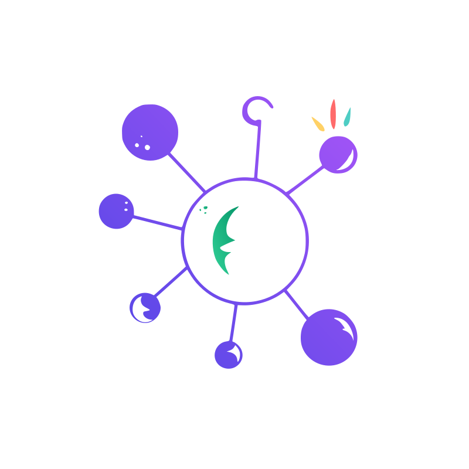
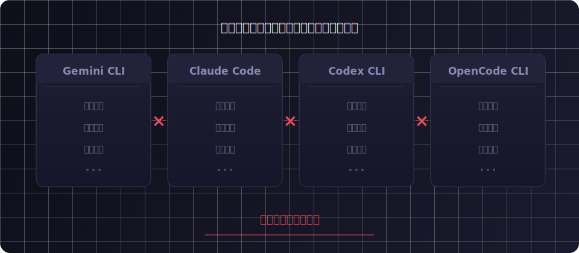
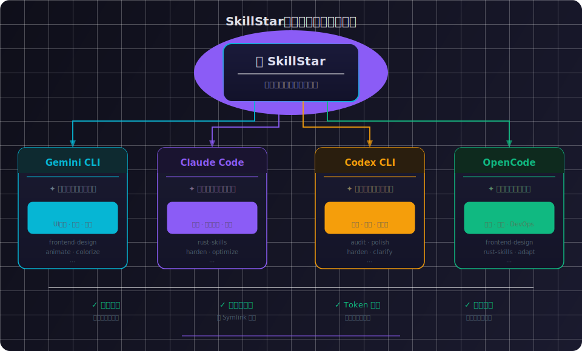

<div align="center">



# SkillStar

### _Your Second Brain for Agent CLIs_

**统一编排，各尽其才——让每一个 Agent CLI 都发挥巅峰智力。**

[](https://v2.tauri.app)
[](https://react.dev)
[](https://www.rust-lang.org)
[](./LICENSE)

<br/>

<video src="https://github.com/xxww0098/SkillStar/raw/main/public/demo.mp4" width="800" autoplay loop muted playsinline></video>

</div>

---

## 故事的起源

> _不同模型各有千秋：Gemini 极具前端审美灵感，Claude 是严密的推理大师，Codex 专注于极速排查与修复 Bug，而 OpenCode 则是全能的六边形战士。_
>
> _理想的工作流，应当是在我们最熟悉的一款 IDE 内，集齐各大模型的原生终端助手——Gemini CLI、OpenCode CLI、Codex CLI、Claude Code——只需在控制台里敲下回车，便能针对性地召唤最得力的那个大脑。_

但现实是**残酷的**——

你在 Claude Code 里精心调教的提示词和工程规范，一旦切换到 Gemini CLI 就形同废纸。你不得不在每个工具里重新构建一切。跨工具带来的**上下文割裂**，使得原本该强大的组合工作流沦为一座座孤岛。

如果你选择妥协，把所有规则堆进一个"全局万能配置"？那只会带来更严重的灾难——**上下文污染 (Context Pollution)**。一万行与当前任务无关的指引，不仅浪费宝贵的 Token，更会让大模型的注意力被稀释，根本无法发挥巅峰实力。

**SkillStar 正是为此而生。**

---

## 它解决了什么

<div align="center">

<br/><br/>

</div>

---

## 核心特性

### 🌐 多生态互通
专为原生 Agent CLI 打造。一套 Skill 系统，无缝适配 **Gemini CLI**、**Claude Code**、**Codex CLI**、**OpenCode CLI**、**OpenClaw** 五大主流终端助手。

### 🧠 AI 智能解读
内嵌 OpenAI 兼容的 AI Provider，对晦涩或外语的 SKILL.md 长文档进行**流式翻译与摘要**，跨越语言障碍。

### 🔗 纯软链分发
以符号链接 (Symlinks) 将 Skill 注入项目——**真正的零文件污染**。不产生任何实体文件拷贝，不干扰 `git status`，在项目之间优雅共享同一套智慧大脑。

### 🏪 skills.sh 生态集市
原生接入全球最大的 Agent Skill 仓库 [skills.sh](https://skills.sh/)，一键拉取社区最前沿的技能，底层以 `tree-hash` 比对实现零感更新。

### 🃏 技能包编排 (Decks)
将多个 Skill 自由组合成一副"套牌"——例如 `React 专家` + `Git 规范` + `Storybook`——为不同复杂度的项目任务按需一键分发。

### 💻 CLI + GUI 双擎并行
同一个二进制文件，既是沉浸式跨平台桌面应用，也是纯粹的终端工具。工作流由你定义。

---

## 快速开始

### 安装

#### 🍺 Homebrew (macOS)

```bash
brew tap xxww0098/skillstar
brew install --cask skillstar
```

#### 📦 手动下载

前往 [GitHub Releases](https://github.com/xxww0098/SkillStar/releases/latest) 下载对应平台的安装包：

| 平台 | 文件 |
|------|------|
| macOS (Apple Silicon) | `SkillStar_x.x.x_aarch64.dmg` |
| macOS (Intel) | `SkillStar_x.x.x_x64.dmg` |
| Windows | `SkillStar_x.x.x_x64-setup.exe` |
| Linux | `SkillStar_x.x.x_amd64.AppImage` / `.deb` / `.rpm` |

> [!NOTE]
> **macOS 用户**：SkillStar 尚未进行 Apple 公证 (Notarization)。如果遇到 _"已损坏，无法打开"_ 的提示，请在终端执行：
> ```bash
> xattr -cr /Applications/SkillStar.app
> ```
> 通过 Homebrew Cask 安装时会自动处理此问题。

### 前置要求

至少安装一个 Agent CLI：[Gemini CLI](https://github.com/google-gemini/gemini-cli) / [Claude Code](https://docs.anthropic.com/en/docs/claude-code) / [Codex CLI](https://github.com/openai/codex) / [OpenCode](https://github.com/opencode-ai/opencode) / [OpenClaw](https://github.com/openclaw/openclaw)

### 从源码构建

需要 [Bun](https://bun.sh/) + [Rust](https://rustup.rs/)：

```bash
# 克隆仓库
git clone https://github.com/xxww0098/SkillStar.git && cd SkillStar

# 安装前端依赖
bun install

# 🚀 启动开发环境（前端 + Tauri 联合热重载）
bun run tauri dev

# 📦 构建产物：.dmg (macOS) / .exe (Windows) / .AppImage (Linux)
bun run tauri build
```

---

## 工作流详解

### 1. 探索 & 安装 — Marketplace

切换到 **Marketplace** 标签页，浏览来自 [skills.sh](https://skills.sh/) 社区最热、最新发布的 Skill 卡片。点击 **Install** 即可将远程 Git 仓库拉取到本地统一管理。支持搜索、分类筛选和 Publisher 下钻浏览。

### 2. 管理 & 编排 — My Skills + Decks

在 **My Skills** 中统一管理全部已安装 Skill：查看、更新、编辑、卸载，并可对单个 Skill 按 Agent 维度挂载。

进而在 **Decks** 面板下，将多个场景 Skill 打包成套牌：

> 📦 `Frontend Expert` = React 规范 + UI 审美 + Storybook 测试  
> 📦 `Rust Builder` = Cargo 惯例 + 错误处理 + 性能优化

### 3. 精准分发 — Projects

这才是 SkillStar 的灵魂所在。

在 **Projects** 面板注册你的工作目录，然后精确控制将哪些 Skill / Deck 分配给哪些 Agent CLI。例如：

| 项目 | Gemini CLI | Claude Code | Codex CLI |
|------|:----------:|:-----------:|:---------:|
| Web App | `Frontend Expert` | `Frontend Expert` | — |
| API Server | — | `Rust Builder` | `Rust Builder` |
| Monorepo | `Full Stack` | `Full Stack` | `Full Stack` |

**这意味着什么？**

- 🎯 **精准聚焦**：每个 Agent 只加载当前工程所需的 Skill，避免上下文膨胀
- 💰 **Token 节省**：不必把无关指引也塞进 AI 的注意力窗口
- 🛡️ **零污染**：全程纯 Symlink 挂载，`git status` 干干净净
- 🔄 **实时性**：修改 Hub 中的 Skill 源文件，所有项目立刻生效

### 4. 终端掌控 — CLI 模式

如果你是重度终端用户，无需打开 GUI——同一个二进制提供完整的子命令体系：

```bash
skillstar list                    # 列出所有已安装 Skill
skillstar install <git-url>       # 从 Git 安装 Skill
skillstar update                  # 检查并拉取所有 Skill 上游更新
skillstar update <skill-name>     # 仅更新指定 Skill
skillstar create                  # 初始化一个新 Skill 骨架
skillstar publish                 # 打包并发布到 GitHub (需 gh CLI)
skillstar switch <provider>       # 快速切换 Agent CLI Provider
skillstar gui                     # 从终端拉起 GUI
```

---

## 技术架构

| Layer | Technology | Purpose |
|-------|------------|---------|
| **Shell** | Tauri v2 | 跨平台桌面容器 + IPC 桥接 |
| **Backend** | Rust, tokio, reqwest | 异步运行时 + HTTP 客户端 |
| **Git Engine** | gix (gitoxide) | 纯 Rust Git 实现，零系统依赖 |
| **CLI** | clap | 子命令解析 |
| **Frontend** | React 18, TypeScript, Vite | SPA 界面 |
| **UI Kit** | shadcn/ui, Tailwind CSS v4, Framer Motion | 组件库 + 动画 |
| **Package** | Bun | 极速包管理与构建 |

---

## 项目结构

```
skillstar/
├── src/                             # ── Frontend ──────────────────
│   ├── components/
│   │   ├── ui/                      # shadcn/ui 基础组件
│   │   ├── layout/                  # Sidebar · Toolbar · DetailPanel
│   │   ├── skills/                  # SkillCard · SkillEditor · Modals
│   │   └── marketplace/             # OfficialPublishers
│   ├── hooks/                       # useSkills · useMarketplace · useProjectManifest …
│   ├── pages/                       # MySkills · Marketplace · Projects · Decks · Settings
│   ├── lib/                         # 工具函数
│   └── types/                       # TypeScript 类型定义
│
├── src-tauri/                       # ── Backend (Rust) ────────────
│   ├── src/
│   │   ├── main.rs                  # CLI + GUI 混合入口
│   │   ├── lib.rs                   # Tauri 插件注册
│   │   ├── commands.rs              # IPC 命令路由
│   │   ├── commands/                # 按领域拆分的命令模块
│   │   │   ├── marketplace.rs       # skills.sh 集市
│   │   │   ├── agents.rs            # Agent 管理
│   │   │   ├── projects.rs          # 项目同步
│   │   │   ├── github.rs            # GitHub 操作
│   │   │   └── ai.rs                # AI Provider
│   │   ├── cli.rs                   # clap 子命令定义
│   │   └── core/                    # 核心业务逻辑
│   │       ├── skill.rs             # Skill 数据结构
│   │       ├── installed_skill.rs   # 已安装 Skill 发现 + 更新检测
│   │       ├── skill_group.rs       # Deck CRUD
│   │       ├── agent_profile.rs     # Agent 探测与管理
│   │       ├── project_manifest.rs  # 项目注册 + 同步
│   │       ├── marketplace.rs       # skills.sh API
│   │       ├── git_ops.rs           # gix 克隆/拉取/tree-hash
│   │       ├── sync.rs              # Symlink 编排
│   │       ├── lockfile.rs          # 锁文件管理
│   │       ├── repo_scanner.rs      # GitHub 仓库扫描
│   │       ├── skill_bundle.rs      # .agentskill 打包/导入
│   │       ├── ai_provider.rs       # AI 翻译/摘要
│   │       └── gh_manager.rs        # gh CLI 集成
│   ├── Cargo.toml
│   └── tauri.conf.json
│
├── package.json
└── README.md                        # 📍 You are here
```

---

## 支持的 Agent CLI

| Agent CLI | Config 目录 | 状态 |
|-----------|------------|:----:|
| **Gemini CLI** | `~/.gemini/` | ✅ |
| **Claude Code** | `~/.claude/` | ✅ |
| **Codex CLI** | `~/.codex/` | ✅ |
| **OpenCode CLI** | `~/.opencode/` | ✅ |
| **OpenClaw** | `~/.openclaw/` | ✅ |

---

## 设计哲学

<table>
<tr>
<td width="50%">

**关于"少即是多"**

SkillStar 的核心信仰：让每一个 Token 都物尽其用。与其给 AI 塞满一切可能有用的规则，不如只给它此刻最需要的那几条精华——这就是为什么我们坚持**项目级粒度**的 Skill 分发，而非粗暴的全局配置。

</td>
<td width="50%">

**关于"零入侵"**

你的代码仓库理应干净纯粹。SkillStar 全程使用符号链接，不在项目中留下任何实体文件——你的 `.gitignore` 和 `git status` 永远保持清爽。删除 SkillStar？链接蒸发，一切如初。

</td>
</tr>
</table>

---

## 贡献

欢迎 PR、Issue 和 Feature Request。详细开发指南请参阅 [DEVELOPMENT.md](./DEVELOPMENT.md)。

## 许可证

[MIT](./LICENSE) — 自由使用，请便。

---

<div align="center">

_Crafted with ❤️ for developers who refuse to compromise._

**less is more.**

</div>
