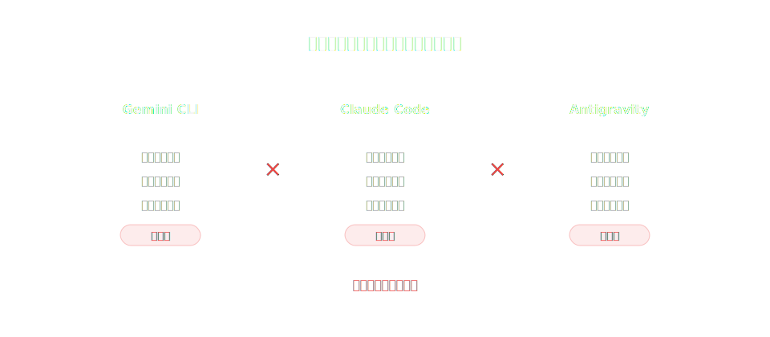
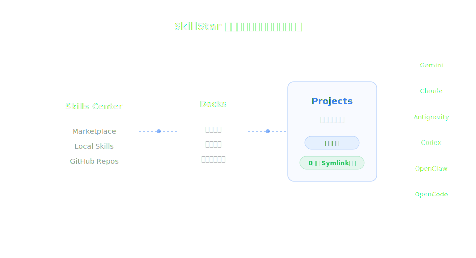

<div align="center">


# SkillStar 技能星球

### _Your Second Brain for Agent CLIs_

**统一编排 Skill，按项目精准分发到不同 Agent CLI。**

[](https://github.com/xxww0098/SkillStar/releases/latest)
[](https://v2.tauri.app)
[](https://react.dev)
[](https://www.rust-lang.org)
[](./LICENSE)

</div>

## SkillStar 是什么
SkillStar 是一个 Tauri 桌面应用（也支持 CLI），用于统一管理 AI Agent Skills：

- 从 `skills.sh` 或 GitHub 仓库安装技能
- 在 `My Skills` 里维护技能和 Agent 链接
- 用 `Decks` 组合并分发一组技能
- 在 `Projects` 里按项目/按 Agent 精准同步
- 通过符号链接（symlink）实现零文件拷贝、低污染工作流

<br/>

### 传统工作流 vs SkillStar 工作流

<div align="center">
  
  <br/><br/>
  
</div>

<br/>

## 核心能力
| 能力 | 说明 |
|------|------|
| 多 Agent 生态 | Gemini CLI、Claude Code、Codex CLI、OpenCode CLI、OpenClaw、Antigravity |
| 纯 symlink 分发 | 项目目录不落地副本，避免 `git status` 污染 |
| Hub + Repo Cache 双层 | 支持多技能仓库统一更新 |
| 安全扫描 | 三模式（Static / Smart / Deep）扫描，含 AI 深度分析与风险评级 |
| AI 辅助阅读 | SKILL.md 翻译与摘要（流式展示），短文本双通道翻译 |
| AI 技能推荐 | 本地预排 + AI 多轮打分，精准推荐技能 |
| 本地技能生命周期 | 创建、编辑、删除、发布、毕业（local → hub） |
| 共享机制 | Share Code + `.ags` / `.agd` Bundle 导入导出 |
| 后台巡检 | 低频单技能节奏更新检查，可在设置/系统托盘控制 |
| 多语言 | 中 / 英 全界面国际化（i18next） |

## 安装
### Homebrew (macOS)
```bash
brew tap xxww0098/skillstar
brew install --cask skillstar
```

### 手动下载
从 [GitHub Releases](https://github.com/xxww0098/SkillStar/releases/latest) 下载：

| 平台 | 安装包 |
|------|--------|
| macOS (Apple Silicon) | `SkillStar_x.x.x_aarch64.dmg` |
| macOS (Intel) | `SkillStar_x.x.x_x64.dmg` |
| Windows | `SkillStar_x.x.x_x64-setup.exe` |
| Linux | `SkillStar_x.x.x_amd64.AppImage` / `.deb` / `.rpm` |

> [!NOTE]
> macOS 首次启动若提示损坏，可执行：
> ```bash
> xattr -cr /Applications/SkillStar.app
> ```

## 前置要求
至少安装一个 Agent CLI：

- [Gemini CLI](https://github.com/google-gemini/gemini-cli)
- [Claude Code](https://docs.anthropic.com/en/docs/claude-code)
- [Codex CLI](https://github.com/openai/codex)
- [OpenCode](https://github.com/opencode-ai/opencode)
- [OpenClaw](https://github.com/openclaw/openclaw)
- [Antigravity](https://github.com/google-gemini/gemini-cli)

## 从源码构建
需要 [Bun](https://bun.sh/) 和 [Rust](https://rustup.rs/)：

```bash
git clone https://github.com/xxww0098/SkillStar.git
cd SkillStar
bun install
bun run tauri dev
bun run tauri build
```

## 典型工作流
1. `Marketplace` 浏览并安装技能
2. `My Skills` 管理技能、编辑 SKILL.md、配置 Agent 链接
3. `Security Scan` 扫描已安装技能的安全风险（支持 AI 深度分析）
4. `Decks` 组合技能并一键部署到项目
5. `Projects` 注册项目并执行按 Agent 同步
6. 需要命令行时使用内置 CLI（`skillstar list/install/update/...`）

## 技术架构
| Layer | Technology | Purpose |
|-------|------------|---------|
| Desktop Shell | Tauri v2 | 桌面容器与 IPC |
| Backend | Rust 2024 + tokio + reqwest 0.13 | 业务逻辑与异步任务 |
| Git Engine | gix 0.80 (gitoxide) | 克隆/拉取/哈希对比 |
| Frontend | React 18 + TypeScript + Vite 5 | SPA UI |
| UI | TailwindCSS v4 + Framer Motion 12 + Radix | 设计系统与交互 |
| Storage | JSON files + SQLite | 配置持久化 + 翻译/安全扫描缓存 |
| Crypto | AES-256-GCM | API Key 加密存储 |

## 目录概览
```text
SkillStar/
├── src/                # React 前端
│   ├── hooks/          #   数据 hooks（skills, projects, marketplace, AI, updater, security）
│   ├── pages/          #   MySkills, Marketplace, SecurityScan, SkillCards, Projects, Settings
│   ├── components/     #   ui/, layout/, skills/, marketplace/, security/
│   ├── lib/            #   共享工具
│   └── types/          #   共享 TS 类型
├── src-tauri/          # Rust 后端（Tauri + CLI）
│   ├── src/commands/   #   marketplace, agents, projects, github, ai, patrol
│   ├── src/core/       #   domain modules（skills, sync, repo, security_scan, ai_provider ...）
│   └── prompts/        #   AI/Security 系统提示词
├── docs/Error.md       # 关键问题与修复记录
├── AGENTS.md           # 后端/全局工程规范
├── AGENTS-UI.md        # 前端规范
└── .impeccable.md      # 设计语义与视觉基线
```

## 支持的 Agent CLI
| Agent | Global Config |
|------|----------------|
| Gemini CLI | `~/.gemini/` |
| Antigravity | `~/.gemini/antigravity` |
| Claude Code | `~/.claude/` |
| Codex CLI | `~/.codex/` |
| OpenCode CLI | `~/.opencode/` |
| OpenClaw | `~/.openclaw/` |

## 开发与协作
- 后端结构或流程调整：先更新 `AGENTS.md`
- 前端结构或交互规范调整：先更新 `AGENTS-UI.md`
- 重要 bug 修复：在 `docs/Error.md` 追加条目

## 许可证
[MIT](./LICENSE)
