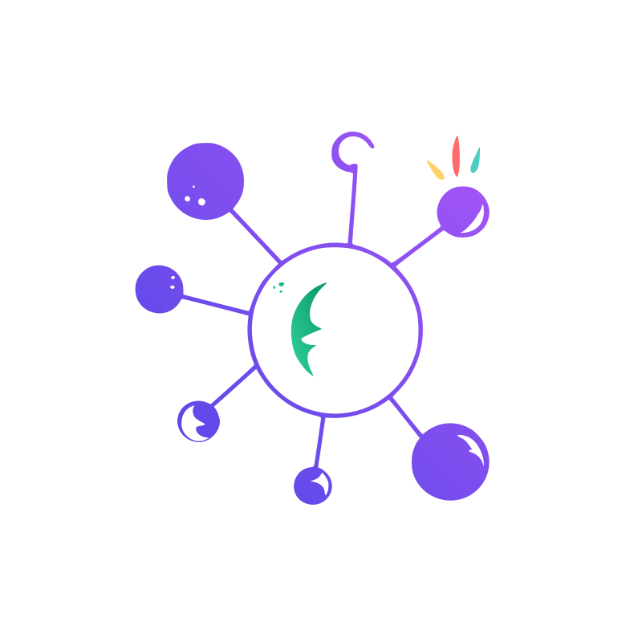

<div align="center">



# SkillStar 技能星球

### _Your Second Brain for Agent CLIs_

**统一管理 Skill、模型供应商与 AI 订阅，并把它们可靠地分发到不同 Agent 和项目。**

[](https://v2.tauri.app)
[](https://react.dev)
[](https://www.rust-lang.org)
[](./LICENSE)

</div>

## SkillStar 是什么

SkillStar 面向同时使用多个 Agent CLI、模型供应商和订阅账号的开发者。它是一个 Tauri 桌面应用，也提供同二进制 CLI，围绕三个工作区组织能力：

- **Skills**：发现、安装、创作和组合 Skill；按 Agent 或项目分发；管理本机、SSH 远端和 S3 同步。
- **Usage**：聚合 OAuth/API Key 订阅的额度、余额、重置周期和续费信息，并在支持时切换真实 CLI 账号。
- **Models**：集中管理 Provider、模型与 Agent binding，检测连接状态并同步目标工具配置。

产品追求 Precise、Unified、Effortless：高信息密度，但不把安全边界、失败状态和用户控制隐藏在“自动化”后面。

## 核心能力

### Skill 管理与分发

- 从 GitHub、仓库简写、本地目录、`.ags`/`.agd` 和 Share Code 安装或导入。
- Local-first Marketplace 使用 SQLite + FTS，本地快照优先，离线仍可搜索。
- 项目级 reconciliation 同时处理新增与移除，并识别共享 Agent 路径冲突。
- 部署优先使用 symlink；平台不允许时自动回退 junction/copy，而不会假装“纯 symlink”。
- 本地创作位于 SkillStar hub，可编辑、打包并通过 GitHub 发布。
- 可将 GitHub App 已选中的组织私有仓库注册为共享频道；确认前会列出全部 Skill 和仓库文件，并明确提示成员可读取完整仓库历史。普通提交保持草稿，owner/publisher 可在 SkillStar 显式发布绑定精确 commit 与完整 Skill hash 的不可变频道版本；订阅者接受仓库邀请后还需单独评审发布、选择要安装的 Skill，选择会跨重启保留且不会自动纳入未来新增项。订阅默认检查新发布、由用户手动应用，也可按频道开启每小时受保护自动升级；只有未修改的已订阅 Skill 会自动前进，新增、移除、分歧或失败项会停下并显示原因，本地修改仍提供 `.local` 保留或明确丢弃选择。单个订阅 Skill 还可从已验证历史发布回滚并固定；固定后仍能看到新版本，但在显式恢复跟随前不会被手动批量或自动升级覆盖。上游移除 Skill 时本地内容和部署保留，用户可选择卸载或以冲突安全名称转为本地副本；未来同名重加也必须再次显式安装并跟踪。
- 频道 owner 可在 SkillStar 用 GitHub 用户名邀请 subscriber 或 publisher，也可移除直接 collaborator；移除后 SkillStar 会重新检查有效 GitHub 权限，Team、组织或 base permission 仍存在时明确提示需前往 GitHub 继续管理。受邀者可在邀请 inbox 接受并自动导入频道，或直接拒绝。成员、继承权限与待处理邀请始终以 GitHub 为准，不使用分享码或额外成员表。订阅端会区分撤权、离线、可重试故障与完整性异常，并在重新验证稳定仓库身份、不可变发布和内容 hash 前冻结远程变更；已安装内容始终保留，确认撤权后还可卸载或转为 `.local` 本地副本。
- 更新 Git-backed Skill 前会检查完整目录；发现本地修改时先停止，让用户选择保留为可改名的 `.local` 本地副本，或明确丢弃修改后继续。
- 可让已配置的 ACP Agent 阅读当前 Skill 的全部文件，按“循序导览 / 技术手册 / 实战工坊”风格和当前界面语言生成带流程图、示例和排错说明的本地持久化 `tutorial.html`；不依赖在线链接，Skill、语言或风格更新后会明确提醒重新生成。
- My Skills 可切换本机、SSH 远端与 S3 云同步工作流。

### Usage 用量面板

- catalog 由代码和测试维护，按 OAuth、API Key 或手动录入模式接入。
- 卡片显示 provider 原生配额窗口、余额、重置时间、套餐和计费周期。
- OAuth 重新授权会原位更新既有订阅，避免生成重复账号。
- 支持的 CLI 账号切换以事务方式更新 active 状态和磁盘凭证；失败时保留原可用账号。
- API key、access token、refresh token 使用域内加密存储；SSH/S3 secret 使用系统 keyring。

> Provider 私有接口可能随上游升级变化。SkillStar 会区分“需要重新授权”“暂时无数据”和普通请求失败，不把所有错误伪装成空额度。

### Models 与 AI

- Provider gallery、模型目录、连接诊断、余额查询和 Agent binding 集中在一个工作台。
- 按 Agent 能力支持 single-provider 或 multi-provider binding。
- Tool sync 只修改 SkillStar 管理的字段，保留用户已有配置并在写入前备份。
- 内置摘要和 Skill 推荐共享 Models provider 配置，并以流式事件报告 route/fallback；Skill 图文教程使用独立的 ACP Agent 配置。

### 桌面体验与安全

- 中英文界面、系统 Tray、后台巡检和签名应用内更新。
- Settings 可通过 GitHub App 设备授权登录 `github.com`，无需粘贴 PAT；access/refresh token 只进入系统凭据存储，代理、刷新、失效与登出状态均可见。该身份用于后续私有共享频道能力，所需 App 权限会在界面中解释。
- 登录后可直接扫描、安装和更新当前身份有权访问的私有 `github.com` Skill 仓库，无需另外配置 `gh` 或全局 Git 凭据。认证只在单次 Git 操作期间提供；私有操作遵循 SkillStar 代理、支持取消，并且不会把 token 写入仓库 remote 或 Git 配置。
- SSH 首次连接使用 host-key TOFU，在认证材料发送前完成信任检查。
- 所有业务 HTTP 统一遵循 SkillStar proxy 配置；GitHub mirror 不修改用户全局 Git 配置。
- 测试和生成工具有专用临时 home，避免触碰真实 Agent 配置。

## 安装

### macOS

```bash
brew tap xxww0098/skillstar
brew install --cask skillstar
```

手动安装 `.dmg` 后可建立 CLI 链接：

```bash
sudo ln -sf /Applications/SkillStar.app/Contents/MacOS/SkillStar /usr/local/bin/skillstar
```

首次启动若被 Gatekeeper 标记为“已损坏”：

```bash
xattr -cr /Applications/SkillStar.app
```

### Windows

运行 GitHub Release 中的安装程序。安装完成并重启终端后，`skillstar` 可从命令行使用。

### Linux

安装 `.deb`/`.rpm`，或把 AppImage 放入 PATH：

```bash
chmod +x SkillStar_x.x.x_amd64.AppImage
sudo mv SkillStar_x.x.x_amd64.AppImage /usr/local/bin/skillstar
```

安装包见 [GitHub Releases](https://github.com/xxww0098/SkillStar/releases/latest)。

## 开始使用

先在 Settings 中手动启用准备使用的内置 Agent，或添加并启用自定义 Agent。SkillStar 不会探测
binary、桌面应用或配置目录来自动启用 Agent；内置注册表同步
[`vercel-labs/skills`](https://github.com/vercel-labs/skills) 的 Agent 目标能力；
完整清单以 [`BUILTIN_AGENT_DEFS`](./crates/skillstar-skills/src/agents/builtin.rs) 及其测试为准。

典型流程：

1. 在 Marketplace 搜索并安装 Skill。
2. 在 My Skills 选择本机 Agent，或切换到 SSH/S3 scope。
3. 在 Projects 注册工程并 reconciliation 项目级技能。
4. 在 Models 创建 Provider，并把 binding 同步到目标 Agent。
5. 在 Usage 添加订阅，查看额度或切换支持的 CLI 账号。

## CLI 快速用法

### 搜索与安装

```bash
skillstar find "code review"
skillstar add vercel-labs/agent-skills
skillstar add vercel-labs/agent-skills@frontend-design
skillstar add https://github.com/vercel-labs/agent-skills/tree/main/skills/web-design-guidelines
skillstar add vercel-labs/agent-skills --skill frontend-design --agent codex,claude-code
skillstar add vercel-labs/agent-skills --skill '*' --agent '*'
skillstar add vercel-labs/agent-skills --all          # 全部 Skill + 全部 Agent + -y
skillstar add vercel-labs/agent-skills --global      # 部署到 Agent 用户级目录
skillstar add vercel-labs/agent-skills --copy        # 强制复制，不创建 link
skillstar add vercel-labs/agent-skills --list
```

`install` 与 `add` 等价；未加 `-y` 时会按需选择 Skill、Agent、Project/Global scope 和部署方式。`-y` 默认 Project，并只使用 Settings 中已手动启用的 Agent；若一个也没有则报错。`--agent` / `--all` 是显式覆盖。

### 管理

```bash
skillstar list
skillstar update [name]
skillstar remove <name> [name...]
skillstar remove --all
```

### 创建、发布与工具包

```bash
skillstar init [name]       # create 仍作为兼容 alias
skillstar publish
skillstar doctor [name]
skillstar pack list
skillstar pack remove <name>
skillstar gui
```

精确参数以 `skillstar --help` 和各子命令 `--help` 为准。

## 从源码构建

需要 [Bun](https://bun.sh/) 和 [Rust](https://rustup.rs/)：

```bash
git clone https://github.com/xxww0098/SkillStar.git
cd SkillStar
bun install
bun run tauri dev
```

质量校验：

```bash
bun run lint
bun run build
bun run test
cargo check --workspace --locked
cargo test --workspace --locked
```

Windows CI 使用 npm，因此依赖变化还要更新 `package-lock.json`。

## 架构与贡献

- Agent 即时规则：[AGENTS.md](./AGENTS.md)
- 项目树和依赖方向：[docs/boundaries.md](./docs/boundaries.md)
- 运行架构和数据所有权：[docs/architecture.md](./docs/architecture.md)
- 功能行为：[docs/features/](./docs/features/)
- 新增 Agent：[docs/features/agents/README.md](./docs/features/agents/README.md)
- 故障记录：[docs/errors.md](./docs/errors.md)
- 结构路线图：[docs/others/roadmap.md](./docs/others/roadmap.md)

提交使用英文 Conventional Commits，文档与代码在同一变更序列中保持一致。

## 许可证

[Apache-2.0](./LICENSE)
