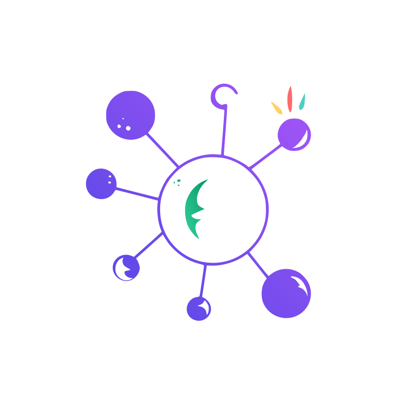
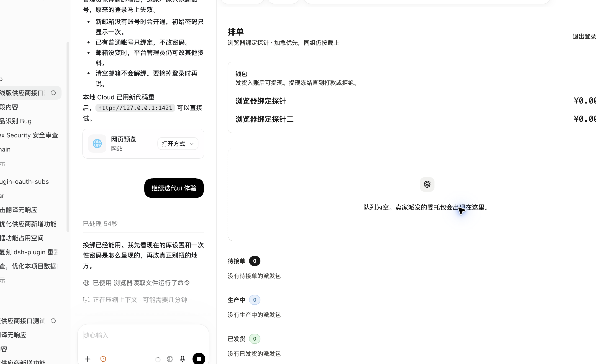

<div align="center">



# SkillStar 技能星球

### _Your Second Brain for Agent CLIs_

**统一管理 Skill 的安装分发、多登录账号的切换与用量展示，并把它们可靠地交付到不同 Agent 和项目。**

[](https://github.com/zed-industries/zed)
[](https://www.rust-lang.org)
[](./LICENSE)

</div>



导入仓库会复用本地 Git 缓存：重复扫描默认不检查上游，安装只补取所选技能缺少的内容。需要新版本时在导入框点「刷新上游」，或运行 `skillstar install owner/repo --refresh`；设置中的缓存清理不会删除已安装技能。详见 [Skills 安装与更新](docs/features/skills/README.md#安装与更新)。

## SkillStar 是什么

SkillStar 面向同时使用多个 Agent CLI 与多个订阅账号的开发者。它是一个 GPUI 桌面应用，也提供同二进制 CLI，围绕三个工作区组织能力：

- **Skills**：发现、安装、创作和组合 Skill；按 Agent 或项目分发；管理本机、SSH 远端与 GitHub 共享频道；团队协作走共享频道，个人服务器部署走 SSH。
- **Accounts**：按平台管理多个登录账号——添加（OAuth / API Key / Cookie / 导入）、一键切换到真实 CLI/IDE、当前账号徽标与分歧检测。
- **Usage**：聚合各订阅的额度、余额、重置周期与今日消耗（会话、token、读时估算成本），只读展示。

模型路由与模型接入（Provider 配置、本机模型网关、Agent 模型写入、应用内 AI）已随 [D-082](./docs/decisions.md) 整体移除，SkillStar 不再配置或接入模型。

产品追求 Precise、Unified、Effortless：高信息密度，但不把安全边界、失败状态和用户控制隐藏在“自动化”后面。

## 核心能力

### Skill 管理与分发

- 从 GitHub、仓库简写、本地目录、`.ags`/`.agd` 和 Share Code 安装或导入。
- 仓库导入支持按目录扫描、按所选技能下载；大仓库可输入 `owner/repo/skills/foo` 或对应 tree URL。具体获取规则见 [技能安装与更新](docs/features/skills/README.md#安装与更新)。
- Local-first Marketplace 使用 SQLite + FTS，本地快照优先，离线仍可搜索。
- 项目级 reconciliation 同时处理新增与移除，并识别共享 Agent 路径冲突。
- 部署优先使用 symlink；平台不允许时自动回退 junction/copy，而不会假装“纯 symlink”。
- 本地创作位于 SkillStar hub，可编辑、打包并通过 GitHub 发布。
- 外部工具安装技能后，可在「设置 → 存储 → 迁移并修复」收纳并恢复链接；同名内容冲突会保留双方。迁移范围和清理规则见 [本地技能修复](docs/features/skills/README.md#本地创作bundle-与-share)。
- 可将 GitHub App 已选中的组织私有仓库注册为共享频道；确认前会列出全部 Skill 和仓库文件，并明确提示成员可读取完整仓库历史。普通提交保持草稿，owner/publisher 可在 SkillStar 显式发布绑定精确 commit 与完整 Skill hash 的不可变频道版本；订阅者接受仓库邀请后还需单独评审发布、选择要安装的 Skill，选择会跨重启保留且不会自动纳入未来新增项。订阅默认检查新发布、由用户手动应用，也可按频道开启每小时受保护自动升级；只有未修改的已订阅 Skill 会自动前进，新增、移除、分歧或失败项会停下并显示原因，本地修改仍提供 `.local` 保留或明确丢弃选择。单个订阅 Skill 还可从已验证历史发布回滚并固定；固定后仍能看到新版本，但在显式恢复跟随前不会被手动批量或自动升级覆盖。上游移除 Skill 时本地内容和部署保留，用户可选择卸载或以冲突安全名称转为本地副本；未来同名重加也必须再次显式安装并跟踪。
- 频道 owner 可在 SkillStar 用 GitHub 用户名邀请 subscriber 或 publisher，也可移除直接 collaborator；移除后 SkillStar 会重新检查有效 GitHub 权限，Team、组织或 base permission 仍存在时明确提示需前往 GitHub 继续管理。受邀者可在邀请 inbox 接受并自动导入频道，或直接拒绝。成员、继承权限与待处理邀请始终以 GitHub 为准，不使用分享码或额外成员表。订阅端会区分撤权、离线、可重试故障与完整性异常，并在重新验证稳定仓库身份、不可变发布和内容 hash 前冻结远程变更；已安装内容始终保留，确认撤权后还可卸载或转为 `.local` 本地副本。
- 更新 Git-backed Skill 前会检查完整目录；发现本地修改时先停止，让用户选择保留为可改名的 `.local` 本地副本，或明确丢弃修改后继续。
- 「设置 → 技能更新」用「更新模式」切换：开关打开是手动（默认），只有你点击「更新」时才覆盖更新；关闭后改为自动，默认每小时在后台检查并应用，也可改成 15 分钟、30 分钟、6 小时或每天。本地已修改的技能会跳过，共享频道托管的技能仍由频道自己的自动升级设置决定。规则见 [Skills 更新策略](docs/features/skills/README.md#更新策略自动与手动)。
- 本机技能、SSH 远端和 GitHub 共享频道的域能力仍在。当前 GPUI 的 My Skills 只展示本机；远端和频道管理界面没有移植。

### Usage 用量面板

- catalog 由代码和测试维护，按 OAuth、API Key 或手动录入模式接入。
- 卡片显示 provider 原生配额窗口、余额、重置时间、套餐和计费周期。
- Accounts 家族范围与 dsh-plugin-oauth-subs 一致，含 API Key 添加的 OpenCode Go，具体入口与限制见 [账号说明](docs/features/accounts/README.md) 和 [认证方式](docs/features/usage/README.md#dsh-家族补齐)。
- Accounts 支持 Codex、Grok 和 GLM 的重置卡：查看剩余数量与到期时间，确认后消耗卡片重置对应额度窗口。
- Usage 页提供今日会话 chips 与花费摘要：当日 token 消耗与按模型估值的读时成本（价格表来自 models.dev 缓存与用户覆盖，见 D-082）。
- OAuth 重新授权会原位更新既有订阅，避免生成重复账号。
- 账号切换在 **Accounts** 工作台以事务方式完成：更新 active 状态与磁盘凭证，失败时保留原可用账号。
- 可在 Usage 里为已经验证过隔离的桌面应用创建实例（当前是 Cursor 和 Antigravity，`~/.skillstar/instances/<app>/<id>/`）。Start 会用独立 `--user-data-dir` 拉起本机 macOS 应用，不改默认 profile。多开范围限 Accounts 家族中的独立 IDE；尚未实机验证的应用只登记启动形状，不出现在多开入口。Claude Desktop 和 Zed 无法隔离，不提供多开。
- 所有密钥（API key、access token、refresh token、SSH secret 等）全部使用本地 AES-256-GCM 加密 JSON 存储，不写入系统钥匙串（macOS Keychain）。

> Provider 私有接口可能随上游升级变化。SkillStar 会区分“需要重新授权”“暂时无数据”和普通请求失败，不把所有错误伪装成空额度。

### 桌面体验与安全

- 中英文界面。系统托盘、后台巡检、深链和签名应用内更新已随 Tauri 退役，当前没有替代实现。
- Settings 可通过 GitHub App 设备授权登录 `github.com`，无需粘贴 PAT；access/refresh token 只进入应用数据目录下的私有文件，不访问 macOS 钥匙串，代理、刷新、失效与登出状态均可见。该身份用于后续私有共享频道能力，所需 App 权限会在界面中解释。
- 登录后可直接扫描、安装和更新当前身份有权访问的私有 `github.com` Skill 仓库，无需另外配置 `gh` 或全局 Git 凭据。认证只在单次 Git 操作期间提供；私有操作遵循 SkillStar 代理、支持取消，并且不会把 token 写入仓库 remote 或 Git 配置。
- SSH 首次连接使用 host-key TOFU，在认证材料发送前完成信任检查。
- 所有业务 HTTP 统一遵循 SkillStar proxy 配置（SOCKS5 出网走远端 DNS）；GitHub mirror 不修改用户全局 Git 配置。GitHub 加速按用户排序的候选链回退：失败的加速源会熔断，公开 GitHub 族流量与 skills.sh 可经加速源包装，全部失败才回退直连，且只用于公开仓库。没有应用内更新器。
- 测试和生成工具有专用临时 home，避免触碰真实 Agent 配置。

## 安装

从 [GitHub Releases](https://github.com/xxww0098/SkillStar/releases/latest) 下载对应平台的 `skillstar` 二进制，放到 PATH 中。无参数启动桌面壳；`skillstar --help` 进入 CLI。

Homebrew cask、`.dmg`、`.deb`、`.rpm`、AppImage、`.msi` 和签名应用内更新已随 Tauri 退役，当前没有替代安装包。从源码构建见下文。

## 开始使用

先在 Settings 中手动启用准备使用的内置 Agent，或添加并启用自定义 Agent。SkillStar 不会探测
binary、桌面应用或配置目录来自动启用 Agent；内置注册表同步
[`vercel-labs/skills`](https://github.com/vercel-labs/skills) 的 Agent 目标能力；
完整清单以 [`BUILTIN_AGENT_DEFS`](./crates/ss-skills/src/agents/builtin.rs) 及其测试为准。

典型流程：

1. 在 Marketplace 搜索并安装 Skill。
2. 在 My Skills 选择本机 Agent，或切换到 SSH 远端 / GitHub 共享频道 scope。
3. 在 Projects 注册工程并 reconciliation 项目级技能。
5. 在 Usage 添加订阅，查看额度或切换支持的 CLI 账号。

## CLI 快速用法

### 搜索与安装

```bash
skillstar find "code review"
skillstar add vercel-labs/agent-skills
skillstar add vercel-labs/agent-skills@frontend-design
skillstar add https://github.com/vercel-labs/agent-skills/tree/main/skills/web-design-guidelines
skillstar add vercel-labs/agent-skills --skill frontend-design --agent codex,claude-code
skillstar add vercel-labs/agent-skills --skill '*' --agent '*'
skillstar add vercel-labs/agent-skills --all          # 全部 Skill + 全部 Agent + -y
skillstar add vercel-labs/agent-skills --global      # 部署到 Agent 用户级目录
skillstar add vercel-labs/agent-skills --copy        # 强制复制，不创建 link
skillstar add vercel-labs/agent-skills --list
```

`install` 与 `add` 等价；未加 `-y` 时会按需选择 Skill、Agent、Project/Global scope 和部署方式。`-y` 默认 Project，并只使用 Settings 中已手动启用的 Agent；若一个也没有则报错。`--agent` / `--all` 是显式覆盖。tree URL 里带子路径（如上面第 4 行）会钉住该副本，之后不随 Agent 换副本，更新也跟着这个路径；只有卸载才解钉。

### 管理

```bash
skillstar list
skillstar update [name]
skillstar update --check        # 只检查，不更新
skillstar update --dry-run      # 列出将要更新的 Skill
skillstar doctor                # 报告技能存储健康，并列出可纳管的本机 Agent 技能
skillstar doctor --json
skillstar doctor --fix          # 只修复能证明所有权的条目，不收养 Agent 目录
skillstar doctor --fix --dry-run
skillstar doctor --adopt        # 预览纳管，不写技能内容
skillstar doctor --adopt --apply
skillstar remove <name> [name...]
skillstar remove --all
```

`update` 先检查上游，只更新确有新版本的 Skill。本地改过的会标明将被覆盖，然后仍然更新。上游已移除、已改名、由共享频道托管或没有上游来源的 Skill 只列出，不改动。指定名字时直接更新该 Skill。`doctor` 报告技能存储问题，并列出本机 Agent 已经装好、可以纳管的技能。`--fix` 重连 SkillStar 自己的断链、刷新没改过的副本；目标已缺失的 backup/remove/retain 还原回原处，目标还在且已提交的暂存残留才清掉，并按锁把缺失的技能装回来；没有所有权证明的目录留在原地，也不收养 Agent 目录。`--fix --dry-run` 不写盘。`--adopt` 只打印将复制或改成链接的步骤；`--adopt --apply` 才执行。内容不同、带排除项或名字已被占用的目录只报告。

### 共享频道

```bash
skillstar channel list
skillstar channel check [repository_id] [--json]
skillstar channel apply <repository_id> [--keep-local a,b] [--discard-local c]
skillstar channel rollback <repository_id> <skill> [--revision N] [--keep-local | --discard-local]
```

频道 Skill 只能通过 `channel` 子命令升级或回滚；本地改过的 Skill 必须显式选择保留为 `.local` 副本或丢弃改动。

### 团队智能（本机 Context / Improvement）

检索已安装 Skill 与本地摩擦笔记，不是 Marketplace 搜索，也不是已移除的教程功能。

```bash
skillstar team recall "pull request tests"
skillstar team health
skillstar team digest
skillstar team friction --interrupts 2 --retries 8 --task "Fix hook injection"
skillstar team share --title "Skipped CI on merge" --body "Always require a green check." --skill pr-review
skillstar team notes
skillstar team used pr-review
```

### 项目技能 MCP

`serve` 给本机 Agent 提供 stdio JSON-RPC。`approve` 在终端展示计划差异，读到 `approve <plan_hash>` 后写入 SkillStar 批准，不部署链接。候选顺序保持 BM25。

```bash
skillstar mcp serve --stdio
skillstar mcp approve <plan_id>
```

### 创建与发布

```bash
skillstar init [name]       # create 仍作为兼容 alias
skillstar publish
skillstar gui
```

精确参数以 `skillstar --help` 和各子命令 `--help` 为准。

## 从源码构建

从源码构建只需要 [Rust](https://rustup.rs/)。

```bash
git clone https://github.com/xxww0098/SkillStar.git
cd SkillStar
./dev.sh
```

`./dev.sh` 一步完成：`git pull --ff-only` 拉取最新代码 → 缺失时安装 git hooks → 以 `cargo run -p skillstar --locked` 启动桌面壳。手动等价流程：

```bash
cargo run -p skillstar --locked
```

本地 GitHub 设备登录需要公开的 App Client ID。复制 `.env.example` 为 `.env`，填入 `SKILLSTAR_GITHUB_APP_CLIENT_ID` 后重启应用；官方 Release 已编进二进制，不必这一步。

质量校验：

```bash
cargo check --workspace --locked
cargo test --workspace --locked
```

依赖变化只更新 `Cargo.lock`。

### Git hooks

建议每个 clone 装一次。上面这些校验在 CI 里全都跑，但 CI 只在 push 到 `main` 或开 PR 时触发。装上 hooks 可以让同一批检查在提交和推送时就先跑一遍：

```bash
bash scripts/internal/install_hooks.sh
```

hooks 直接写进 `.git/hooks/`，不引入额外依赖。分两层：

| Hook | 内容 |
| --- | --- |
| `pre-commit` | workspace 依赖、文件大小、错误字符串、孤儿模块、依赖图文档 |
| `pre-push` | 上面全部 + `cargo test --workspace --locked` + clippy 棘轮 |

`pre-push` 不单独跑 `cargo check`：`cargo test --workspace --locked` 已经编译了严格更多的目标，两者叠加只是白等（依据见 `ci.yml` 里的实测注释）。冷缓存（刚 `cargo sweep` 过或改了依赖）时 cargo 步骤会显著变慢，第一次推送需要几分钟。

需要临时绕过时用 `--no-verify`，不要删 hook 文件：

```bash
git commit --no-verify        # 跳过 pre-commit
git push --no-verify          # 跳过 pre-push
bash scripts/internal/install_hooks.sh --uninstall   # 真的要卸载
```

hooks 会在脚本不存在（例如切到旧分支）或工具未安装时跳过该项而不是拦住你；已存在的第三方 hook 不会被覆盖，除非加 `--force`。

### 清理构建缓存

长期开发后 `target/` 会涨到几十 GB（本机实测 77 GB / 389,311 个文件，其中 `incremental/` 39 GB、`deps/` 38 GB），拖慢文件系统操作。清理用 `cargo-sweep` 按时间淘汰旧产物：

```bash
cargo install cargo-sweep   # 首次
cargo sweep --time 15       # 删掉 15 天没被访问过的构建产物
```

**不要用 `cargo clean`**：它会连同增量编译缓存一起删光，下一次构建退化成完整冷构建，而 `cargo sweep` 保留仍在用的那部分。

## 架构与贡献

- Agent 即时规则：[AGENTS.md](./AGENTS.md)
- 项目树和依赖方向：[docs/boundaries.md](./docs/boundaries.md)
- 运行架构和数据所有权：[docs/architecture.md](./docs/architecture.md)
- 功能行为：[docs/features/](./docs/features/)
- 新增 Agent：[docs/features/agents/README.md](./docs/features/agents/README.md)
- 故障记录：[docs/errors.md](./docs/errors.md)
- 结构路线图：[docs/others/roadmap.md](./docs/others/roadmap.md)

提交使用英文 Conventional Commits，文档与代码在同一变更序列中保持一致。

## 许可证

[Apache-2.0](./LICENSE)
