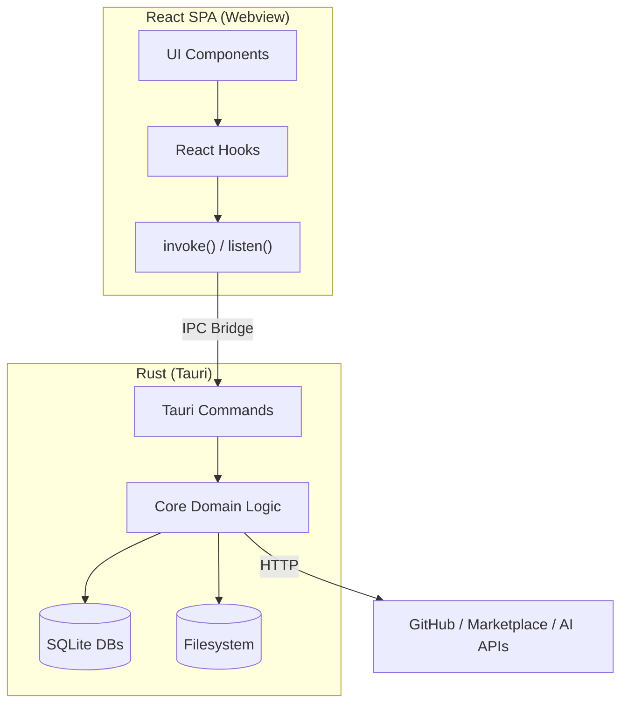
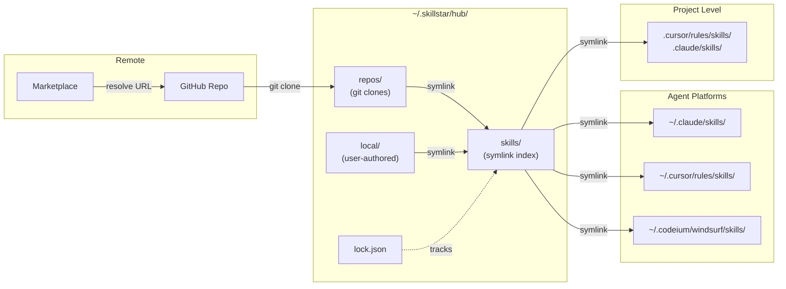
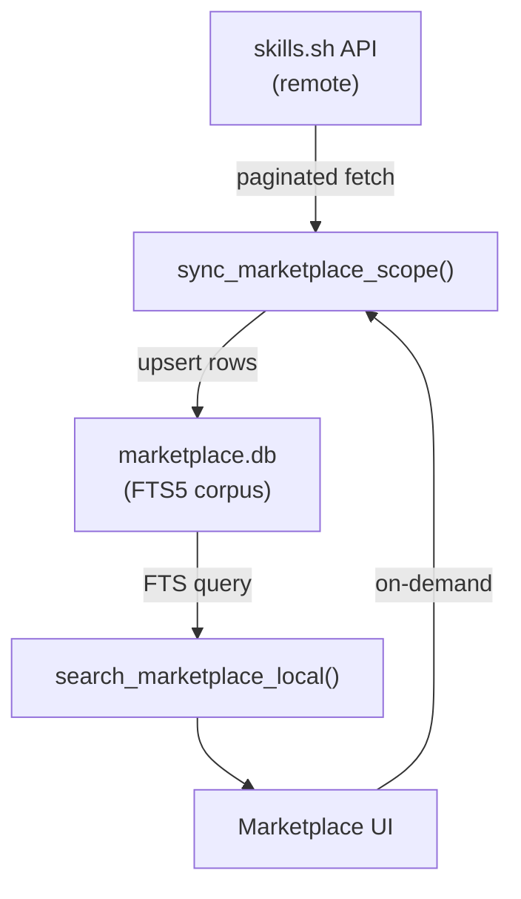
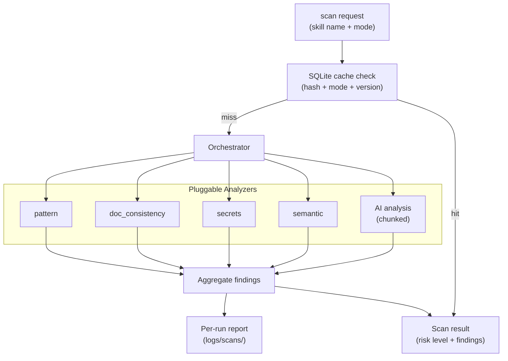

# SkillStar Architecture

## System Overview

SkillStar is a **Tauri v2 desktop app** (Rust backend + React SPA frontend) that manages AI agent skills across multiple agent platforms.



## Data Flow: Hub → Local → Project Symlink

This is the central data model. Skills flow through three stages:



### Key Design Decisions

1. **Symlink-based distribution**: Hub skills are symlinked (not copied) to agent directories. Changes to the hub immediately reflect in all linked agents.
2. **Windows fallback**: When Developer Mode is disabled, `create_symlink()` falls back to NTFS junction points, then directory copies as last resort.
3. **Repo-cached skills**: Multi-skill repos are cloned once to `repos/`, and each skill gets a symlink from `skills/` pointing to its subdirectory.

## Storage Layout

```
~/.skillstar/                    # data_root()
├── config/                      # User-editable configuration
│   ├── ai.json                  # AI provider settings (keys, model, language)
│   ├── proxy.json               # HTTP/SOCKS proxy config
│   ├── github_mirror.json       # Mirror acceleration config
│   ├── profiles.toml            # Custom agent profile definitions
│   └── scan_policy.yaml         # Security scan policy
├── db/                          # SQLite databases
│   ├── marketplace.db           # Local-first marketplace snapshot + FTS
│   ├── translation.db           # Translation cache (hash + lang keyed)
│   └── security.db              # Security scan result cache
├── logs/                        # Runtime logs
│   ├── security.log             # Rolling security scan log
│   └── scans/                   # Per-run timestamped scan reports
├── state/                       # Rebuildable runtime state
│   ├── patrol.json              # Background patrol config
│   ├── projects.json            # Registered projects manifest
│   ├── groups.json              # Skill groups (Decks)
│   ├── packs.json               # Installed packs registry
│   └── scan_smart_rules.yaml    # Smart triage rules
└── hub/                         # hub_root() — all skill data
    ├── skills/                  # Central symlink index
    ├── local/                   # User-authored local skills
    ├── repos/                   # Cached git repositories
    ├── publish/                 # Publish staging area
    └── lock.json                # Installation lockfile
```

### Environment Overrides

| Variable | Default | Purpose |
|---|---|---|
| `SKILLSTAR_DATA_DIR` | `~/.skillstar` | App root override |
| `SKILLSTAR_HUB_DIR` | `~/.skillstar/hub` | Hub root override |
| `SKILLSTAR_LOG_JSON` | *(unset)* | Enable JSON structured logging |

## IPC Communication Model

### Command Layer

```
Frontend                          Backend
─────────                         ───────
invoke("list_skills")       →     commands::list_skills()
                                      → core::installed_skill::list_installed_skills()
                                      → returns Vec<Skill>

invoke("ai_translate_skill_stream", { content })
                             →     commands::ai::translate::ai_translate_skill_stream()
                                      → core::ai_provider::translate_stream()
                                      → emits "ai://translate-stream" events
```

### Streaming Events

| Event | Phases | Use |
|---|---|---|
| `ai://translate-stream` | `start` → `delta`* → `complete`/`error` | SKILL.md translation |
| `ai://summarize-stream` | `start` → `delta`* → `complete`/`error` | Skill summarization |
| `marketplace://ready` | *(one-shot)* | Startup marketplace sync done |
| `patrol://enabled-changed` | *(one-shot)* | Background patrol toggle |

## Marketplace Data Flow



**Local-first principle**: UI reads from SQLite snapshot first. Remote sync happens on-demand or via background refresh. Never blocks the UI on network.

## Security Scan Pipeline



**Key rules**:
- Cache keys distinguish scan mode (`static` vs `ai`) and scanner version
- Partial AI failures are NOT cached as `Safe`
- File-level cache writes are batched per skill to reduce SQLite contention
- AI concurrency is globally bounded across all active scans

## Agent Profile System

Agent profiles define where skills are symlinked for each AI assistant:

| Agent | Global Skills Path | Project Skills Path |
|---|---|---|
| Claude | `~/.claude/skills/` | `.claude/skills/` |
| Cursor | `~/.cursor/rules/skills/` | `.cursor/rules/skills/` |
| Windsurf | `~/.codeium/windsurf/skills/` | `.windsurf/skills/` |
| *(custom)* | User-defined | User-defined |

Profiles are:
- **Builtin**: Defined in `agent_profile::builtin_profiles()`, always available
- **Custom**: Stored in `config/profiles.toml`, user-defined via UI

## Build & CI

| Workflow | Trigger | Purpose |
|---|---|---|
| `ci.yml` | push/PR to main | Frontend lint/test + cross-platform Rust check/test |
| `security-scan.yml` | push/PR + weekly | CodeQL + skill scan gate |
| `release.yml` | version tags | Cross-platform build + notarize + publish |

See [AGENTS.md](../AGENTS.md) for complete project conventions and rules.
