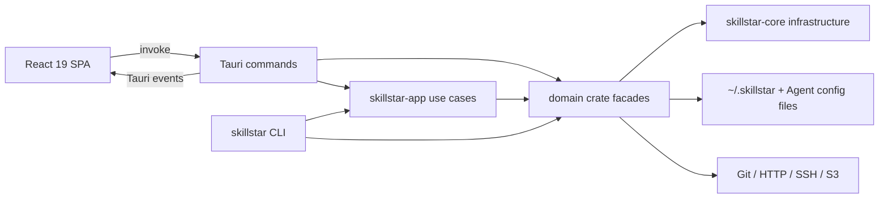

# SkillStar 运行架构

状态：active

本文件描述运行拓扑、数据所有权、持久化和必须保持的不变量。目录职责与依赖方向见 [boundaries.md](./boundaries.md)。

## 交付面与组合根

SkillStar 有一个 Rust package 交付两个入口：桌面 GUI 和 `skillstar` CLI。`src-tauri/src/main.rs` 决定进入 CLI 还是启动 Tauri；`src-tauri/src/lib.rs` 组装插件、State、命令和窗口生命周期。

前端不直接触达业务文件或网络。GUI 和 CLI 应复用同一域实现；表现层只负责输入输出差异。

## 技术选择的事实源

版本不在文档硬编码：

- 前端依赖与脚本：根 `package.json`、`bun.lock`、`package-lock.json`。
- Rust edition、workspace 和共享依赖：根 `Cargo.toml`、各 package `Cargo.toml`、根 `Cargo.lock`。
- Tauri 权限、bundle 和 updater：`src-tauri/tauri.conf.json`、`src-tauri/capabilities/`。
- CI 和发布：`.github/workflows/`。

当前实现使用 React/TypeScript/Vite/Tailwind、Tauri/Rust/Tokio、SQLite、JSON/TOML 配置、gitoxide/git 子进程，以及 SSH/S3 传输。精确版本只从 manifest 读取。

## 数据所有权

默认数据根为 `~/.skillstar/`，可通过环境变量覆盖。路径解析必须来自 `skillstar-core`，调用方不能自行拼接另一个“默认路径”。

| 数据 | 默认位置 | 所有者 |
| --- | --- | --- |
| 全局配置、日志和状态 | `~/.skillstar/{config,logs,state}/` | `skillstar-core` + 对应域 |
| SQLite 数据库 | `~/.skillstar/db/` | marketplace 等具体模块 |
| 已安装、创作和仓库技能 | `~/.skillstar/hub/{skills,local,repos,content}/` | `skillstar-skills` |
| Skill 安装来源、Git tree 与完整内容 baseline | `~/.skillstar/hub/lock.json` | `skillstar-skills::lockfile` 持久化；`skillstar-skills::skill_update` 独占更新事务 |
| Skill 图文教程 artifact | `~/.skillstar/tutorials/<skill-key>/{tutorial.html,metadata.json}` | `skillstar-skills` 提供内容快照并拥有校验/freshness/原子持久化；`src-tauri::core::skill_tutorial` 只编排 ACP 会话 |
| Project 技能 manifest | `~/.skillstar/state/projects/` | `skillstar-skills`；共享项目路径只记录一个 Agent owner |
| 技能 update 可用状态 | `~/.skillstar/state/skill_update_states.json` | `skillstar-skills::update_state` 唯一所有者；批量 refresh、patrol 和 update 完成都写穿它，UI 与事件只是投影 |
| Agent profile 与可消费的技能部署 | `~/.skillstar/config/profiles.toml`；Agent 用户级目录或项目内 `.agents/skills`/专属目录 | `skillstar-skills` 持有手动激活偏好并从 hub 物化；内置路径/能力跟随 `vercel-labs/skills` 注册表基线，Agent 不拥有 canonical 内容 |
| Models provider 与工具同步状态 | `~/.skillstar/config/` 及 Agent 配置文件 | `skillstar-models` |
| Usage 订阅和 OAuth/token 状态 | `~/.skillstar/config/usage/` | `skillstar-usage`；跨域 CLI 激活由 `skillstar-app` 编排 |
| SSH 主机元数据 | `~/.skillstar/config/ssh_hosts.toml` | `skillstar-sync::ssh` |
| S3 目标元数据和设备状态 | `~/.skillstar/config/s3_targets.toml`、`state/sync_device.json` | `skillstar-sync` |
| GitHub 用户登录凭据 | OS 系统凭据存储（service `skillstar-github-auth`，account `github.com`） | `skillstar-skills::github_auth`；普通配置只保存非敏感共享频道状态 |
| 共享频道订阅、发布目标与升级策略/状态 | `~/.skillstar/config/shared_channel_subscriptions.json` | `skillstar-skills::shared_channels`；只保存 repository ID、release target、所选 Skill、安装 baseline/provenance、逐 Skill 历史 pin、按频道自动升级偏好与最近逐项结果，不保存 GitHub 凭据 |

敏感凭证不得明文写入普通配置：SSH 兼容服务名保持 `skillstar-ssh`；S3 使用 `skillstar-sync`；Usage token 使用域内加密存储或系统凭证设施。具体行为见对应功能文档。

## 核心不变量

### IPC 与命令层

- Tauri command 是边界 adapter，不是业务模块。
- 长任务通过带 `session_id` 的结构化事件反馈；组件生命周期监听统一处理异步 cleanup race。
- 命令注册、前端 IPC 声明和 dev mock 必须一起演进。

### 文件和部署

- 技能向 Agent/项目部署优先 symlink；平台不允许时回退 junction/copy。
- SkillStar hub 是安装后的 canonical source；兼容 Agent 的项目级 universal surface 是 `.agents/skills`。多个 Agent 指向同一物理路径时，manifest 只保留一个 owner，部署、清理与 reconciliation 必须按路径去重。
- 内置 Agent 注册表区分 Home、XDG config、环境变量覆盖、动态 OpenClaw 根和不支持全局目录；空全局路径只能表示项目级 Agent，任何全局部署入口都必须先做能力检查。
- 本机 Agent 不做 PATH、桌面应用或目录存在性探测；profile 默认关闭，Settings 持久化开关是进入所有本机 Agent 投影的唯一激活来源。冻结 IPC 字段 `installed` 仅镜像 `enabled`，不得恢复为探测状态。
- reconciliation 同时处理新增和删除；失败的 staged swap 不得先破坏可用部署。
- 判断一个 hub 条目是否为 repo cache 链接只有一个实现；symlink 与 Windows junction 必须由同一入口解析，否则 update 检测与 update 应用会对同一技能得出不同结论。
- 扫描、检测等只读动作不得创建用户目录。
- 所有覆盖写入使用临时文件/目录和原子替换，尽量保留已有可用状态。
- Git-backed Skill 更新前必须用 `lock.json` v5 的带算法版本完整内容 baseline 做 fail-closed 检查。共享同一物理 checkout 的 Skill 作为一个保护单元：任一分歧未显式保留或丢弃前不得 fetch/reset；pull 后的内容快照或 lockfile 提交失败时，checkout 回滚到旧 revision、旧 sparse 配置和更新前受管内容。
- Skill 更新/分歧解决使用进程内互斥与数据目录中的跨进程文件锁串行化；等待锁后必须重新检查完整内容 baseline，不能复用锁外的“未修改”判断。
- `resolve_skill_update` 是 GUI 的分歧解决 IPC facade；command 只适配 DTO/异步调度，保留副本、子树清理、整组复检和继续更新都由 `skillstar-skills::skill_update` 完成。前端 IPC 声明、dev mock 与全局选择对话框必须同步该契约。

### 网络

- HTTP 统一通过 `probe_http_client`，确保代理配置和探测策略一致。
- `github.com` GitHub App 用户登录使用设备授权流；access/refresh token 只经系统凭据抽象读写，设备码和已解析身份只保存在进程内。到期时间必须来自 GitHub 响应元数据，登出同时清除钥匙串凭据、待处理授权与内存身份。
- 私有 GitHub 仓库的扫描、克隆、检查和更新由 `skillstar-skills` 的统一 Git operation session 执行。session 在开始时从认证 facade 取得短期 access token，只向规范化的 `github.com` HTTPS 操作注入临时 askpass 环境；它不得持久化凭据，并负责非交互、代理、取消、进度和敏感信息清洗。Tauri 和未来 CLI 只适配该域入口。
- 组织私有共享频道由 `skillstar-skills::shared_channels` 拥有。GitHub 数字 repository ID 是跨重命名稳定身份；本地版本化 registry 只保存非敏感描述符和创建状态。创建前校验 selected-repository 安装及 Administration/Contents write，由 App 用户身份创建仓库；远端创建后必须先持久化 pending，再只读校验 GitHub 自动授予的 App 仓库访问并转 active。GitHub App 用户令牌不得用于修改安装仓库范围。
- 频道订阅是第二次、本地且显式的同意：GitHub invitation 只授予仓库访问，订阅 facade 重新验证最新不可变 Release，Git scanner 固定到 manifest commit 并核对所选 content roots/hashes，之后才通过 staged Skill installer 写入 hub。版本化 subscription store 保存选择、release target 与非敏感 provenance；未知 schema 只能投影为只读摘要。新增 Skill 不自动加入既有选择，订阅写盘失败必须回滚本次新安装。
- 频道升级 facade 默认检查、显式应用，并以订阅 Skill 为隔离事务单元。它从最新已验证 Release 与每项已安装 release hash/provenance 推导频道状态；只把完整内容仍等于 baseline 的 updated Skill 切到目标 commit 的隔离 ref cache。分歧或失败项保留旧 checkout，成功项独立前进；新增项只通知、removed 项不隐式删除。每项事务复用统一分歧解决、update state、Agent/Project reconciliation 与回滚接缝，最近一次检查结果持久化以支持重启和离线展示。
- 单 Skill 历史回滚也由频道升级 facade 编排：它在同一仓库的已验证 manifest 集合中将当前 provenance/hash 解析为唯一安装 Release，只允许更早且仍包含该 Skill 的精确 target，再复用 staged update transaction 替换文件与部署。成功只更新该 Skill 的安装事实并写入 pin，不倒退频道整体 target；手动与自动批量应用均排除 pin。恢复跟随以一次 subscription store 事务清 pin 并按最新 Release 重建计划，不在该动作中直接替换 Skill。
- Release 移除是 manifest 与本地 tracked 集合的差异状态，不是删除指令。频道 facade 保留 Hub 内容、lockfile 与部署，直到用户显式卸载或转为本地副本；前者复用统一卸载清理，后者先以完整内容快照建立 `skills-local` 所有权，再解除频道跟踪。Hub/lockfile 先进入可恢复 staging，subscription store 在同一共享 mutation/update transaction 内提交；metadata 失败会恢复 Hub/lockfile 并删除未提交的本地安全副本，metadata 成功后的部署清理失败则保留已解除跟踪事实并报告剩余清理。未处理的 removal tombstone 会跨后续 Release 保留；移除 tracked/known/pin 后，未来同名重加只能进入带最终内容/provenance 校验的显式 staged install 路径。
- GitHub 成员撤销与订阅访问冻结是两端独立、以远端为准的状态机。owner 端只删除 direct collaborator，随后复查 effective permission 并区分完全撤权、继承访问和未确认错误；subscriber 端只在明确的无读取权限响应后持久化 `revoked`，冻结所有需要远端内容的 mutation，但保留 Hub、lockfile、部署与逐项转本地/卸载能力。网络或协议暂时失败不改变上次已知授权事实；冻结后的检查仅用于探测权限恢复，成功验证仓库身份后才恢复下载。
- 后台检查与受保护自动升级复用上述 facade，不是第二套更新器。`skillstar-skills` 以注入时间为所有订阅判定一小时检查窗口并持久化结果；只有按频道显式开启的偏好才允许选择并应用安全项。Tauri `core` 只负责应用进程存活期间的分钟级唤醒、可取消认证会话和事件通知。自动与手动扫描/应用共享 subscription mutation lease，实际文件替换继续共享全局 Skill update transaction lock，因此普通更新器并发移动 checkout 时，自动路径必须在写入前重新检查并暂停该项。
- 已有仓库注册使用独立的进程内 registration session：session 把扫描预览、数字 repository ID 与确认动作绑定，扫描 generation 让取消结果不能被晚到响应复活，确认先原子 claim，失败才恢复原 session。取消、成功、GitHub 登出或进程退出后 session 失效。仓库库存来自当前 revision 的完整 tracked tree，Skill 目录按 tree 按需物化；扫描复用操作级 Git session 的凭据、代理、进度与取消能力。本地 registration session 只保存非敏感库存预览，不保存 Git 凭据或 checkout 路径。确认时必须重新向 GitHub 校验 ID、组织、私有性、Admin 与 selected-repository 访问，再以 registry 锁原子拒绝重复绑定。
- 频道发布真相位于 GitHub 的不可变 revision tag 与 Release：annotated tag message 是版本化 release manifest，tag 最终指向预览时的精确 commit；普通 branch HEAD 不构成订阅版本。只有可验证的正式 Release 才对订阅者可见，孤立 tag 仅保留 revision、防止进程中断后复用编号。发布扫描使用操作级凭据的隔离 partial clone，不触碰共享 repo cache；预览 session 仅在进程/当前 GitHub 登录生命周期内保存非敏感 commit、Skill hash 和变更集，空闲过期回收，确认前重新校验远端 HEAD、仓库私有/组织身份与用户有效写权限。只有远端 tag ref 和 Release 均成功后才向 UI 返回成功，本地 registry 不提前维护可与远端分叉的 revision 计数。
- 频道成员、有效角色和 open invitations 的运行时真相只位于 GitHub。SkillStar 用当前 GitHub App user identity 调用 collaborator/invitation API，管理动作先按稳定 repository ID 刷新路由并重新验证 Admin；本地不持久化成员、邀请历史或 share code。接受 invitation 是可恢复的跨系统事务：先落非敏感 `awaiting_invitation_acceptance` descriptor，再修改 GitHub，最后转 active；最后落盘失败或 GitHub 响应丢失/5xx 导致结果不确定时保留 marker，后续从当前用户可见私有仓库库存按 repository ID 和远端读权限恢复，不能要求已经被 GitHub 消费的 invitation 再次出现。只有明确远端拒绝才回滚 marker。邀请 inbox 只能依据 GitHub 返回的组织私有仓库 invitation 让用户显式导入，因为 GitHub invitation 没有承载 SkillStar 自定义元数据的字段。
- 认证 Git 操作绕过第三方 GitHub 镜像，防止凭据转发；公开操作可以继续使用镜像回退。Git 子进程使用当前 SkillStar 代理配置，不读取或修改用户的全局 Git 凭据状态。
- GitHub mirror 只影响单次 Git 命令，不修改用户全局 Git 配置；传输失败允许直接 GitHub fallback 和熔断。
- SSH 在发送认证材料前完成 host-key gate；远端命令检查退出码并设置超时，SFTP 路径显式解析为绝对路径。

### 跨进程与凭证事务

- Usage 刷新、账号切换和凭证写入按 catalog 串行化，并在必要时使用 OS 文件锁。
- 账号切换必须把“卡片 active 状态”和目标 CLI 凭证视作一个可回滚事务；失败时保留原可用账号。
- 外部 Agent 配置的测试必须改写到临时 home，不能触碰开发者真实配置。

### 本地优先

- Marketplace 和已安装技能列表优先从本地快照返回；远程刷新是显式的后续动作。
- SQLite 使用适合并发读的短连接/WAL 模式；页面不得用浏览器网络请求绕过快照层。

### ACP 教程生成

- Skill 教程走独立 ACP 子进程，不复用 Models provider 的 HTTP 翻译链路。会话根固定为当前 Skill 的隔离快照，模型读取递归清单后只返回自包含 HTML 文件内容；SkillStar 在本机落盘，不接受在线链接替代 artifact。
- 持久化教程是昂贵生成结果而不是临时页面状态。可复用性的判据是当前内容 hash、Settings 所选教程风格、规范化界面语言、完整 prompt bundle hash 和 artifact schema 均匹配；不匹配的旧 artifact 仍可展示，但状态必须是 stale。
- HTML 在后端完成结构、完整清单覆盖和主动内容安全校验；前端再以无脚本、无同源权限的 sandbox iframe 隔离展示。两层都不能把模型输出当作可信应用 DOM。
- 生成事务采用“快照 → ACP → 再快照 → DOM/CSP/文件覆盖校验 → 跨进程锁 → 同步落盘 → staging/backup 目录替换”。启动读取会恢复中断窗口留下的最后一个已提交 backup；ACP 失败、输出不合格或生成期间内容变化时，最后一个可用 artifact 保持不变。

## 前端运行模型

- `App.tsx` 负责顶层布局、路由和真正跨页的导航状态。
- 页面是薄组合层；TanStack Query hooks 与 feature API wrapper 管理服务端状态。
- 全局不引入额外 state manager，除非有被记录的设计决策。
- i18n 的 `en` 与 `zh-CN` 同步；Tauri 事件流必须处理 start/delta/complete/error 和中断清理。

## 发布与验证

- Linux/macOS CI 使用 Bun；Windows CI 使用 npm，二者分别验证 lockfile 和平台差异。
- tag `v*` 触发 Tauri 多平台发布；签名 updater 由 `release.yml` 和 `tauri.conf.json` 共同定义。
- 日常完整门槛见根 [AGENTS.md](../AGENTS.md)；功能级验证见对应 `docs/features/` 文档。

## 变化触发器

修改 composition root、IPC/event 契约、数据位置、凭证边界、网络 fallback、发布拓扑或持久化所有权时，先更新本文件，再更新对应功能文档和测试。
