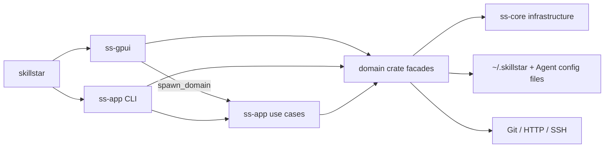

# SkillStar 运行架构

状态：active

本文件描述运行拓扑、数据所有权、持久化和必须保持的不变量。目录职责与依赖方向见 [boundaries.md](./boundaries.md)。

## 交付面与组合根

SkillStar 有一个产品二进制 `skillstar`。`crates/skillstar/src/main.rs` 先处理 MCP serve，再处理 askpass，再把已知 CLI 子命令交给 `ss-app`，其余启动 GPUI。GUI 直接调用域 facade，没有 IPC 层。

```mermaid
flowchart LR
  BIN["skillstar"] --> GUI["ss-gpui"]
  BIN --> CLI["ss-app CLI"]
  GUI -->|spawn_domain| APP["ss-app use cases"]
  GUI --> DOMAIN["domain crate facades"]
  CLI --> APP
  CLI --> DOMAIN
  APP --> DOMAIN
  DOMAIN --> INFRA["ss-core infrastructure"]
  DOMAIN --> DATA["~/.skillstar + Agent config files"]
  DOMAIN --> NET["Git / HTTP / SSH"]
```

GUI 不绕过域 facade 去碰业务文件或网络。GUI 和 CLI 复用同一域实现；表现层只负责输入输出差异。

SKILL.md frontmatter 解析、诊断与安装门禁统一归技能域；发现、安装和打包复用 `ss-skills::validation` 接口。解析实现保持私有模块，不另设规范解析 crate（D-099）。

## 技术选择的事实源

版本不在文档硬编码：

- Rust edition、workspace 和共享依赖：根 `Cargo.toml`、各 package `Cargo.toml`、根 `Cargo.lock`。
- 产品版本：`crates/skillstar/Cargo.toml`。
- 依赖审查：根 `deny.toml`。
- CI 和发布：`.github/workflows/`。

当前实现使用 GPUI、Rust/Tokio、SQLite、JSON/TOML 配置、gitoxide/git 子进程，以及 SSH 传输。精确版本只从 manifest 读取。

## 数据所有权

默认数据根为 `~/.skillstar/`，可通过环境变量覆盖。路径解析必须来自 `ss-core`，调用方不能自行拼接另一个“默认路径”。顶层目录分类（config/data/secrets/cache/state/runtime/logs）、落位判定与旧位置迁移映射的唯一事实源是 [storage-layout.md](./storage-layout.md)。

| 数据 | 默认位置 | 所有者 |
| --- | --- | --- |
| 顶层目录分类（config/data/secrets/cache/state/runtime/logs） | 按数据用途分组，规则见 [storage-layout.md](./storage-layout.md) | `ss-core` + 对应域 |
| 市场快照 SQLite（可重建缓存） | `~/.skillstar/cache/marketplace/` | `ss-marketplace` |
| 已安装技能规范副本 | `~/.skillstar/data/skills/installed/<name>`（真实目录；`SKILLSTAR_DATA_DIR` 重植数据根时一起搬走） | `ss-skills::materialize` 写入，`installer`、更新和频道升级调用它（[D-100](./decisions.md#d-100已安装技能的规范副本放在-skillstar-数据根)） |
| Skill 安装锁（`.skill-lock.json` v3） | `~/.skillstar/data/skills/.skill-lock.json` | `ss-skills::skill_lock`。读侧对过新、损坏和过旧都展示为空且不改文件；写侧对过新或损坏先备份再拒绝，对旧 schema 备份后重写（[D-094](./decisions.md#d-094技能物化统一为校验暂存交换原语部署所有权由链接目标或部署标记证明)） |
| 安装锁文件锁 | `~/.skillstar/runtime/locks/skills/skill-lock.lock` | `ss-skills::skill_lock`；只串行化锁文件的读改写 |
| 技能事务锁 | `~/.skillstar/runtime/locks/skills/update.lock` | `ss-skills::skill_update`。安装、更新、频道升级和发布的网络在锁外；修复计划按锁重装时在已持有的锁内拉取（[D-098](./decisions.md#d-098技能生命周期不变量)） |
| 本地创作 Skill | `~/.skillstar/data/skills/local/<name>`，经 `~/.skillstar/data/skills/installed/<name>` 链接暴露 | `ss-skills::local_skill`；v3 迁移随目录移动重建 Agent 链接（[storage-layout.md](./storage-layout.md)） |
| 本地 Skill 长期身份 sidecar | `~/.skillstar/data/skills/local/<name>/.skillstar/identity.json` | `ss-skills::local_identity`；`.skillstar` 不进入内容 hash |
| 旧安装模型残留清理标记 | `~/.skillstar/state/agents-migration-done` | `ss-skills::legacy_cleanup`；首次启动幂等清理 `~/.skillstar/hub/{skills,repos}`、旧 `lock.json` 与指向旧 hub `skills/repos/content` 的 Agent 链接；指向 `hub/local` 的链接由 v3 迁移重指（[storage-layout.md](./storage-layout.md)） |
| Project 技能 manifest | `~/.skillstar/state/projects/` | `ss-skills`；共享项目路径只记录一个 Agent owner |
| 技能 update 可用状态 | `~/.skillstar/state/skill_update_states.json` | `ss-skills::update_state` 唯一所有者；保存每技能 `update_available/upstream_change/checked_at` 投影，刷新与更新完成都写穿它，批量检查以 stamp/commit 防止旧结果覆盖新结果，UI 与事件只是投影 |
| 技能安装内容基线 | `~/.skillstar/data/skills/install_baselines.json` | `ss-skills::install_baseline`；安装/更新成功后记 canonical 内容 hash、卸载时删除，只供自动更新判断本地修改（[D-095](./decisions.md#d-095更新检测按-tree-逐层解析安装基线保护自动更新频道升级由类型化授权与本地备份承担)），不进入安装锁 |
| GitHub API 限流冷却 | `~/.skillstar/state/skills/github_api_cooldown.json` | `ss-skills::update_check`；记录 GitHub 返回的限流截止时间，截止前更新检查直接走克隆回退 |
| 本机团队智能（learnings / usage / recall / friction） | `~/.skillstar/state/team.json` | `ss-skills::team`；schema v1，未来版本 fail-closed。不是已删除的 `learning/` 教程树 |
| Agent profile、手动激活偏好与临时技能恢复 journal；可消费的技能部署 | `~/.skillstar/config/profiles.toml`；Agent 用户级目录或项目内 `.agents/skills`/专属目录 | `ss-skills::agents` 持有 profile 偏好和按物理 Global skills 目录保存的恢复 journal；部署以 `~/.skillstar/data/skills/installed` 为 canonical source 创建链接；`ss-skills::workflows::agent_managed_skills` 编排“先写 journal、后停用 / 仅 journal 恢复”事务。内置路径/能力跟随 skills CLI 注册表基线，Agent 不拥有 canonical 内容 |
| 模型域遗留数据（provider store、网关配置/账本、决策权重） | `~/.skillstar/config/model_providers*.json`、`model_gateway.json`、`~/.skillstar/gateway/usage.jsonl`、`~/.skillstar/models/`、`cache/{model_catalog,gateway-catalog}/` | 模型域已整体移除（[D-082](./decisions.md)）：这些文件不再被写入，留在磁盘不主动清理；`model_gateway.json` 的 `prices` 覆盖与 `cache/gateway-catalog/models.dev.json` 仍被 `ss-usage::pricing` 只读，用于消费汇总的读时计价 |
| Usage 订阅和 OAuth/token 状态（含加密 token，整体按秘密保护） | `~/.skillstar/secrets/accounts/usage/`；刷新/存储锁在 `runtime/locks/accounts/` | `ss-usage`；账号用例与消费汇总由 `ss-usage::accounts` 编排 |
| CLI 凭据托管快照（整文件软链 custody） | 默认 `~/.skillstar/secrets/accounts/cli/<catalog_id>/<subscription_id>.json`；已有旧 catalog 路径兼容见 [storage-layout.md](./storage-layout.md) | `ss-usage::usage_switch`（D-077）；live 路径是 CLI 自己读取的凭证文件 |
| Agent 会话解析增量 checkpoint 索引 | `~/.skillstar/cache/sessions/index.json` | `ss-usage::sessions`（`sessions/checkpoint.rs`，原子替换）；纯派生缓存，删掉只是下次全量重读，不写 Agent 目录 |
| 桌面应用多开 profile 与清单 | `~/.skillstar/data/instances/<app>/<instance-id>/`；清单 `~/.skillstar/data/instances/app_instances.json` | `ss-core` 解析路径；`ss-usage::instances` 拥有清单、argv 与 PID 匹配。启动走 `--user-data-dir`，不改默认 `~/Library/Application Support/*` 或 `~/.grok` |
| SSH 主机元数据；SSH 加密凭据 | `~/.skillstar/config/ssh_hosts.toml`；`~/.skillstar/secrets/ssh/credentials.json` | `ss-sync::ssh` |
| GitHub 用户登录凭据 | `~/.skillstar/secrets/github/auth.json`（Unix `0600`） | `ss-skills::github_auth`；普通配置只保存非敏感共享频道状态 |
| 共享频道订阅、发布目标与升级策略/状态 | `~/.skillstar/config/shared_channel_subscriptions.json` | `ss-skills::channels::shared_channels`；只保存 repository ID、release target、所选 Skill、安装 baseline/provenance、逐 Skill 历史 pin、按频道自动升级偏好与最近逐项结果，不保存 GitHub 凭据 |
| 项目技能计划、批准和回执 | `~/.skillstar/state/project-skill-plans/`、`project-skill-approvals/`、`project-skill-receipts/` | `ss-app::project_skills_mcp`。项目写入的跨进程锁是 `state/project-write.lock`，所有者是 `ss-skills::projects::write_lock` |
| 技能描述与 SKILL.md 译文 | `cache/translations/entries.json`；偏好 `config/translation.json` | `ss-core::translation`。大模型只读账户里的 OpenCode Go、Ollama、Command Code API Key，不另存一份密钥。没手动改过模型时，用该服务的推荐模型（OpenCode Go 为 `deepseek-v4.1-flash`）。用户点拉取时才请求 `{base}/models`。描述和 SKILL.md 各有一个开关，默认关。壳只在对应开关打开、且界面语言为中文时读缓存并排队缺失项；关掉开关仍留着缓存，再打开直接用。机翻、大模型翻译和模型列表都走 `probe_http_client`。密钥不进缓存键 |

敏感凭证不得明文写入普通配置：SSH 兼容服务名保持 `skillstar-ssh`；Usage token 使用域内加密存储或系统凭证设施。具体行为见对应功能文档。

## 核心不变量

### 进程入口

- MCP serve 在 askpass 和市场快照初始化之前返回。它不调用 `ss_app::bootstrap::prepare_process`。
- Windows release 保持 `windows` subsystem，不调用 `AllocConsole`。MCP 继承父进程已经重定向的管道。
- 未知参数落入 GPUI，这样系统启动器仍能打开应用。深链注册本身没有移植。
- 长任务的取消和进度属于域 session。GPUI 目前没有托盘、深链或签名更新器。

### 文件和部署

- 技能向 Agent/项目部署优先 symlink；平台不允许时回退 junction/copy。全局安装的 canonical source 是 `~/.skillstar/data/skills/installed/<name>` 真实目录副本；全局目录本身就是这个规范根的 Agent 不建链。`~/.agents/skills` 不是规范根。
- 内置 Agent 注册表区分 Home、XDG config、环境变量覆盖、动态 OpenClaw 根和不支持全局目录；空全局路径只能表示项目级 Agent，任何全局部署入口都必须先做能力检查。
- 本机 Agent 不做 PATH、桌面应用或目录存在性探测；profile 默认关闭，Settings 持久化开关是进入所有本机 Agent 投影的唯一激活来源。冻结 IPC 字段 `installed` 仅镜像 `enabled`，不得恢复为探测状态。
- reconciliation 同时处理新增和删除；失败的 staged swap 不得先破坏可用部署。
- 规范副本经暂存交换写入，不在原目录上覆盖。配置与状态等覆盖写入仍使用临时文件和原子替换。
- 本地扫描、检测等只读动作不得创建用户目录；用户主动导入远程来源允许写入可清理的导入缓存。
- 技能从获取到纳管的规则见 [Skills 生命周期](./features/skills/README.md#生命周期)。普通导入的持久 Git 缓存由 `ss-skills::fetch` 拥有，以仓库/ref 互斥；完整快照仍用临时 checkout。规范副本是独立目录。Agent 与项目侧只触碰 `deployment::ownership` 判定为 SkillStar 拥有的条目。每次扫描或物化均经操作级 Git session，跨请求只复用仓库对象，不保存认证 session。手动更新在上游 tree 变化时覆盖式重装；自动更新按安装基线跳过已改副本。安装来源只在 `skill_lock` 里。
- `skillstar doctor` 与设置存储页的修复、纳管都在 `ss-app` 里调用域计划：健康是 `ss-skills::health`，纳管是 `ss-skills::local_skill::intake`。GUI 存活期间的监测仍由 `skill_wake` 与 `channel_wake` 唤醒，不在壳里另计时。
- 判断一个条目是否指向 canonical 副本只有一个实现；symlink 与 Windows junction 必须由同一入口解析。

### 网络

- 短探测和有总超时的 HTTP 走 `probe_http_client`。上游流式生成走同一模块的 `stream_http_client`：同一份 `proxy.json` 指纹，连接有上限，响应体没有总超时。两条路径都不另读一套代理。SOCKS5 出网使用 `socks5h`（远端 DNS）；bypass 列表进入 client fingerprint。
- 匿名 GitHub 族 HTTP（raw / codeload / objects / gist / 无凭据的 `api.github.com`）经 `github_http::get_anonymous` 走健康加速源链，失败回直连。带 `Authorization` 的请求禁止进入该入口。
- GitHub mirror 影响单次 Git 命令与匿名 HTTP，不修改用户全局 Git 配置；连续失败熔断 20 分钟，保存配置重置；传输失败允许直接 GitHub fallback。
- `ss-skills::github_auth` 的 GitHub App 用户登录使用设备授权流；access/refresh token 只经凭据抽象读写，设备码和已解析身份只保存在进程内。到期时间必须来自 GitHub 响应元数据，登出同时清除本地凭据、待处理授权与内存身份。
- 私有 GitHub 仓库的扫描、克隆、检查和更新由 `ss-git` 的统一 Git operation session 执行。session 在开始时从认证 facade 取得短期 access token，只向规范化的 `github.com` HTTPS 操作注入临时 askpass 环境；它不得持久化凭据，并负责非交互、代理、取消、进度和敏感信息清洗。CLI 和 GPUI 只适配该域入口。
- 组织私有共享频道由 `ss-skills::channels::shared_channels` 拥有。GitHub 数字 repository ID 是跨重命名稳定身份；本地版本化 registry 只保存非敏感描述符和创建状态。创建前校验 selected-repository 安装及 Administration/Contents write，由 App 用户身份创建仓库；远端创建后必须先持久化 pending，再只读校验 GitHub 自动授予的 App 仓库访问并转 active。GitHub App 用户令牌不得用于修改安装仓库范围。
- 频道订阅是第二次、本地且显式的同意：GitHub invitation 只授予仓库访问，订阅 facade 重新验证最新不可变 Release，Git scanner 固定到 manifest commit 并核对所选 content roots/hashes，之后才通过 staged Skill installer 写入 hub。版本化 subscription store 保存选择、release target 与非敏感 provenance；未知 schema 只能投影为只读摘要。新增 Skill 不自动加入既有选择，订阅写盘失败必须回滚本次新安装。
- 频道升级 facade 默认检查、显式应用，并以订阅 Skill 为隔离事务单元。它从最新已验证 Release 与每项已安装 release hash/provenance 推导频道状态；只把完整内容仍等于 baseline 的 updated Skill 切到目标 commit 的隔离 ref cache。分歧或失败项保留替换前的规范副本（升级前留下的隐藏副本，不重新拉取），成功项独立前进；新增项只通知、removed 项不隐式删除。每项事务复用统一分歧解决、update state、Agent/Project reconciliation 与回滚接缝，最近一次检查结果持久化以支持重启和离线展示。
- 单 Skill 历史回滚也由频道升级 facade 编排：它在同一仓库的已验证 manifest 集合中将当前 provenance/hash 解析为唯一安装 Release，只允许更早且仍包含该 Skill 的精确 target，再复用 staged update transaction 替换文件与部署。回执的复核、订阅写入和失败补偿与批量升级共用一段流程，见 [Skills 生命周期](./features/skills/README.md#频道升级)。成功只更新该 Skill 的安装事实并写入 pin，不倒退频道整体 target；手动与自动批量应用均排除 pin。恢复跟随以一次 subscription store 事务清 pin 并按最新 Release 重建计划，不在该动作中直接替换 Skill。
- 频道 marketplace 导出是纯本地只读管线：从 subscription registry 读取当前选择与安装 baseline，逐 Skill 重新对 canonical 副本做内容 hash 校验（相等才导出，fail-closed），再由协议叶子 `claude-marketplace`（[D-102](./decisions.md#d-102claude-code-插件市场格式独立为协议叶子-crate)）写出自包含的市场目录（根 `marketplace.json` + 每技能 `plugin.json` + 内容副本）。不经网络、不需要 GitHub 登录；输出目录必须不存在或为空。导出不修改订阅、锁或任何远端状态。
- Release 移除是 manifest 与本地 tracked 集合的差异状态，不是删除指令。频道 facade 保留 Hub 内容、lockfile 与部署，直到用户显式卸载或转为本地副本；前者复用统一卸载清理，后者先以完整内容快照建立 `skills-local` 所有权，再解除频道跟踪。Hub/lockfile 先进入可恢复 staging，subscription store 在同一共享 mutation/update transaction 内提交；metadata 失败会恢复 Hub/lockfile 并删除未提交的本地安全副本，metadata 成功后的部署清理失败则保留已解除跟踪事实并报告剩余清理。未处理的 removal tombstone 会跨后续 Release 保留；移除 tracked/known/pin 后，未来同名重加只能进入带最终内容/provenance 校验的显式 staged install 路径。
- GitHub 成员撤销与订阅访问冻结是两端独立、以远端为准的状态机。owner 端只删除 direct collaborator，随后复查 effective permission 并区分完全撤权、继承访问和未确认错误；subscriber 端把远端探测投影为 `active`、`revoked`、`offline`、`recoverable_failure`、`integrity_error`。非 active 状态一律冻结需要远端内容的 mutation 并保留 Hub、lockfile、部署和最近已验证快照；只有 revoked 额外开放逐项转本地/卸载。频道所有权 guard 位于域层通用 mutation 接缝，覆盖扫描/安装、更新、内容、本地收养、bundle/pack、项目导入及卸载，而不是只靠界面隐藏动作。检查在冻结时仍可只读重试，必须在隔离验证 cache 中重新通过 stable repository/organization ID、权限、manifest/tag/commit/path/hash 全链验证才恢复 active。网络/代理状态不得推断为撤权，完整性错误不得被普通重试结果或旧缓存绕过。该 guard 通过域内窄查询接缝实现：`ss-skills::skill_mutation::SkillMutationPolicy`（默认使用域内频道策略）由 `ss-skills::channels::policy::ChannelAwarePolicy` 实现，策略由技能域直接提供默认值，不依赖 GUI/CLI 启动注册。
- 后台检查与受保护自动升级复用上述 facade，不是第二套更新器。`ss-skills` 以注入时间为所有订阅判定一小时检查窗口并持久化结果；只有按频道显式开启的偏好才允许选择并应用安全项。`ss-app::channel_wake` 只负责 GUI 进程存活期间的分钟级唤醒。它不发桌面通知。自动与手动扫描/应用共享 subscription mutation lease，实际文件替换继续共享全局 Skill update transaction lock，因此普通更新器并发移动 checkout 时，自动路径必须在写入前重新检查并暂停该项。
- 通用技能的后台自动更新遵循同一原则，不是第二套更新器（自动模式额外按安装基线跳过本地已修改的技能，[D-095](./decisions.md#d-095更新检测按-tree-逐层解析安装基线保护自动更新频道升级由类型化授权与本地备份承担)）：偏好是 `config/skill_updates.json` 的 `auto_update`（默认手动）和 `interval_minutes`（默认 1 小时，限于固定档位），`ss-app::skill_wake` 只负责 GUI 进程存活期间的分钟级唤醒与上次运行时间，检查与应用分别复用 `ss-skills::update::auto_update_locked_skills` 包装的既有读侧与 `GitSkillFacade::update_skills`；更新投影仍只有 `ss-skills::update_state` 一处。
- 已有仓库注册使用独立的进程内 registration session：session 把扫描预览、数字 repository ID 与确认动作绑定，扫描 generation 让取消结果不能被晚到响应复活，确认先原子 claim，失败才恢复原 session。取消、成功、GitHub 登出或进程退出后 session 失效。仓库库存来自当前 revision 的完整 tracked tree，Skill 目录按 tree 按需物化；扫描复用操作级 Git session 的凭据、代理、进度与取消能力。本地 registration session 只保存非敏感库存预览，不保存 Git 凭据或 checkout 路径。确认时必须重新向 GitHub 校验 ID、组织、私有性、Admin 与 selected-repository 访问，再以 registry 锁原子拒绝重复绑定。
- 频道发布真相位于 GitHub 的不可变 revision tag 与 Release：annotated tag message 是版本化 release manifest，tag 最终指向预览时的精确 commit；普通 branch HEAD 不构成订阅版本。只有可验证的正式 Release 才对订阅者可见，孤立 tag 仅保留 revision、防止进程中断后复用编号。发布扫描使用操作级凭据的隔离 partial clone，不触碰共享 repo cache；预览 session 仅在进程/当前 GitHub 登录生命周期内保存非敏感 commit、Skill hash 和变更集，空闲过期回收，确认前重新校验远端 HEAD、仓库私有/组织身份与用户有效写权限。只有远端 tag ref 和 Release 均成功后才向 UI 返回成功，本地 registry 不提前维护可与远端分叉的 revision 计数。
- 频道成员、有效角色和 open invitations 的运行时真相只位于 GitHub。SkillStar 用当前 GitHub App user identity 调用 collaborator/invitation API，管理动作先按稳定 repository ID 刷新路由并重新验证 Admin；本地不持久化成员、邀请历史或 share code。接受 invitation 是可恢复的跨系统事务：先落非敏感 `awaiting_invitation_acceptance` descriptor，再修改 GitHub，最后转 active；最后落盘失败或 GitHub 响应丢失/5xx 导致结果不确定时保留 marker，后续从当前用户可见私有仓库库存按 repository ID 和远端读权限恢复，不能要求已经被 GitHub 消费的 invitation 再次出现。只有明确远端拒绝才回滚 marker。邀请 inbox 只能依据 GitHub 返回的组织私有仓库 invitation 让用户显式导入，因为 GitHub invitation 没有承载 SkillStar 自定义元数据的字段。
- 认证 Git 操作绕过第三方 GitHub 镜像，防止凭据转发；公开操作可以继续使用镜像回退。`ss-git` 子进程使用当前 SkillStar 代理配置（SOCKS 为 `socks5h`），不读取或修改用户的全局 Git 凭据状态。
- GitHub mirror 改写 GitHub 族 origin（含 raw/codeload/objects/gist），只影响单次 Git 命令，不修改用户全局 Git 配置；传输失败允许直接 GitHub fallback 和熔断。
- SSH 在发送认证材料前完成 host-key gate；远端命令检查退出码并设置超时，SFTP 路径显式解析为绝对路径。

### 本机项目技能 MCP

- `skillstar mcp serve --stdio` 在 Git askpass 和桌面窗口之前进入 `ss_app::project_skills_mcp::serve`。stdout 只有换行分隔的 JSON-RPC。tracing 写 stderr。
- 该进程只广告 `protocol` 里的项目技能工具。批准不是工具参数。不启用 roots，不提供资源，技能正文不进结果。
- 项目写入先拿技能 update 锁、再拿 `state/project-write.lock`。已经持有项目锁时不再拿 update 锁。
- Windows release 不改 `windows_subsystem`，不调用 `AllocConsole`。父进程接上的管道就是传输。
- 项目技能 MCP 只接受协议 `2026-07-28`。推荐保持 BM25 原序。

### 跨进程与凭证事务

- Usage 刷新、账号切换和凭证写入按 catalog 串行化，并在必要时使用 OS 文件锁。
- 账号切换必须把“卡片 active 状态”和目标 CLI 凭证视作一个可回滚事务；失败时保留原可用账号。
- 外部 Agent 配置的测试必须改写到临时 home，不能触碰开发者真实配置。

### 本地优先

- Marketplace 和已安装技能列表优先从本地快照返回；远程刷新是显式的后续动作。
- SQLite 使用适合并发读的短连接/WAL 模式；GUI 不得另开网络请求绕过快照层。旧市场缓存不逐文件迁移，重建与离线影响见 [存储迁移语义](./storage-layout.md#迁移语义)。

## 壳运行模型

- `ss-gpui` 的 `Shell` 负责窗口、侧栏和跨能力路由。能力目录拥有自己的 view。
- 异步域调用经 `spawn_domain` 回到 view。不另建全局状态库。
- i18n 的 `en` 与 `zh-CN` 同步。应用文案在 `crates/ss-gpui/assets/locales/`。GPUI Kit 组件文案按 [I18n](https://gpui-kit.com/docs/i18n/) 用 `crates/ss-gpui/locales/ui.yml` 扩展，查找顺序是应用覆盖优先，缺的 key 回落到组件自带译文。

## 发布与验证

- Linux、macOS 和 Windows CI 都运行 `cargo test --workspace --locked`。
- tag `v*` 构建并上传 `skillstar` 二进制。没有签名安装包，也没有应用内更新清单。
- 日常完整门槛见根 [AGENTS.md](../AGENTS.md)；功能级验证见对应 `docs/features/` 文档。

## 变化触发器

修改 composition root、IPC/event 契约、数据位置、凭证边界、网络 fallback、发布拓扑或持久化所有权时，先更新本文件，再更新对应功能文档和测试。
