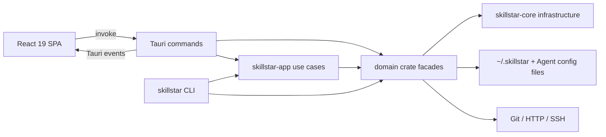

# SkillStar 运行架构

状态：active

本文件描述运行拓扑、数据所有权、持久化和必须保持的不变量。目录职责与依赖方向见 [boundaries.md](./boundaries.md)。

## 交付面与组合根

SkillStar 有一个 Rust package 交付两个入口：桌面 GUI 和 `skillstar` CLI。`src-tauri/src/main.rs` 决定进入 CLI 还是启动 Tauri；`src-tauri/src/lib.rs` 组装插件、State、命令和窗口生命周期。

```mermaid
flowchart LR
  UI["React 19 SPA"] -->|invoke| CMD["Tauri commands"]
  CMD --> APP["skillstar-app use cases"]
  CMD --> DOMAIN["domain crate facades"]
  APP --> DOMAIN
  DOMAIN --> INFRA["skillstar-core infrastructure"]
  DOMAIN --> DATA["~/.skillstar + Agent config files"]
  DOMAIN --> NET["Git / HTTP / SSH"]
  CMD -->|Tauri events| UI
  CLI["skillstar CLI"] --> APP
  CLI --> DOMAIN
```

前端不直接触达业务文件或网络。GUI 和 CLI 应复用同一域实现；表现层只负责输入输出差异。

协议叶子（当前为 `skill-spec`）位于域 crate 之下：它们只解析外部技术规范，不依赖任何 `skillstar-*` 产品 crate。SkillStar 的安装门禁、发现与打包仍由 `skillstar-skills` 等产品 crate 做薄 adapter。

## 技术选择的事实源

版本不在文档硬编码：

- 前端依赖与脚本：根 `package.json`、`bun.lock`、`package-lock.json`。
- Rust edition、workspace 和共享依赖：根 `Cargo.toml`、各 package `Cargo.toml`、根 `Cargo.lock`。
- Tauri 权限、bundle 和 updater：`src-tauri/tauri.conf.json`、`src-tauri/capabilities/`。
- CI 和发布：`.github/workflows/`。

当前实现使用 React/TypeScript/Vite/Tailwind、Tauri/Rust/Tokio、SQLite、JSON/TOML 配置、gitoxide/git 子进程，以及 SSH 传输。精确版本只从 manifest 读取。

本地决策模型是唯一在进程内跑张量计算的能力，因此它的运行时是一个**被隔离的技术选择**：`skillstar-decision` 用 candle 直接读官方 bf16 safetensors（没有 ONNX 中间产物、没有 Python sidecar），在 macOS 上按 `target_os` 开启 Metal、其余平台走 CPU。默认精度是 f32：candle 0.11 的 Metal 后端对 f16 缺少部分算子核，而逐算子回退到 CPU 会把一次前向静默串行化。这条选择及其后果见 [D-064](./decisions.md#d-064本地决策模型用-candle-直读-safetensors不引入-onnx-或-python)。

## 数据所有权

默认数据根为 `~/.skillstar/`，可通过环境变量覆盖。路径解析必须来自 `skillstar-core`，调用方不能自行拼接另一个“默认路径”。

| 数据 | 默认位置 | 所有者 |
| --- | --- | --- |
| 全局配置、日志和状态 | `~/.skillstar/{config,logs,state}/` | `skillstar-core` + 对应域 |
| SQLite 数据库 | `~/.skillstar/db/` | marketplace 等具体模块 |
| 已安装、创作和仓库技能 | `~/.skillstar/hub/{skills,local,repos,content}/` | `skillstar-skills` |
| 本地 Skill 长期身份 sidecar | `~/.skillstar/hub/local/<name>/.skillstar/identity.json` | `skillstar-skills::local_identity`；`.skillstar` 被 v2 snapshot 排除，不进入内容 hash |
| Skill 安装来源、Git tree 与完整内容 baseline | `~/.skillstar/hub/lock.json` | `skillstar-skills::lockfile` 持久化；`skillstar-skills::skill_update` 独占更新事务 |
| 仓库缓存的稀疏物化计划 | `~/.skillstar/hub/repos/<cache_key>/.git/skillstar-inventory.json` | `skillstar-skills::repo_scanner::inventory`；代表目录 + deferred 副本集合，按 HEAD revision 失效重算，`.git` 内不污染工作区（[D-063](./decisions.md#d-063代表副本唯一物化与永不整仓下载)） |
| 每仓库安装/扫描锁 | `~/.skillstar/state/repo-locks/<cache_key>.lock` | `skillstar-skills::skill_update::transaction`；网络与发现阶段持有，hub 提交另持全局短锁 |
| 内容基线 stat 指纹 | `~/.skillstar/state/snapshot-stats/<name>.json` | `skillstar-skills::content_stats`；fetch 前 cleanliness 证明的 mtime/size 快路径，失配回退全量快照 |
| Project 技能 manifest | `~/.skillstar/state/projects/` | `skillstar-skills`；共享项目路径只记录一个 Agent owner |
| 技能 update 可用状态 | `~/.skillstar/state/skill_update_states.json` | `skillstar-skills::update_state` 唯一所有者；批量 refresh、patrol 和 update 完成都写穿它，UI 与事件只是投影 |
| 本机团队智能（learnings / usage / recall / friction） | `~/.skillstar/state/team.json` | `skillstar-skills::team`；schema v1，未来版本 fail-closed。不是已删除的 `learning/` 教程树 |
| Agent profile、手动激活偏好与临时技能恢复 journal；可消费的技能部署 | `~/.skillstar/config/profiles.toml`；Agent 用户级目录或项目内 `.agents/skills`/专属目录 | `skillstar-skills::agents` 持有 profile 偏好和按物理 Global skills 目录保存的恢复 journal；`skillstar-skills` 从 hub 物化并读取当前链接；`skillstar-app::agent_managed_skills` 编排“先写 journal、后停用 / 仅 journal 恢复”事务。内置路径/能力跟随 `vercel-labs/skills` 注册表基线，Agent 不拥有 canonical 内容 |
| Models provider 与工具同步状态 | `~/.skillstar/config/model_providers.json`（v4：`providers` + `bindings`）及 Agent 配置文件 | `skillstar-models` |
| 本机模型网关的路由与监听配置 | `~/.skillstar/config/model_gateway.json` | `skillstar-gateway` 经 `config_dir()` 解析，跟 `SKILLSTAR_DATA_DIR` 走。缺文件、空的 `routing`，以及读不出来的文件，都是 smart。启动不创建、不改写这个文件 |
| 本地决策模型 checkpoint（AgentJev-0.6B，1.2 GB） | 默认 `~/.skillstar/models/agentjev-0.6b/`；`SKILLSTAR_DECISION_MODEL_DIR` 覆盖目录，`SKILLSTAR_HF_ENDPOINT` / `HF_ENDPOINT` 覆盖下载源 | `skillstar-decision`；四个文件按固定 revision + SHA-256 校验，缺一个都不能加载。权重不进仓库，也不进 rolling 清理之外的位置 |
| 迁移前的 provider store 快照 | `~/.skillstar/config/model_providers.v3.json` | `skillstar-models::providers::store_v4`；**不进 rolling 清理**，它是迁移报告「撤销」按钮的依据 |
| Provider 自身 `/v1/models` 返回的模型目录 | `~/.skillstar/cache/model_catalog/<provider_id>.json` | `skillstar-models::providers::catalog_cache`；从 provider 行搬出来的——目录可重新拉取、绑定不可，两者不该共享同一份持久性保证，也不该让几百个模型的原始 JSON 反复重写进存着凭据的文件 |
| Usage 订阅和 OAuth/token 状态 | `~/.skillstar/config/usage/` | `skillstar-usage`；跨域 CLI 激活由 `skillstar-app` 编排 |
| 桌面应用多开 profile 与清单 | `~/.skillstar/instances/<app>/<instance-id>/`；清单 `~/.skillstar/config/app_instances.json` | `skillstar-core` 解析路径；`skillstar-app::instances` 拥有清单、argv 与 PID 匹配。启动走 `--user-data-dir`，不改默认 `~/Library/Application Support/*` 或 `~/.grok` |
| SSH 主机元数据 | `~/.skillstar/config/ssh_hosts.toml` | `skillstar-sync::ssh` |
| GitHub 用户登录凭据 | `~/.skillstar/state/github_auth.json`（Unix `0600`） | `skillstar-skills::github_auth`；普通配置只保存非敏感共享频道状态 |
| 共享频道订阅、发布目标与升级策略/状态 | `~/.skillstar/config/shared_channel_subscriptions.json` | `skillstar-channels::shared_channels`；只保存 repository ID、release target、所选 Skill、安装 baseline/provenance、逐 Skill 历史 pin、按频道自动升级偏好与最近逐项结果，不保存 GitHub 凭据 |
| 项目技能计划、批准和回执 | `~/.skillstar/state/project-skill-plans/`、`project-skill-approvals/`、`project-skill-receipts/` | `skillstar-app::project_skills_mcp`。项目写入的跨进程锁是 `state/project-write.lock`，所有者是 `skillstar-skills::projects::write_lock` |
| 可选 Laya ONNX 包 | `~/.skillstar/models/laya/` | `skillstar_core::infra::paths::laya_model_dir`。`SKILLSTAR_LAYA_ONNX` 整目录覆盖；`SKILLSTAR_DATA_DIR` 把默认位置一起搬走。应用不下载这份权重 |

敏感凭证不得明文写入普通配置：SSH 兼容服务名保持 `skillstar-ssh`；Usage token 使用域内加密存储或系统凭证设施。具体行为见对应功能文档。

## 核心不变量

### IPC 与命令层

- Tauri command 是边界 adapter，不是业务模块。
- 长任务通过带 `session_id` 的结构化事件反馈；组件生命周期监听统一处理异步 cleanup race。
- 命令注册、前端 IPC 声明和 dev mock 必须一起演进。

### 文件和部署

- 技能向 Agent/项目部署优先 symlink；平台不允许时回退 junction/copy。
- SkillStar hub 是安装后的 canonical source；兼容 Agent 的项目级 universal surface 是 `.agents/skills`。多个 Agent 指向同一物理路径时，manifest 只保留一个 owner，部署、清理与 reconciliation 必须按路径去重。
- 内置 Agent 注册表区分 Home、XDG config、环境变量覆盖、动态 OpenClaw 根和不支持全局目录；空全局路径只能表示项目级 Agent，任何全局部署入口都必须先做能力检查。
- 本机 Agent 不做 PATH、桌面应用或目录存在性探测；profile 默认关闭，Settings 持久化开关是进入所有本机 Agent 投影的唯一激活来源。冻结 IPC 字段 `installed` 仅镜像 `enabled`，不得恢复为探测状态。
- reconciliation 同时处理新增和删除；失败的 staged swap 不得先破坏可用部署。
- 判断一个 hub 条目是否为 repo cache 链接只有一个实现；symlink 与 Windows junction 必须由同一入口解析，否则 update 检测与 update 应用会对同一技能得出不同结论。
- 扫描、检测等只读动作不得创建用户目录。
- 所有覆盖写入使用临时文件/目录和原子替换，尽量保留已有可用状态。
- Git-backed Skill 更新前必须用 `lock.json` v5 的带算法版本完整内容 baseline 做 fail-closed 检查。共享同一物理 checkout 的 Skill 作为一个保护单元：任一分歧未显式保留或丢弃前不得 fetch/reset；pull 后的内容快照或 lockfile 提交失败时，checkout 回滚到旧 revision、旧 sparse 配置和更新前受管内容。
- Skill 更新/分歧解决使用进程内互斥与数据目录中的跨进程文件锁串行化；等待锁后必须重新检查完整内容 baseline，不能复用锁外的“未修改”判断。
- `resolve_skill_update` 是 GUI 的分歧解决 IPC facade；command 只适配 DTO/异步调度，保留副本、子树清理、整组复检和继续更新都由 `skillstar-skills::skill_update` 完成。前端 IPC 声明、dev mock 与全局选择对话框必须同步该契约。

### 网络

- 短探测和有总超时的 HTTP 走 `probe_http_client`。上游流式生成走同一模块的 `stream_http_client`：同一份 `proxy.json` 指纹，连接有上限，响应体没有总超时。两条路径都不另读一套代理。SOCKS5 出网使用 `socks5h`（远端 DNS）；bypass 列表进入 client fingerprint。
- 匿名 GitHub 族 HTTP（raw / codeload / objects / gist / 无凭据的 `api.github.com`）经 `github_http::get_anonymous` 走健康加速源链，失败回直连。带 `Authorization` 的请求禁止进入该入口。
- GitHub mirror 影响单次 Git 命令与匿名 HTTP，不修改用户全局 Git 配置；连续失败熔断 20 分钟，保存配置重置；传输失败允许直接 GitHub fallback。
- `skillstar-skills::github_auth` 的 GitHub App 用户登录使用设备授权流；access/refresh token 只经凭据抽象读写，设备码和已解析身份只保存在进程内。到期时间必须来自 GitHub 响应元数据，登出同时清除本地凭据、待处理授权与内存身份。
- 私有 GitHub 仓库的扫描、克隆、检查和更新由 `skillstar-git` 的统一 Git operation session 执行。session 在开始时从认证 facade 取得短期 access token，只向规范化的 `github.com` HTTPS 操作注入临时 askpass 环境；它不得持久化凭据，并负责非交互、代理、取消、进度和敏感信息清洗。Tauri 和未来 CLI 只适配该域入口。
- 组织私有共享频道由 `skillstar-channels::shared_channels` 拥有。GitHub 数字 repository ID 是跨重命名稳定身份；本地版本化 registry 只保存非敏感描述符和创建状态。创建前校验 selected-repository 安装及 Administration/Contents write，由 App 用户身份创建仓库；远端创建后必须先持久化 pending，再只读校验 GitHub 自动授予的 App 仓库访问并转 active。GitHub App 用户令牌不得用于修改安装仓库范围。
- 频道订阅是第二次、本地且显式的同意：GitHub invitation 只授予仓库访问，订阅 facade 重新验证最新不可变 Release，Git scanner 固定到 manifest commit 并核对所选 content roots/hashes，之后才通过 staged Skill installer 写入 hub。版本化 subscription store 保存选择、release target 与非敏感 provenance；未知 schema 只能投影为只读摘要。新增 Skill 不自动加入既有选择，订阅写盘失败必须回滚本次新安装。
- 频道升级 facade 默认检查、显式应用，并以订阅 Skill 为隔离事务单元。它从最新已验证 Release 与每项已安装 release hash/provenance 推导频道状态；只把完整内容仍等于 baseline 的 updated Skill 切到目标 commit 的隔离 ref cache。分歧或失败项保留旧 checkout，成功项独立前进；新增项只通知、removed 项不隐式删除。每项事务复用统一分歧解决、update state、Agent/Project reconciliation 与回滚接缝，最近一次检查结果持久化以支持重启和离线展示。
- 单 Skill 历史回滚也由频道升级 facade 编排：它在同一仓库的已验证 manifest 集合中将当前 provenance/hash 解析为唯一安装 Release，只允许更早且仍包含该 Skill 的精确 target，再复用 staged update transaction 替换文件与部署。成功只更新该 Skill 的安装事实并写入 pin，不倒退频道整体 target；手动与自动批量应用均排除 pin。恢复跟随以一次 subscription store 事务清 pin 并按最新 Release 重建计划，不在该动作中直接替换 Skill。
- Release 移除是 manifest 与本地 tracked 集合的差异状态，不是删除指令。频道 facade 保留 Hub 内容、lockfile 与部署，直到用户显式卸载或转为本地副本；前者复用统一卸载清理，后者先以完整内容快照建立 `skills-local` 所有权，再解除频道跟踪。Hub/lockfile 先进入可恢复 staging，subscription store 在同一共享 mutation/update transaction 内提交；metadata 失败会恢复 Hub/lockfile 并删除未提交的本地安全副本，metadata 成功后的部署清理失败则保留已解除跟踪事实并报告剩余清理。未处理的 removal tombstone 会跨后续 Release 保留；移除 tracked/known/pin 后，未来同名重加只能进入带最终内容/provenance 校验的显式 staged install 路径。
- GitHub 成员撤销与订阅访问冻结是两端独立、以远端为准的状态机。owner 端只删除 direct collaborator，随后复查 effective permission 并区分完全撤权、继承访问和未确认错误；subscriber 端把远端探测投影为 `active`、`revoked`、`offline`、`recoverable_failure`、`integrity_error`。非 active 状态一律冻结需要远端内容的 mutation 并保留 Hub、lockfile、部署和最近已验证快照；只有 revoked 额外开放逐项转本地/卸载。频道所有权 guard 位于域层通用 mutation 接缝，覆盖扫描/安装、更新、内容、本地收养、bundle/pack、项目导入及卸载，而不是只靠界面隐藏动作。检查在冻结时仍可只读重试，必须在隔离验证 cache 中重新通过 stable repository/organization ID、权限、manifest/tag/commit/path/hash 全链验证才恢复 active。网络/代理状态不得推断为撤权，完整性错误不得被普通重试结果或旧缓存绕过。该 guard 通过依赖倒置接缝注入：`skillstar-skills::skill_mutation::SkillMutationPolicy`（默认 allow-all）由 `skillstar-channels::policy::ChannelAwarePolicy` 实现，组合根（Tauri setup、CLI 入口）在任一技能写路径前调用 `install_global_policy`。
- 后台检查与受保护自动升级复用上述 facade，不是第二套更新器。`skillstar-skills` 以注入时间为所有订阅判定一小时检查窗口并持久化结果；只有按频道显式开启的偏好才允许选择并应用安全项。Tauri `core` 只负责应用进程存活期间的分钟级唤醒、可取消认证会话和事件通知。自动与手动扫描/应用共享 subscription mutation lease，实际文件替换继续共享全局 Skill update transaction lock，因此普通更新器并发移动 checkout 时，自动路径必须在写入前重新检查并暂停该项。
- 已有仓库注册使用独立的进程内 registration session：session 把扫描预览、数字 repository ID 与确认动作绑定，扫描 generation 让取消结果不能被晚到响应复活，确认先原子 claim，失败才恢复原 session。取消、成功、GitHub 登出或进程退出后 session 失效。仓库库存来自当前 revision 的完整 tracked tree，Skill 目录按 tree 按需物化；扫描复用操作级 Git session 的凭据、代理、进度与取消能力。本地 registration session 只保存非敏感库存预览，不保存 Git 凭据或 checkout 路径。确认时必须重新向 GitHub 校验 ID、组织、私有性、Admin 与 selected-repository 访问，再以 registry 锁原子拒绝重复绑定。
- 频道发布真相位于 GitHub 的不可变 revision tag 与 Release：annotated tag message 是版本化 release manifest，tag 最终指向预览时的精确 commit；普通 branch HEAD 不构成订阅版本。只有可验证的正式 Release 才对订阅者可见，孤立 tag 仅保留 revision、防止进程中断后复用编号。发布扫描使用操作级凭据的隔离 partial clone，不触碰共享 repo cache；预览 session 仅在进程/当前 GitHub 登录生命周期内保存非敏感 commit、Skill hash 和变更集，空闲过期回收，确认前重新校验远端 HEAD、仓库私有/组织身份与用户有效写权限。只有远端 tag ref 和 Release 均成功后才向 UI 返回成功，本地 registry 不提前维护可与远端分叉的 revision 计数。
- 频道成员、有效角色和 open invitations 的运行时真相只位于 GitHub。SkillStar 用当前 GitHub App user identity 调用 collaborator/invitation API，管理动作先按稳定 repository ID 刷新路由并重新验证 Admin；本地不持久化成员、邀请历史或 share code。接受 invitation 是可恢复的跨系统事务：先落非敏感 `awaiting_invitation_acceptance` descriptor，再修改 GitHub，最后转 active；最后落盘失败或 GitHub 响应丢失/5xx 导致结果不确定时保留 marker，后续从当前用户可见私有仓库库存按 repository ID 和远端读权限恢复，不能要求已经被 GitHub 消费的 invitation 再次出现。只有明确远端拒绝才回滚 marker。邀请 inbox 只能依据 GitHub 返回的组织私有仓库 invitation 让用户显式导入，因为 GitHub invitation 没有承载 SkillStar 自定义元数据的字段。
- 认证 Git 操作绕过第三方 GitHub 镜像，防止凭据转发；公开操作可以继续使用镜像回退。`skillstar-git` 子进程使用当前 SkillStar 代理配置（SOCKS 为 `socks5h`），不读取或修改用户的全局 Git 凭据状态。
- GitHub mirror 改写 GitHub 族 origin（含 raw/codeload/objects/gist），只影响单次 Git 命令，不修改用户全局 Git 配置；传输失败允许直接 GitHub fallback 和熔断。
- 决策模型 checkpoint 的下载同样经 `probe_http_client`（用户代理与 bypass 生效），走 Hugging Face 的 `resolve/<pinned-revision>/<file>`；中断的传输用 Range 续传，落地前逐个核对固定 SHA-256，校验失败删除临时文件而不是留一份看似完整的权重。除这条下载外，决策模型不再发起任何网络请求：推理完全在本进程内。
- SSH 在发送认证材料前完成 host-key gate；远端命令检查退出码并设置超时，SFTP 路径显式解析为绝对路径。

### 本机模型网关

- 桌面进程在打开窗口之前，用后台线程调用 `skillstar_gateway::serve`。`skillstar gateway serve` 走同一个函数，不打开窗口。其它 CLI 子命令不启动它。`src-tauri` 只认 argv，不直接依赖网关 crate。
- 默认听 `127.0.0.1:21847`。`SKILLSTAR_GATEWAY_ADDR` 可以改地址。端口 `3425` 直接拒绝，不绑定。地址已经被占用时，后启动的那一份把「地址已被占用」写到 stderr，不关掉先启动的那份，也不往 stdout 打日志。
- 这一个 `serve` 应答网关的 HTTP 路由表。`GET /api/hello` 的 `name` 是 `skillstar`，版本字是 `dev`。不提供配额路径。模型目录不在网关 crate 里；模型 id 含 `/` 时解析失败是本机错误，请求不转给厂商。
- 路由模式放在 `model_gateway.json` 里 provider 或分组的 `routing`。空字符串和缺省是 smart。这份文件只在已经存在时读取；启动不创建、不改写它。密钥仍在 `model_providers.json`，配额仍在 Usage。网关不打开这两处。
- 亲和在路由顺序之前决定要不要留下上次的回答者。留下时，那一名排到已经算出的顺序最前；`off` 时顺序不变。空模式在回合内留下，跨回合只在厂商缓存还值得、而且还没冷的时候留下。会话从 `X-Skillstar-Session` 认起，不认 `X-Magpie-Session`。休息中的回答者标成 `resting`，这一步不换人。模式、上次的 stick 和时钟由调用方传入。
- 一次失败休息多久，只看这次的状态码和正文。时钟、已用份额和窗口恢复时间由调用方传入，不向 Usage 拉取。频率限制不按配额的缺省时长休息。配额自己写明的恢复时间可以长过一小时，厂商的 Retry-After 仍最多信一小时。验证失败在更短的一段时间里用上一次的拒绝回答，不再问上游。内容字节已经写下之后，下一次挑选不再叫另一条上游。未到期的候选从这次挑选里拿掉。不认 `X-Magpie-Resets-At`。
- 模型 id `group/<id>` 展开成该分组的成员，成员也可以是另一个分组。会让分组包含自己、或嵌套深过 8 层的写入不改 `model_gateway.json`。同名模型的自动分组在调用方列出模型时推导，用户编辑之前不写入。不读密钥表。
- 分组上的规则按书写顺序匹配。token 数、图像、effort 和来源 Agent 都满足才算命中。第一条命中的成员排到已经展开的顺序最前，其余不动。没有命中时展开顺序保持原样。来源 Agent 先看占位 bearer `skillstar-<id>`，认不出再用 User-Agent。
- 带 intent 的规则只在分类器于回合开始点名、且置信度达到 0.4 时命中。模型 id 写在分组的 `classifier`，可以是 `provider/model` 或 `group/<id>`。没写时不命中，也不另找本机模型。失败、超时或答非所问都没有 intent 命中。相同消息 10 分钟内沿用上次的回答；失败后 30 秒内不再问。回合中途不再问。问询带上 User-Agent `skillstar-router/1`，期限 8 秒。这一步不加载决策模型。
- 脱敏默认关闭。开关在 `model_gateway.json` 顶层：`redact`、`redact_personal`、`redact_words`、`redact_rules`，词表和自定义规则是 `redact_word_list`、`redact_rule_list`。打开后，正文在翻译之后、发给上游之前换成占位符；上游响应在译回 Agent 之前还原。密钥文件是 `config_dir()/redact.key`，新建时 Unix 权限 `0600`。文件缺失或读不出来时正文原样离开，不创建密钥文件。
- 视觉转述默认关闭。`model_gateway.json` 顶层的 `vision` 为空、`off` 或缺省时，带图请求按原文转发。写成模型 id 之后，目标不是这个 id、正文里有 Chat 图片，就先请这个 id 把图写成文字，再把文字交给目标。提示词固定，User-Agent 是 `skillstar-vision/1`，单次 2 分钟，同时最多 4 张，成功的描述保留 256 条。描述请求本身不再转述。调用方明确目标不能看图、且转述关着时，当前这张图被拒绝，不会发出描述请求。
- 上游签名只用调用方注入的账户快照和 Usage 已经写好的余量。`skillstar-app` 从 Usage 的已保存列表填这份快照。网关不打开 Usage 的存储，不刷新令牌，不请求配额。没有快照时候选保持未知。`anthropic` 不产生 Anthropic HTTP，生成仍走进程桥。没有 Usage 行的 Agent 只用 provider 快照里的 API 密钥。
- 保存 Codex 只写环回。已登录：`openai_base_url` 指向 `{origin}/backend-api/codex`。API 形态：`[model_providers.skillstar]`，`base_url` 是 `{origin}/v1`，`wire_api = "responses"`，占位 bearer `skillstar`，目录文件 `skillstar-models.json`。接管字段之前，旧值进 `config_dir()/agent_stash.json`（Unix `0600`，原子替换）。取消托管按 stash 写回。表和目录文件留下。网关不推断登录态，调用方传入形态。`skillstar-models` 不依赖网关。
- 保存文件型 Agent 走 `apply_gateway`。写出的地址总是 `http://127.0.0.1:<端口>` 加上该 Agent 的路径后缀，占位 bearer 是 `skillstar` 或 `skillstar-<id>`。取消托管把接管前的整份文件从同一份 `agent_stash.json` 放回。Goose、Cursor CLI、Copilot CLI、Devin 不写环回地址，调用返回未托管。在册的 id 以 `apply_gateway_` 测试为准。
- Claude Code 的 `~/.claude/settings.json` 由 `apply_gateway("claude", …)` 写入。`ANTHROPIC_BASE_URL` 是网关根，不带 `/v1`。`ANTHROPIC_AUTH_TOKEN` 是占位 `skillstar`，不是 Usage 的 access token，文件里也不写 `CLAUDE_CODE_OAUTH_TOKEN`。各档跟随这一次的模型。取消托管放回接管前的整份文件。进程桥不读这份文件，保存时不启动 `claude`。
- Claude Desktop 由 `apply_gateway("claude-desktop", …)` 写入两份 `claude_desktop_config.json` 和 Claude-3p 配置档。配置档 id 是 `00000000-0000-4000-8000-736b696c6c73`。`inferenceGatewayBaseUrl` 是网关根，不带 `/v1`。`inferenceGatewayApiKey` 是 `skillstar-claude-desktop`。不写 `skillstar-binding.json`。取消托管放回接管前的整份文件。
- OpenHanako 由 `apply_gateway("hanako", …)` 写入。进程在跑时，先确认 `server-info.json` 里的本地 API，再 `PUT /api/config` 和 `PUT /api/agents/<id>/config`。没在跑时写 catalog 和该 agent 的配置。provider 名是 `skillstar`，地址是网关的 `/v1`，密钥是占位 `skillstar-hanako`。没有已有 agent 时不写文件。
- 订阅侧的 Claude 启动本机 `claude`。Usage 里的 access token 不进子进程，进程也不请求 Anthropic 的令牌地址或 `/v1/messages`。`claude-mcp-helper` 在窗口和 Git askpass 之前进入，stdout 只有 MCP 帧。

### 本机项目技能 MCP

- `skillstar mcp serve --stdio` 在 Git askpass 和桌面窗口之前进入 `skillstar_app::project_skills_mcp::serve`。stdout 只有换行分隔的 JSON-RPC。tracing 写 stderr。
- 该进程只广告 `protocol` 里的项目技能工具。批准不是工具参数。不启用 roots，不提供资源，技能正文不进结果。
- 项目写入先拿技能 update 锁、再拿 `state/project-write.lock`。已经持有项目锁时不再拿 update 锁。
- Windows release 不改 `windows_subsystem`，不调用 `AllocConsole`。父进程接上的管道就是传输。
- 可选 Laya 重排在第一次 `recommend_project_skills` 时加载，不在 `server/discover`。默认目录是 `~/.skillstar/models/laya/`，`SKILLSTAR_LAYA_ONNX` 可以改指向别处。只使用 CPU Execution Provider。项目技能 MCP 只接受协议 `2026-07-28`。

### 跨进程与凭证事务

- Usage 刷新、账号切换和凭证写入按 catalog 串行化，并在必要时使用 OS 文件锁。
- 账号切换必须把“卡片 active 状态”和目标 CLI 凭证视作一个可回滚事务；失败时保留原可用账号。
- 外部 Agent 配置的测试必须改写到临时 home，不能触碰开发者真实配置。

### 本地优先

- Marketplace 和已安装技能列表优先从本地快照返回；远程刷新是显式的后续动作。
- SQLite 使用适合并发读的短连接/WAL 模式；页面不得用浏览器网络请求绕过快照层。

## 前端运行模型

- `App.tsx` 负责顶层布局、路由和真正跨页的导航状态。
- 页面是薄组合层；TanStack Query hooks 与 feature API wrapper 管理服务端状态。
- 全局不引入额外 state manager，除非有被记录的设计决策。
- i18n 的 `en` 与 `zh-CN` 同步；Tauri 事件流必须处理 start/delta/complete/error 和中断清理。

## 发布与验证

- Linux/macOS CI 使用 Bun；Windows CI 使用 npm，二者分别验证 lockfile 和平台差异。
- tag `v*` 触发 Tauri 多平台发布；签名 updater 由 `release.yml` 和 `tauri.conf.json` 共同定义。
- 日常完整门槛见根 [AGENTS.md](../AGENTS.md)；功能级验证见对应 `docs/features/` 文档。

## 变化触发器

修改 composition root、IPC/event 契约、数据位置、凭证边界、网络 fallback、发布拓扑或持久化所有权时，先更新本文件，再更新对应功能文档和测试。
