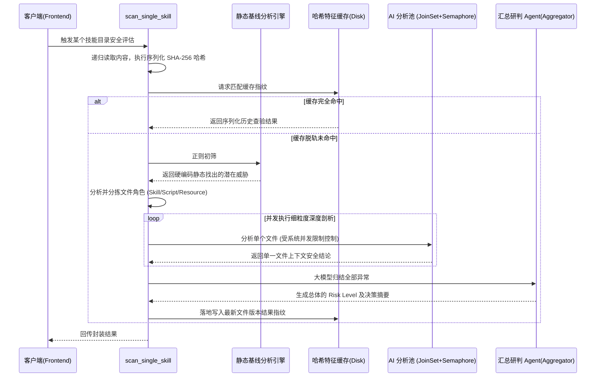

# SkillStar 后端核心技术细节实现文档（中文版本）

本文档旨在深入剖析 SkillStar 应用程序后端（Rust 侧）一些核心且复杂的业务逻辑模块的架构考量和实现细节。内容涵盖了多并发 AI 安全扫描协同架构、本地防篡改与拦截路径逃脱的防丢/安全的技能包导入系统、以及高度优化的多角色下沉式软链接（Symlink）协调同步机制。

---

## 1. AI 赋能的超并发聚合安全扫描 (Security Scanning)
> 模块位置: `src-tauri/src/core/security_scan/` (原 `security_scan.rs` 已重构解耦)

为了保证安全扫描过程既能捕捉细粒度的潜伏恶意逻辑，又能保证整体性能与防止大模型 API 短时过载引发限流，SkillStar 设计了一套包含“**初筛**”、“**分拣散派**”、“**再汇总**”的微型多智能体 (Multi-Agent) 协同架构。

### 1.1 扫描流程与并发设计
扫描流程执行了两层剥离方案：
1. **静态正则拦截 (Static Pattern Scan)**：这是前置的第一层拦截，拥有极高的计算效率（零 AI 消耗时间），利用多维度组合正则表达式直接扫描代码，实时截获反弹 Shell、高危配置读取注入（例如 `curl | sh` 等）、恶意修改系统启动链配置等行为。
2. **AI 多角色协程作业 (AI Worker + Aggregator)**：
   - 这是整个后端的硬核点。后端在做安全扫描时会根据启发式逻辑去为进入池子的不同类型的文件去赋予不同身份的 Prompt (`Skill Agent`，`Script Agent`，`Resource Agent` 等）。
   - 通过 `tokio` 提供的 `JoinSet` 与受控信号量 `Semaphore`，创建有边界的最高并发数量（由常量 `MAX_CONCURRENT_AI` 所控，默认为 3）的 AI 请求任务；一旦所有文件判定结束，结果会被抛送回最终的聚合器 (`Aggregator Agent`) 中进行大局研判。从而实现了从单个恶意函数到全局危害能力的联动判定。

### 1.2 高性能的组合摘要 (Content Hash) 防抖缓存
常规的按文件修改时间戳或者 Lockfile 比对非常容易受本地同步逻辑等行为的干扰引发频繁假阳性失能。因此，在开启协同运算池之前，该模块首先会对收集来的有效扫描文件按路径顺序做字符串组合，对其全量字节内容进行整体的 `SHA-256` 递归哈希验算。这让每一次安全审计与实际内容彻底绑定在一起并具备 7 天有效生存周期缓存。

### 1.3 核心状态流转图



---

## 2. 技能包裹 (Bundle) 沙箱解析与篡改防御的导入机制
> 文件模块: `src-tauri/src/core/skill_bundle.rs`

通过外部渠道传播分享的技能文件包 (`.ags` 或 `.agd`) 本质是将代码库降级为了一个包含 manifest 原信息的 `tar.gz` 压缩流。系统解压和部署这些包裹时，后端加入了重型的容错与防护拦截技术。

### 2.1 篡改防御校验
外部传进来的包在被打包时会在 `manifest.json` 单独留存了该内部所有文件的按字典排序的内容 `SHA-256`。如果在传输期间某些脚本被人恶意替换或者插队，将在完整落盘后的对比中被直接拉黑中断执行。

### 2.2 防护型导入 (Import Sandbox)
1. **流式预览 (Preview-only stream)**：导入逻辑会通过 `GzDecoder` 执行预览，提前筛查当前版本的解析引擎是否过时兼容 `FORMAT_VERSION` 以及重名技能的存在状态，在这一时期系统尚未真正落地文件。
2. **沙箱解压与路径逃狱拦截 (Path Traversal Mitigation)**: 当开始真实解压归档内部逻辑时，不会往真正的 `Hub` 里解压。底层代码往 `.importing-xxx` 前缀起名的预发沙箱进行注入。整个注入的过程拦截了包含了绝对路径（`/开头`）以及试图上跳溢出（包含了 `..`）等目录跳切恶意解压。
3. **原子性重命名覆盖部署 (Atomic Deployment)**: 后端仅在所有文件提取完成，再次哈希测算证明与 manifest 中留下的身份匹配一致的情况下，调用了主系统的 `fs::rename` 把此预发沙箱强制覆盖过掉以前安装的被更新文件（由于原子覆盖没有断层期，程序极快），由于部署变更了代码指纹，紧随其后地挂起触发了将旧缓存强制移除（Invalidation Cache）保证再次使用触发复行强检。

### 2.3 防御型解压流

```mermaid
flowchart TD
    A([外部流文件包裹导入请求]) --> B[流式读取通过包体解码出 manifest.json]
    B --> C{版本向下兼容保护与覆盖性检测}
    C -- 产生冲突中止 --> Err([抛出拒绝重载异常并熔断])
    C -- 通过环境预审 --> D[在全局缓存区开启 .importing-{name} 级别隔离沙箱]
    D --> E{路径提取异常检测: 是否包含 '..' 或为绝对路径?}
    E -- 非法相对路径 -> Err([触发逃逸漏洞预警，拉黑包并主动粉碎沙箱])
    E -- 路径安全 --> F[抽取实体并结合真实内容从头计算实体 SHA-256]
    F --> G{实时哈希指纹防篡改比对}
    G -- 内容已变质 --> Err([报告 Checksum Mismatch 并移除隔离区数据])
    G -- 检验无误指纹吻合 --> H[通过 fs::rename 原子化更迭到正式技能安装点]
    H --> I[挂起失效该版本之前留存的 Security Cache]
    I --> Done([安全部署达成])
```

---

## 3. 基于软链接（Symlink）的项目同步及生命周期内存锁定防爆
> 文件模块: `src-tauri/src/core/sync.rs`

技能作为各个系统间的插件应用挂接器，当业务项目（Project）试图从 Hub 获取多枚 Agent 技能分配时，这涉及跨工作环境调度同步。为了防止各处引用技能库副本膨胀、也防止各工作组升级时出现离群滞后的老版本拷贝堆积，系统放弃了直接的文件级 `copy` 而选用了操作系统的软链接挂载能力来同步。

### 3.1 对操作系统的抹平设计
将所有 Agent 对于挂载点的引用强依赖到一个单一的核心数据真相 (Single Source Of Truth) 目录，当有任何升级请求仅涉及挂接 `target` 本身的升级处理。
为抹平系统层调用隔离，采用了条件编译的方式实现不同平台的挂接指令: `unix::fs::symlink` 处理 Mac/Linux，并动用了 `windows::fs::symlink_dir` 处理对文件夹引用的 Windows 端跨越。

### 3.2 短时缓存衰减技术防颠簸 (Anti-Thrashing)
针对极度敏感的在用户页面对 Profile 和多个项目文件产生的大量挂载请求下发。后端规避了每次进行关联前遍历成百上千个配置并加载系统信息的操作。
运用 `OnceLock<RwLock<ProfileSnapshotCache>>` 设计了高时效寿命极短 (2秒生命 `PROFILE_CACHE_TTL`) 的瞬态内存快照。这意味着页面触发任何多阶段更新批量任务操作指令在这一小窗口期都能高效率直接穿透，仅复用同批数据而免于过度消耗重置读写。

### 3.3 状态同步调度图

```mermaid
flowchart LR
    Hub[全局技能唯一可信来源库
    ~/.skillstar/.agents/skills/] 
    
    Agent[Agent 全局环境节点
    ~/.skillstar/profiles/]
    
    Project[局部 Project 级挂接环境节点
    <目标项目>/.agents/skills]

    subgraph 引擎状态调和器
        Cache[读写分离锁: ProfileSnapshotCache 
        (由 TTL 阻断批处理查询穿透)]
        Logic{增量协调挂点分派器}
        Link((执行源挂靠: fs::symlink))
        Unlink((断开历史链接与收容))
    end

    Hub -->|单实体存储| 引擎状态调和器
    Agent --> 状态请求 --> Cache
    Cache --> Logic

    Logic -- 添加新挂配请求 --> Link
    Logic -- 取消装配/环境剥除 --> Unlink

    Link -. UNIX / WIN  .-> Agent
    Link -. 抹平状态壁垒 .-> Project
```

### 3.4 完整 Agent 路径参考 (Full Agent Path Reference)

不同 AI Agent 对应的全局及项目级技能挂载路径列表：

| Agent | Global skills path | Project-level path |
|---|---|---|
| OpenCode | `~/.config/opencode/skills` | `.opencode/skills` |
| Claude Code | `~/.claude/skills` | `.claude/skills` |
| Codex CLI | `~/.codex/skills`<br>*(备用: `~/.agents/skills`)* | `.codex/skills` |
| Antigravity | `~/.gemini/antigravity/skills` | `.agents/skills` |
| Gemini CLI | `~/.gemini/skills` | `.gemini/skills` |
| Cursor | `~/.cursor/skills` | `.cursor/skills` |
| Qoder | `~/.qoder/skills` | `.qoder/skills` |
| Trae | `~/.trae/skills` | `.trae/skills` |
| OpenClaw | `~/.openclaw/skills` | *(global-only)* |

---

## 4. 基于 SQLite 与 FTS5 的 Local-First 市场快照架构
> 模块位置: `src-tauri/src/core/marketplace_snapshot/`

为了彻底解决此前每次获取 Marketplace 技能列表与搜索均依赖远程网络请求造成的卡顿及请求失败率高的问题，SkillStar Marketplace 从原先的在线抓取模型重构为了“**本地首选 (Local-First) 快照引擎**”。

### 4.1 数据隔离与并发访问模式 (Concurrency & WAL)
所有的 Marketplace 数据均被缓存于 `~/.skillstar/marketplace.db` 这一独立的 SQLite 库中。
- 由于前端应用会有诸如“获取流”、“搜索”、“排行榜”、“推荐页”等多维度的并行接口请求，Rust 后端规避了使用进程级单一数据库全局读写锁，转而推荐使用 **WAL (Write-Ahead Logging)** 模式搭配每个操作短暂拉起独立防阻塞连接 (`Connection`)。
- 当远端（Remote）发来更新包或者按需触发后台刷新时，后端能够保障在全量刷新落库时，前端读取的展示流水线依旧流畅不被挂起。

### 4.2 FTS5 全文搜索与 AI 二次提纯流水线整合
1. 本地的搜索查询不再盲目等待接口，直接利用 SQLite 原生自带的 `FTS5` 虚拟表对技能名称、描述以及内部 metadata 构建索引倒排，实现极高帧率的键入防抖搜索展示。
2. 当且仅当用户发起的自然语言（模糊查寻/描述查寻）遇到本地 FTS 无法高度匹配时，才将文本发送进行 AI 模型评估（意图抽取）转化为具象标签后再反馈倒库查询。保证了本地化的高吞吐流与大模型的强大意图理解之间的完美弥合。

### 4.3 渐进式 Schema 自动迁移 (Progressive Migration)
该 Snapshot 的数据表定义利用了 SQLite 原生的 `PRAGMA user_version` 用于控制客户端的版本迁移。即便之后数据表字段发生变化（如加入新的 Vector 向量字段辅助 Semantic Search 等演进路线），也能依据用户本地版本分发原子化的 ALTER 语句静默流式完成更新，防范崩溃。

---

## 5. “上帝文件”(God Files) 的领域解耦与重构设计
> 改进节点：2026 年中后期的深层重构

随着各种不同 Agent 支持、不同 AI 服务商协议、以及防篡改检测维度的持续增加，应用后端曾经的 `ai_provider.rs`、`security_scan.rs` 和 `marketplace_snapshot.rs` 等文件一度膨胀为充斥庞大内部业务且极难单元测试的“上帝文件”。

为了保证项目后续架构演进（如引入 TanStack Query 后更复杂的长线流请求等），项目整体进行了大刀阔斧的重构成基于目录级别的 `mod.rs` 设计：

### 5.1 从平面铺排到领域分治模型
1. 每个超大 `rs` 文件被退化为了同名目录（如 `src-tauri/src/core/ai_provider/`）。
2. 在通过 `mod.rs` 暴露原先 API 契约的情况下，内部的巨型实现按照功能领域被完全切分为了独立的无状态小模块：
   - 例如把 `security_scan` 细分为 `static_analyzer.rs`、`cache_validator.rs`、`ai_worker.rs` 和 `aggregator.rs` 等。
   - 这不仅使得编译速度有定点缓存的提升，更重要的是切断了模块间隐藏的状态污染。
3. 任何原本静态注入的代码模板（如 Prompt 指令等用 `include_str!` 挂载的文件），被通过统一规整存放进行就近引用（Co-location），极大地保障了 CI 在跑 `cargo check` 和 `test` 时的上下文鲁棒性。

### 5.2 减少嵌套锁死 (Nested Tokio runtime panic) 防护
在解耦模块时，进一步梳理清退了过去在全局 `ai_provider` 调用链中滥用的 `block_on` 调用，避免将 async 执行体嵌套调用导致的 `Cannot start a runtime from within a runtime` 的恐慌崩溃，保证所有微处理模块（Micro-Modules）均服从于外层的 Tokio Worker Thread。
