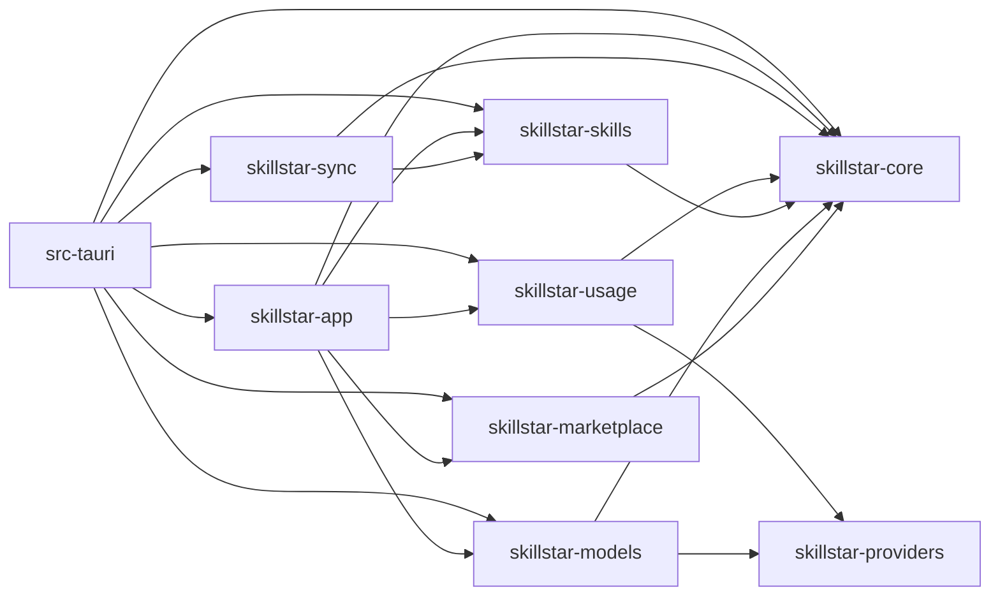

# SkillStar 项目边界

状态：active

本文件是项目树、目录所有权、依赖方向与跨层接缝的单一事实来源。运行时数据流和技术选择见 [architecture.md](./architecture.md)。

## 项目树

```text
SkillStar/
├── .claude/                     # 项目级 Claude 配置与本地 skill 入口
├── .github/workflows/           # 跨平台 CI 与发布
├── src/                         # React SPA
│   ├── pages/                   # 路由级薄壳
│   ├── features/                # 产品域切片；内部实现默认私有
│   ├── components/              # ui/、layout/、跨域 shared/
│   ├── hooks/                   # 真正全局的生命周期与事件 hooks
│   ├── lib/                     # 无 UI 的共享工具、IPC 契约和 adapters
│   ├── i18n/                    # en / zh-CN 同步维护
│   └── types/                   # 共享类型与 Rust 生成类型
├── src-tauri/
│   ├── src/cli/                 # GUI 同二进制的 CLI 入口与展示适配
│   ├── src/commands/            # 薄 Tauri 命令层
│   ├── src/core/                # Tauri State、Emitter、窗口、ACP 子进程等框架胶水
│   ├── src/lib.rs               # Tauri composition root
│   └── src/main.rs              # 可执行入口
├── crates/
│   ├── skillstar-core/          # 共享契约、配置和基础设施
│   ├── skillstar-providers/     # Provider 元数据叶子
│   ├── skillstar-skills/        # 技能、项目、Agent、部署和 patrol
│   ├── skillstar-marketplace/   # 本地市场快照、FTS 与 MCP catalog
│   ├── skillstar-models/        # Provider store、AI、MCP store、tool sync
│   ├── skillstar-usage/         # 订阅、OAuth 和配额
│   ├── skillstar-sync/          # S3 与 SSH 远程传输
│   └── skillstar-app/           # 跨域 use case 与共享 CLI 解析
├── docs/                        # 宪章、功能活文档和冻结历史
├── scripts/internal/            # CI 棘轮和一致性检查
├── scripts/release/             # 发布辅助脚本
├── public/                      # 静态资源与架构图（Agent 图标来自 @lobehub/icons）
└── Cargo.toml / Cargo.lock / package.json
                                  # Rust workspace（唯一 lockfile）与前端脚本/依赖事实源
```

## Workspace crate 所有权

| Crate | 拥有 | 不拥有 |
| --- | --- | --- |
| `skillstar-core` | 路径、文件操作、DB pool/migration、共享错误和配置、HTTP client、共享 `Skill` 契约 | 任一产品域的业务流程 |
| `skillstar-providers` | Provider identity、鉴权和余额端点元数据 | Provider 持久化、Usage 抓取或 UI preset |
| `skillstar-skills` | 安装、更新、bundle、本地创作、repo scan、lockfile、repo-link 判定、update 状态、Agent registry、项目 manifest、deployment、patrol | Marketplace 搜索、Usage 或 Models |
| `skillstar-marketplace` | SQLite 快照、FTS、技能市场和 MCP registry/curated 数据 | 技能安装实现、MCP 本地配置 |
| `skillstar-models` | Provider store/preset、tool sync、AI 推理、MCP store | Usage 订阅或 Marketplace 快照 |
| `skillstar-usage` | catalog、OAuth/API-key fetcher、加密 token、请求构建器 | Models provider store、CLI 凭证文件编排 |
| `skillstar-sync` | SSH/SFTP、S3、远程 manifest、传输凭证引用 | 本地技能域规则 |
| `skillstar-app` | 需要多个域协作的 use case、CLI 解析和模式识别 | Tauri command 宏或窗口对象 |

## 允许的依赖方向

当前 Cargo 依赖形成以下单向图：



禁止：

- `skillstar-core` 依赖任一产品域。
- `skills ↔ marketplace`、`usage → models`、域 crate → `src-tauri`。
- 命令层为绕过边界而直接拼装跨域事务。
- leaf crate 用 default feature 隐式决定最终二进制的重 feature；由 `src-tauri` 显式选择。

依赖方向由 `Cargo.toml` 和 `scripts/internal/check_workspace_deps.sh` 共同看门；本文件不维护依赖版本。
Cargo 只使用仓库根 `Cargo.lock`；workspace member 下出现嵌套 lockfile 由同一 guard 拒绝。

## 前端边界

- `src/pages/*.tsx` 只负责路由、页面级组合和跨区布局，不拥有可复用业务逻辑。
- `src/features/<domain>/` 拥有自己的 `api/`、`hooks/`、`lib/`、`components/`；跨域只消费公开 `index.ts` 或提升后的共享层。
- SSH feature 只公开主机管理、连接进度和远程操作接口；My Skills 的远程卡片、筛选、详情与批量迁移 UI 位于 `src/features/my-skills/remote/`，以单向 `my-skills → ssh` 依赖消费公开入口。
- 无产品语义的 UI primitive 放 `src/components/ui/`；跨域展示组件放 `src/components/shared/`；纯工具放 `src/lib/`。
- Settings 可以组合各域的公开设置入口，但不复制域逻辑。
- `scripts/internal/check_feature_imports.sh` 允许通过目标 feature 根 `index.ts` 的显式依赖，对新跨 feature 深层导入直接失败；既有基线只能缩减。

## 关键接缝

| 接缝 | 规则 | 证据入口 |
| --- | --- | --- |
| React → Rust | 只通过集中 IPC wrapper 调用 Tauri command | `src/lib/ipc/`、`src-tauri/src/commands/mod.rs` |
| Tauri → 域 | command 做参数/State/事件适配后调用 facade | `src-tauri/src/commands/` |
| Skill → ACP 教程 | `skillstar-skills::content` 提供只读快照，`skillstar-skills::tutorial` 校验并持久化 artifact；`src-tauri::core` 只限定 ACP 会话与临时 staging；command 不直接读写文件 | `crates/skillstar-skills/src/{content,tutorial}.rs`、`src-tauri/src/core/skill_tutorial.rs` |
| 跨域事务 | 放入 `skillstar-app`，由窄 facade 组合 | `crates/skillstar-app/src/` |
| 网络 | 经统一 HTTP client，读取 proxy 配置 | `crates/skillstar-core/src/infra/http_client.rs` |
| 生成类型 | Rust struct → ts-rs → `src/types/generated/` | `package.json` 的 `types:gen` |
| 本地技能与远端传输 | `skillstar-sync` 消费 `skillstar-skills` 的公开契约 | `crates/skillstar-sync/Cargo.toml` |

`scripts/internal/check_command_boundaries.sh` 对 command 层新增的直接文件系统/path ownership 与任何 HTTP 构造（`reqwest`/`probe_http_client`）失败；存量按文件计数棘轮，只能下降。

## 新代码放置决策

1. 只影响一个现有域：先放该 crate/feature 的私有 module。
2. 多域业务事务：放 `skillstar-app`，不要制造反向依赖。
3. 仅 Tauri 生命周期或窗口能力：放 `src-tauri/src/core/`。
4. 仅命令序列化/事件适配：放 `src-tauri/src/commands/`。
5. 真正跨域且无业务语义的基础能力：才考虑 `skillstar-core` 或前端 shared/lib。
6. 只有变更节奏、依赖集合或 deletion test 证明独立编译单元有收益时，才晋升为新 crate。

## 变化触发器

新增、移动、删除顶层目录、workspace member、前端 feature 或公开接缝时，必须先更新本文件，并同步更新 [architecture.md](./architecture.md) 中受影响的数据流。
