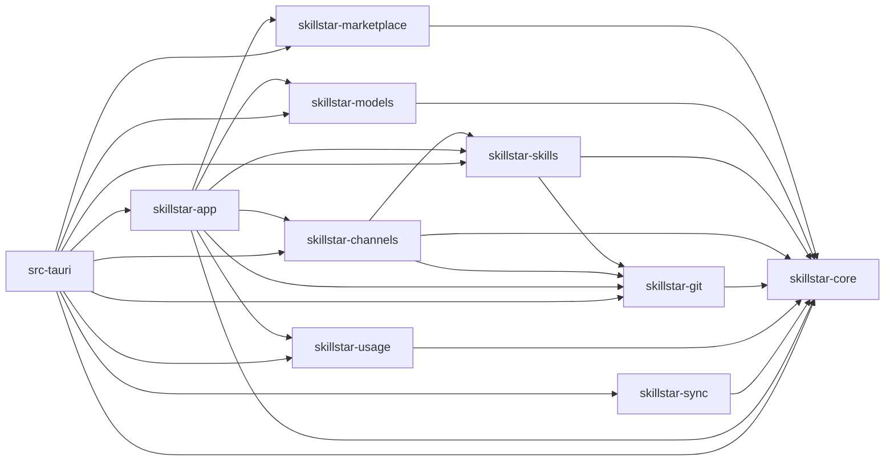

# SkillStar 项目边界

状态：active

本文件是项目树、目录所有权、依赖方向与跨层接缝的单一事实来源。运行时数据流和技术选择见 [architecture.md](./architecture.md)。

## 项目树

```text
SkillStar/
├── .claude/                     # 项目级 Claude 配置与本地 skill 入口
├── .github/workflows/           # 跨平台 CI 与发布
├── src/                         # React SPA
│   ├── pages/                   # 路由级薄壳
│   ├── features/                # 产品域切片；内部实现默认私有
│   ├── components/              # ui/、layout/、跨域 shared/
│   ├── hooks/                   # 真正全局的生命周期与事件 hooks
│   ├── lib/                     # 无 UI 的共享工具、IPC 契约和 adapters
│   ├── i18n/                    # en / zh-CN 同步维护
│   └── types/                   # 共享类型与 Rust 生成类型
├── src-tauri/
│   ├── src/cli/                 # GUI 同二进制的 CLI 入口与展示适配
│   ├── src/commands/            # 薄 Tauri 命令层
│   ├── src/core/                # Tauri State、Emitter、窗口、ACP 子进程等框架胶水
│   ├── src/lib.rs               # Tauri composition root
│   └── src/main.rs              # 可执行入口
├── crates/
│   ├── skillstar-core/          # 共享契约、配置、基础设施、Provider 元数据
│   ├── skillstar-git/           # Git transport/ops/tree/history 叶子
│   ├── skillstar-skills/        # 技能、项目、部署、Agent profile、GitHub App 身份
│   ├── skillstar-channels/      # 共享频道与 patrol
│   ├── skillstar-marketplace/   # 本地市场快照、FTS 与 MCP catalog
│   ├── skillstar-models/        # Provider store、AI、MCP store、tool sync
│   ├── skillstar-usage/         # 订阅、OAuth 和配额
│   ├── skillstar-sync/          # SSH 远端技能传输
│   └── skillstar-app/           # 跨域 use case 与共享 CLI 解析
├── docs/                        # 宪章、功能活文档和冻结历史
├── scripts/internal/            # CI 棘轮和一致性检查
├── scripts/release/             # 发布辅助脚本
├── public/                      # 静态资源与架构图（Agent 图标来自 @lobehub/icons）
└── Cargo.toml / Cargo.lock / package.json
                                  # Rust workspace（唯一 lockfile）与前端脚本/依赖事实源
```

## Workspace crate 所有权

| Crate | 拥有 | 不拥有 |
| --- | --- | --- |
| `skillstar-core` | 路径、文件操作、DB pool/migration、共享错误和配置、HTTP client、共享 `Skill` 契约、Provider identity/鉴权/余额端点元数据（`providers`） | 任一产品域的业务流程 |
| `skillstar-git` | Git 子进程 transport（认证材料、代理、取消、进度、脱敏）、tree-hash、repo history、dismissed skills、操作级 Git 辅助 | 依赖 content/lockfile/channels 的 GitHub 仓库管理（`gh_manager` 留在 `skillstar-skills::git`） |
| `skillstar-channels` | 组织共享频道（GitHub REST 编排、权限投影、descriptor、registry、成员/邀请、registration、release manifest/publish、subscription store、精确发布安装、逐 Skill 升级事务、自动升级策略）与 patrol；`policy::ChannelAwarePolicy` 实现 skills 的 mutation gate | 技能安装/更新核心实现、Marketplace、Usage、Models |
| `skillstar-skills` | 安装、更新、bundle、本地创作、repo scan、lockfile、repo-link 判定、update 状态、统一 `GitSkillFacade`、GitHub 仓库管理（`git::gh_manager` 编排 + `git::gh_rest` 发布 REST）、项目 manifest、deployment；SKILL.md frontmatter 质量校验（`validation`）、`.claude-plugin` 清单发现（`plugin_manifest`）、GitHub API 更新检测快速路径（`update_api`）；`skill_mutation` 定义注入式 mutation-gate 策略接缝；Agent spec/registry/custom profile 与 profile storage（`agents`）；GitHub App 设备授权、token 生命周期、凭据存储与网关（`github_auth`） | Marketplace 搜索、Usage、Models，或拆出叶子的业务编排 |
| `skillstar-marketplace` | SQLite 快照、FTS、技能市场；MCP 多源 catalog（源注册表、用户自定义源持久化、跨源抓取合并、`server.json` 解析、参数化卡片查询）与 curated 数据 | 技能安装实现、MCP 本地配置、registry→store 的映射 |
| `skillstar-models` | Provider store/preset、tool sync、AI 推理、MCP store 与 per-tool 投影、双纪元健康探测 | Usage 订阅、Marketplace 快照或 catalog 形态选择 |
| `skillstar-usage` | catalog、OAuth/API-key fetcher、加密 token、请求构建器 | Models provider store、CLI 凭证文件编排、桌面应用多开 |
| `skillstar-sync` | SSH/SFTP、远端 hub、传输凭证引用（S3 云同步已移除，见 decisions.md） | 本地技能域规则 |
| `skillstar-app` | 需要多个域协作的 use case、CLI 解析和模式识别；桌面应用多开（Cursor / Grok Bot / Antigravity 的独立 Chromium profile） | Tauri command 宏或窗口对象 |

## 允许的依赖方向

当前 Cargo 依赖形成以下单向图：



- `skillstar-models::providers` 的模块归属：`provider.rs` / `credential.rs` / `binding.rs` / `catalog.rs` / `roles.rs` 是 v4 域类型（`roles.rs` 拥有跨 Agent 的角色词表、`RoleDef` 注册表行类型与写盘跳过原因，因此 `tool_sync` 的 Agent 注册表依赖 `providers`，而不是反过来）；`crud_v4.rs` 拥有 v4 的 provider 行与绑定命令；`migrate/` 拥有 v3→v4 纯函数与迁移报告；`store_v4.rs` 拥有 v4 读写与备份/校验外壳；`catalog_cache.rs` 拥有 provider 自身模型目录的磁盘缓存（`<data_root>/cache/model_catalog/`，一 provider 一文件）；`types.rs` 降级为只供迁移读的 v1/v2/v3 历史形状，新代码不得引用。前端 DTO 投影（剥离明文凭据）在 `skillstar-app/src/models/dto.rs`，Agent 注册表的声明面投影（`AgentDescriptorDto`，剥离函数指针）在 `skillstar-app/src/models/agents.rs`，都不在域 crate。
- `skillstar-models::tool_sync` 只接受 v4 类型：writer 签名是 `(&AgentBinding, &[Provider])`，`view.rs` 是把 v4 可选端点与 `Credential` 投影成 writer 需要的平字符串的**唯一**地方。`migrate_configs.rs` 拥有「迁移那一次运行修复已写坏的 Agent 配置文件」这条接缝——它是 `providers` 与 `tool_sync` 之间唯一一处由 store 侧调用写盘侧的方向。
- `src-tauri/src/commands/models_commands/compat.rs` 是 v4 域类型与仍为 v3 形状的 IPC 之间的唯一翻译层，随前端 IA 重写一并删除。除它以外，命令层不得出现 v3 类型。

禁止：

- `skillstar-core` 依赖任一产品域。
- `skills ↔ marketplace`、`usage → models`、域 crate → `src-tauri`。
- 命令层为绕过边界而直接拼装跨域事务。
- leaf crate 用 default feature 隐式决定最终二进制的重 feature；由 `src-tauri` 显式选择。

依赖方向由 `Cargo.toml` 和 `scripts/internal/check_workspace_deps.sh` 共同看门；本文件不维护依赖版本。
Cargo 只使用仓库根 `Cargo.lock`；workspace member 下出现嵌套 lockfile 由同一 guard 拒绝。

## 前端边界

- `src/pages/*.tsx` 只负责路由、页面级组合和跨区布局，不拥有可复用业务逻辑。
- `src/features/<domain>/` 拥有自己的 `api/`、`hooks/`、`lib/`、`components/`；跨域只消费公开 `index.ts` 或提升后的共享层。
- SSH feature 只公开主机管理、连接进度和远程操作接口；My Skills 的远程卡片、筛选、详情与批量迁移 UI 位于 `src/features/my-skills/remote/`，以单向 `my-skills → ssh` 依赖消费公开入口。
- 无产品语义的 UI primitive 放 `src/components/ui/`；跨域展示组件放 `src/components/shared/`；纯工具放 `src/lib/`。
- Settings 可以组合各域的公开设置入口，但不复制域逻辑。
- Settings 内的 `github/` 子模块拥有 GitHub 登录 hook 与展示；它只消费 typed IPC，设备授权、凭据和网络状态机仍由 `skillstar-skills::github_auth` 拥有。账户入口 `GitHubAccountMenu` 经 `src/features/settings/index.ts` 公开给侧边栏，是该 feature 目前唯一的公开出口。
- `skillstar-skills::git_skill` 是扫描、安装、更新检查和升级的展示无关入口；`skillstar-git::transport` 独占远程 Git 子进程的认证、代理、取消、进度和脱敏策略，私有 `skillstar-git::tree` 对 tracked tree 元数据执行有界读取。`skillstar-skills::git::gh_manager` 因耦合 content/lockfile/shared_channels 留在 skills，`skills::git` 对 `skillstar-git` 仅 re-export。发布链路的 GitHub REST 独占在 `skills::git::gh_rest`（App 凭据 + `probe_http_client`），`gh_manager` 只做编排；发布的 clone/pull/push 必须经 `skillstar-git::transport` 的 operation session，本地 init/add/commit 才允许裸子进程。`src-tauri::core::github_auth` 只管理 facade/session 生命周期并把结构化进度适配为事件，commands 与 CLI 不得另起带网络的 Git 命令。
- `skillstar-channels::shared_channels` 独占共享频道 GitHub REST 编排、权限投影、版本化 descriptor、本地登记、成员/邀请 facade、已有仓库 registration session、不可变 release manifest/publish session，以及版本化 subscription store、精确发布安装、逐 Skill 频道升级事务和按频道自动升级到期/暂停策略；仓库库存、发布快照和订阅内容扫描只能经注入的操作级 Git scanner/installer/updater 接缝，生产 REST gateway 必须使用 `probe_http_client`。成员与 invitation 不得另建持久 ACL，订阅选择、自动升级偏好和升级结果不得写入 GitHub；Tauri 远程命令只适配当前认证 state，本地只读状态与偏好命令直接访问 subscription registry，不得被登录状态阻断。应用进程内的周期唤醒与事件发送属于 `src-tauri/src/core/` 胶水，不得复制到前端计时器或 command wrapper。`src/features/shared-channels/` 是独立前端 feature，只通过 typed IPC 暴露给 My Skills 组合。
- 通用技能 mutation gate 是依赖倒置接缝：`skillstar-skills::skill_mutation::SkillMutationPolicy` 定义查询接口（默认 allow-all），`skillstar-channels::policy::ChannelAwarePolicy` 查订阅注册表实现它；组合根（Tauri setup、CLI 入口）必须调用 `install_global_policy`，任何新的可执行入口都要注册后才能执行技能写路径。
- `scripts/internal/check_feature_imports.sh` 允许通过目标 feature 根 `index.ts` 的显式依赖，对新跨 feature 深层导入直接失败；既有基线只能缩减。
- `scripts/internal/check_ts_orphan_modules.sh` 是 `check_no_orphan_modules.sh` 的 TypeScript 对偶：`src/features/` 下每个 `.ts`/`.tsx` 必须能从 `src/main.tsx` 或 `src/pages/` 走静态与动态 import 抵达。只被测试或只被另一个孤儿引用都算孤儿——lint/build/test 全绿并不能证明文件在生产路径上。基线 `ts_orphan_modules_baseline.txt` 为空且应保持为空。
- Models 工作台的生产组件树在 `src/features/models/components/hub/`：`ModelsHub.tsx` 是入口，矩阵实现在 `hub/matrix/`（`rich/` 为单元格与面板）。**不存在 `hub/prototype/`**；原型目录不得再作为生产代码的落点。

## 关键接缝

| 接缝 | 规则 | 证据入口 |
| --- | --- | --- |
| React → Rust | 只通过集中 IPC wrapper 调用 Tauri command | `src/lib/ipc/`、`src-tauri/src/commands/mod.rs` |
| Tauri → 域 | command 做参数/State/事件适配后调用 facade | `src-tauri/src/commands/` |
| 跨域事务 | 放入 `skillstar-app`，由窄 facade 组合 | `crates/skillstar-app/src/` |
| MCP catalog → store | 运行时形态选择、draft 映射、安装前确认负载、preset 映射全部在 `skillstar-app::mcp`；两个域 crate 互不知晓，命令层不做映射 | `crates/skillstar-app/src/mcp/` |
| 网络 | 经统一 HTTP client，读取 proxy 配置 | `crates/skillstar-core/src/infra/http_client.rs` |
| 生成类型 | Rust struct → ts-rs → `src/types/generated/` | `package.json` 的 `types:gen` |
| 远端 SSH | `skillstar-sync` 只依赖 `skillstar-core`；SFTP 列出远端 hub，不消费 skills 域契约 | `crates/skillstar-sync/Cargo.toml` |

`scripts/internal/check_command_boundaries.sh` 对 command 层新增的直接文件系统/path ownership 与任何 HTTP 构造（`reqwest`/`probe_http_client`）失败；存量按文件计数棘轮，只能下降。

## MCP 模块布局

MCP 是唯一横跨两个域 crate 的功能域，模块边界因此单列。三层各自拥有什么：

```text
crates/skillstar-marketplace/src/
├── mcp_models/          # server.json `2025-12-11` 模型与解析
│   ├── mod.rs           #   快照/卡片/详情记录
│   ├── inputs.rs        #   Input 语义（env / header / CLI argument）
│   ├── spec.rs          #   packages / remotes / icons / status
│   ├── parse.rs         #   wire → snapshot，所有源共用
│   └── raw.rs           #   camelCase / snake_case 容错读取
├── mcp_remote/          # 多源抓取
│   ├── sources.rs       #   源注册表（内置 + 用户覆盖）
│   ├── config.rs        #   `<config_dir>/mcp_sources.json` 持久化
│   ├── fetch.rs         #   逐源分页、重试、限流、ETag
│   └── merge.rs         #   版本去重与跨源字段合并
└── mcp_snapshot/        # 本地快照
    ├── schema.rs        #   表定义与 v13 列清单
    ├── seeding.rs       #   curated seed upsert
    ├── filters.rs       #   参数化卡片查询形状
    ├── query/           #   `&Connection` SQL 读写核心（纯函数、可测）
    ├── seeds/           #   curated 种子数据
    └── tests/

crates/skillstar-app/src/mcp/     # 跨域 use case（本域唯一编排层）
├── runtime.rs           #   运行时形态候选与排序
├── draft.rs             #   registry server → McpServerEntry 草稿（含来源指纹）
├── install.rs           #   安装前确认负载（完整命令 + Input 表单 + secret 策略）、答案→entry 的折叠，以及提交时的校验裁决（必填项 + 与已确认命令比对，纯函数，不做 IO）
└── presets.rs           #   curated 行 → preset 芯片

crates/skillstar-models/src/mcp/  # 本地 store 与投影
├── import.rs            #   从各 Agent 活配置读入
├── import_paste.rs      #   粘贴 / 深链 → 草稿（不写 store）
└── probe/               #   双纪元健康探测（modern / legacy）+ schema 体积


src-tauri/src/commands/mcp_commands.rs      # 只有命令注册 / DTO / State / 错误
src-tauri/src/commands/mcp_marketplace.rs   # 同上
```

已删除的单文件（旧布局，不要再引用）：`mcp_models.rs`、`mcp_remote.rs`、`mcp_snapshot/query.rs`。

## 新代码放置决策

1. 只影响一个现有域：先放该 crate/feature 的私有 module。
2. 多域业务事务：放 `skillstar-app`，不要制造反向依赖。
3. 仅 Tauri 生命周期或窗口能力：放 `src-tauri/src/core/`。
4. 仅命令序列化/事件适配：放 `src-tauri/src/commands/`。
5. 真正跨域且无业务语义的基础能力：才考虑 `skillstar-core` 或前端 shared/lib。
6. 只有变更节奏、依赖集合或 deletion test 证明独立编译单元有收益时，才晋升为新 crate。

## 变化触发器

新增、移动、删除顶层目录、workspace member、前端 feature 或公开接缝时，必须先更新本文件，并同步更新 [architecture.md](./architecture.md) 中受影响的数据流。
