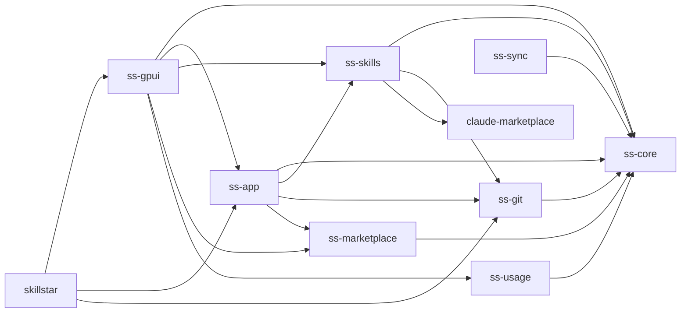

# SkillStar 项目边界

状态：active

本文件是项目树、目录所有权、依赖方向与跨层接缝的单一事实来源。运行时数据流和技术选择见 [architecture.md](./architecture.md)。

## 项目树

```text
SkillStar/
├── .claude/                     # 项目级 Claude 配置与本地 skill 入口
├── .github/workflows/           # 跨平台 CI 与发布
├── crates/
│   ├── skillstar/        # 产品二进制：MCP、askpass、CLI、GPUI 分派
│   ├── ss-core/          # 共享契约、配置与基础设施
│   ├── ss-git/           # Git transport/ops/tree/history 叶子
│   ├── ss-skills/        # 技能生命周期、共享频道、项目部署与 Agent profile
│   ├── ss-marketplace/   # 本地技能市场快照与 FTS
│   ├── ss-usage/         # 订阅、OAuth、配额、CLI/IDE 账号切换与桌面应用多开
│   ├── ss-sync/          # SSH 远端技能传输
│   ├── claude-marketplace/ # Claude Code 插件市场格式协议叶子（D-102）
│   ├── ss-gpui/          # GPUI 桌面壳（D-091；应用文案在 assets/locales，组件文案覆盖在 locales/ui.yml）
│   └── ss-app/           # 跨域 use case、CLI 解析、进程启动与周期唤醒
├── docs/                        # 宪章、功能活文档和冻结历史
│   └── assets/                  # README 用的产品图标
├── specs/                       # 多切片实施计划（write-spec 产物）；不承载运行时契约，落地后以 docs/ 为准
├── scripts/internal/            # CI 棘轮和一致性检查
├── vendor/
│   └── gpui-component/          # 上游 0.7.1 vendored 副本，经 [patch.crates-io] 接入；唯一 diff 是悬浮窗入场动画（D-101）
└── Cargo.toml / Cargo.lock / deny.toml
                                  # Rust workspace、唯一 lockfile、cargo-deny 配置
```

`vendor/` 不是 workspace 成员：vendored crate 的清单带空 `[workspace]`，只被根 `Cargo.toml` 的 `[patch.crates-io]` 引用，结构与门禁脚本只扫 `crates/`。升级上游等于重新 vendor 并重放 [D-101](./decisions.md#d-101gpui-component-以-vendored-patch-引入悬浮窗入场统一为原地弹出) 的那一处 diff，不在此处做任何发散修改。

## Workspace crate 所有权

| Crate | 拥有 | 不拥有 |
| --- | --- | --- |
| `ss-core` | 路径、文件操作原语（不含技能部署语义）、DB pool/migration、共享错误和配置、HTTP client、共享 `Skill` 契约 | 任一产品域的业务流程 |
| `ss-git` | Git 子进程 transport（认证材料、代理、取消、进度、脱敏）、临时目录浅克隆与 ref/folder tree-hash 等操作级 Git 辅助、repo history | 依赖 content/lock/channels 的 GitHub 仓库管理（`gh_manager` 留在 `ss-skills::git`） |
| `ss-skills` | skills CLI 语义安装核心（[D-081](./decisions.md#d-081技能安装锁与更新整体同步-vercel-labsskills删除自研管线)：`skill_lock` 锁、`fetch` 临时浅克隆、`installer` canonical 复制与相对链接、`materialize` 名字换算/受限复制/暂存交换原语（[D-094](./decisions.md#d-094技能物化统一为校验暂存交换原语部署所有权由链接目标或部署标记证明)）、`update` 按来源分组拉取的覆盖式重装与后台自动更新用例（`update::auto_update_locked_skills`）、`update_check` 上游 tree SHA 检测（逐层子树解析、限流冷却、有界并发）、`install_baseline` 安装内容基线、`installed_skill` 读侧）、bundle、本地创作、`GitSkillFacade`、GitHub 仓库管理（`git::gh_manager` 编排 + `git::gh_rest` 发布 REST）、项目 manifest、deployment（`deployment::ownership` 是部署所有权与链接/复制部署的唯一实现）；SKILL.md frontmatter 解析与诊断（`validation` 下私有 `frontmatter` 模块）、安装门禁（`validation::ensure_installable`）、`.claude-plugin` 清单发现（`plugin_manifest`）、GitHub Trees API 更新检测（`update_api`）；`skill_mutation` 定义 mutation-gate 查询接缝，默认使用域内频道策略；Agent spec/registry/custom profile 与 profile storage（`agents`）；GitHub App 设备授权、token 生命周期、凭据存储与网关（`github_auth`）；本机团队智能（`team`：installed-skill BM25 recall、friction notes、skill health、digest）；共享频道与巡检（`channels`）；单域部署用例（`workflows`：Agent 技能暂停/恢复、安装后部署、Deck 的 Agent rail）；存储健康检查与只修复有所有权证明的条目（`health`，[D-096](./decisions.md#d-096存储健康检查只修复能证明所有权的条目)） | Marketplace 搜索、Usage，或拆出叶子的业务编排；不拥有已删除的 Learn/教程域 |
| `ss-marketplace` | SQLite 快照、FTS、技能市场 | 技能安装实现 |
| `ss-usage` | 账号 facade 与 DTO 投影（`accounts`，含消费汇总）、私有余额端点元数据（`providers`）、与 DSH 家族范围一致的账号 catalog（不决定 Skills / sessions 支持范围）、OAuth/API-key/Cookie/TokenImport fetcher（重置卡 transport 私有归属各 provider，账号 facade 编排指定窗口消费）、加密 token、`tool_paths` / `tool_store` 本地存储基元、请求构建器；Agent 会话文件只读解析（`sessions`：增量 checkpoint 落 `data_root()/sessions/`，覆盖的 Agent 家族以 `sessions::parsers()` 注册表及其测试为准，文档不手抄清单）；CLI 凭证切换引擎（`usage_switch`：软链快照 custody、逐 CLI target、IDE 凭据写回注册表，D-077）；只读模型价格表（`pricing`：model_gateway.json 覆盖 + models.dev 缓存，D-082 随模型域移除下沉）；桌面应用多开（`instances`，限账号目录内独立 IDE；按 D-054 不绑定订阅数据） | Models provider store；`sessions` 只读 Agent 自己的会话文件，不写 Agent 目录 |
| `ss-sync` | SSH/SFTP、远端 hub、传输凭证引用（S3 云同步已移除，见 decisions.md） | 本地技能域规则 |
| `claude-marketplace` | Claude Code 插件市场外部格式（[D-102](./decisions.md#d-102claude-code-插件市场格式独立为协议叶子-crate)）：`marketplace.json` / `plugin.json` schema、命名与路径校验、自包含 marketplace 目录写出。协议叶子，零 `ss-*` 依赖 | 产品编排：频道注册表读取、技能内容校验与物化（归 `ss-skills::channels`）、CLI/GUI 入口（归 `ss-app`） |
| `ss-gpui` | GPUI 壳：窗口、`nav` 路由、tokio↔GPUI 桥（`spawn_domain`）、按能力分的 view entity（见下文）、嵌入的界面文案 | 域逻辑本身（委托 `crates/*`）；进程分派、市场快照接线、频道周期唤醒；不按页面再拆 workspace crate |
| `ss-app` | 需要多个域协作的 use case、CLI 解析（含 `cli::update` 先检查后应用、`cli::doctor` 存储健康与纳管、`cli::channel` 频道检查/升级/回滚）、进程启动（迁移 + 旧 hub 链接修复 + 市场快照接线）和 GUI 存活期间的周期唤醒（`channel_wake` 频道自动升级、`skill_wake` 通用技能自动更新、`release_check_wake` 应用版本检查；生产频道 facade 由 `channel_facade` 统一构造） | 窗口对象。不承载单域账号 facade、消费汇总、切换/多开或技能部署用例（D-086）；不拥有健康计划或纳管计划，只调用 `ss-skills` 的对应 facade。模型域已整体移除（D-082），不得回流 |
| `skillstar` | 唯一产品二进制的进程分派：MCP serve、askpass、CLI、GPUI | 域逻辑、窗口实现 |

## GPUI 壳模块

`crates/ss-gpui/src` 按能力分模块。壳组合窗口和这些能力，能力之间不引用对方的内部模块。跨能力跳转走 `nav` 上的事件，由 `Shell` 订阅后改路由。

```text
crates/ss-gpui/src/
├── lib.rs            # 窗口启动、资源、tokio↔GPUI 桥
├── layout.rs         # 窗口、技能卡、额度卡的静态宽度
├── shell.rs          # 侧栏、模式、KeepAlive 页面表
├── shell/nav.rs      # 技能模式四项；选中框按测到的行框滑动
├── nav.rs            # NavPage、AppMode、跨能力事件
├── chrome/           # 各能力共用的顶栏、图标和对话框外框，不含页面状态
├── my_skills/        # skill-card 在 skill_card/
├── marketplace/      # 榜单；market-card 在 market_card.rs；发布者详情在 publisher/
├── skill_cards/      # 卡组；group-card 在 group_card.rs；分享码和文件导入在 deck_import.rs；新建卡组对话框在 create_group.rs（导入对话框的 Quick Pack 步嵌同一实体）
├── projects/
├── accounts/
├── settings/
├── skill_card/       # 技能/市场/卡组外框；技能卡和额度卡共用的轨道（grid.rs）；来源 chip
├── theme.rs
├── i18n.rs
├── translation.rs    # 卡片、详情列和阅读悬浮窗的译文查找与绘制；网络与缓存在 ss-core::translation
├── prefs.rs
├── notify.rs
└── agent_icons.rs
```

这些模块共享同一个 gpui-kit 窗口和同一条 `spawn_domain` 桥，拆成多个 workspace crate 不会缩小依赖图。新的 GPUI 界面放进已有能力目录；只有第二个能力要复用、且能叫出一个独立名字时，才抽到 `skill_card/` 这一层。技能卡、市场卡、卡组卡分别住在各自能力里，只共用这一层的尺寸和外框。额度卡用同一条轨道（`grid.rs`），图例面留在 `accounts`。

公开缝只留该页 entity 和它发出的事件。要打开另一页，发 `nav` 上的事件，由 `Shell` 改路由。对话框、空状态和本页工具栏留在该能力目录。`chrome/` 只放没有页面状态的共用控件。`theme`、`i18n`、`prefs`、`notify`、`agent_icons` 留在 crate 根。视觉与交互见 [features/frontend/README.md](./features/frontend/README.md)。

## 当前功能的域划分

按数据所有权和事务内聚性划分，不按页面数量建 crate（D-086）。Skills 拥有从安装到共享频道升级的完整生命周期；Accounts 由既有 `ss-usage` 承载，名称保留以避免无收益的全量重命名。`accounts` 是账号用例与 DTO 的公开 facade，内部 service/dto 模块保持私有。`channels` 是技能域下的命名空间，不再是独立编译单元。 Devin Desktop 的额度与登录实现位于 `ss-usage/src/fetchers/oauth/devin_desktop/`，账号切换实现位于 `ss-usage/src/usage_switch/devin_desktop.rs`；旧品牌仅保留于外部协议和兼容迁移边界。

Marketplace 保留独立 SQLite 快照/FTS 生命周期；Git 和 SSH 保留各自传输依赖与取消/认证边界。SKILL.md 解析留在技能域的私有模块，通过 `validation` 暴露统一接口（D-099）。`ss-app` 只组合真正跨域的流程和交付入口，不为单域操作增加转发层。

## 允许的依赖方向

当前 Cargo 依赖形成以下单向图：


```mermaid
flowchart LR
  core["ss-core"]
  git["ss-git"]
  skills["ss-skills"]
  market["ss-marketplace"]
  usage["ss-usage"]
  sync["ss-sync"]
  cmkt["claude-marketplace"]
  app["ss-app"]
  gpui["ss-gpui"]
  bin["skillstar"]

  market --> core
  skills --> core
  skills --> git
  skills --> cmkt
  git --> core
  usage --> core
  sync --> core
  app --> core
  app --> skills
  app --> git
  app --> market
  gpui --> core
  gpui --> app
  gpui --> skills
  gpui --> market
  gpui --> usage
  bin --> gpui
  bin --> app
  bin --> git
```

禁止：

- `ss-core` 依赖任一产品域。
- `skills ↔ marketplace`、域 crate → `skillstar` 或 `ss-gpui`。
- 壳或 CLI 为绕过边界而直接拼装跨域事务。
- leaf crate 用 default feature 隐式决定最终二进制的重 feature；由 `skillstar` 显式选择。

依赖方向由 `Cargo.toml` 和 `scripts/internal/check_workspace_deps.sh` 共同看门；本文件不维护依赖版本。
Cargo 只使用仓库根 `Cargo.lock`；workspace member 下出现嵌套 lockfile 由同一 guard 拒绝。

## 壳与进程边界

- GPUI 能力目录的规则见上文「GPUI 壳模块」。视觉与交互见 [features/frontend/README.md](./features/frontend/README.md)。能力不引用另一个能力的内部模块。
- 应用文案只来自 `crates/ss-gpui/assets/locales/`。en 与 zh-CN 同步维护。GPUI Kit 组件自带字符串；要覆盖时写在 `crates/ss-gpui/locales/ui.yml` 的 `gpui_component` 下，并在 `gpui_kit::init` 之前 `extend`。语言切换调用 `set_locale` 后刷新窗口。见 [I18n](https://gpui-kit.com/docs/i18n/)。
- `ss-skills::fetch` 的私有 `fetch/cache.rs` 管理普通导入的持久缓存与互斥，`fetch::clear_import_cache` 向存储维护暴露清理入口；完整快照仍用临时 checkout。
- Settings 可以组合各域的公开设置入口，但不复制域逻辑。GitHub 设备授权、凭据和网络状态机仍由 `ss-skills::github_auth` 拥有。
- 本机 Agent 已装技能的纳管计划由 `ss-skills::local_skill` 的私有 `intake` 模块拥有；`repair` 只把 `repair_installations` 委托给该计划。`doctor --fix` 与设置里的修复按钮不调用它。`doctor --adopt` 与设置存储页的预览/纳管调用它。存储维护的显式 `repair_skills` 只跑这条纳管计划，断链清理留在 `clean_broken_skills`；GPUI 只展示逐项结果。
- `ss-skills::git_skill` 是扫描、安装、更新检查和升级的展示无关入口；`ss-git::transport` 独占远程 Git 子进程的认证、代理、取消、进度和脱敏策略，仓库内容获取统一走 `ss-skills::fetch`（行为见 [Skills](./features/skills/README.md#安装与更新)）。`ss-skills::git::gh_manager` 因耦合 content/共享频道安装器留在 skills，`skills::git` 对 `ss-git` 仅 re-export。发布链路的 GitHub REST 独占在 `skills::git::gh_rest`（App 凭据 + `probe_http_client`），`gh_manager` 只做编排；发布的 clone/pull/push 必须经 `ss-git::transport` 的 operation session，本地 init/add/commit 才允许裸子进程。CLI 与 GUI 不得另起带网络的 Git 命令。
- `ss-skills::channels::shared_channels` 独占共享频道 GitHub REST 编排、权限投影、版本化 descriptor、本地登记、成员/邀请 facade、已有仓库 registration session、不可变 release manifest/publish session，以及版本化 subscription store、精确发布安装、逐 Skill 频道升级事务、按频道自动升级到期/暂停策略和 marketplace 导出编排（格式 schema 与目录写出归 `claude-marketplace` 叶子，[D-102](./decisions.md#d-102claude-code-插件市场格式独立为协议叶子-crate)）；仓库库存、发布快照和订阅内容扫描只能经注入的操作级 Git scanner/installer/updater 接缝，生产 REST gateway 必须使用 `probe_http_client`。成员与 invitation 不得另建持久 ACL，订阅选择、自动升级偏好和升级结果不得写入 GitHub。本地只读状态与偏好直接访问 subscription registry，不得被登录状态阻断。应用进程内的周期唤醒属于 `ss-app` 的 `channel_wake`，由 GPUI 进程启动，不得复制成壳内计时器。共享频道管理界面和 SSH 远端界面随 React 壳删除，尚未在 GPUI 重建。
- 通用技能自动更新偏好由 `ss-core::config::skill_updates` 拥有（Settings 只读写它），检查与应用用例在 `ss-skills::update`，GUI 存活期间的周期唤醒在 `ss-app::skill_wake`；壳不自己计时，也不复制更新事务。
- 通用技能 mutation gate 保留窄查询接口，默认使用域内 `channels::policy::ChannelAwarePolicy` 查询订阅注册表；无需 GUI/CLI 注册，直接调用技能域也不能绕过频道所有权保护。测试直接验证生产默认策略；不再公开可替换的全局策略注册口。
- 顶层模式只有 Skills 与 Accounts 两个（见 [D-085](./decisions.md)）：Usage 域只提供数据，账号增删改切与消费展示都只在 Accounts 出现。
- MCP serve 不得调用 `ss_app::bootstrap::prepare_process`。市场快照初始化不属于 stdio 握手。

## 关键接缝

| 接缝 | 规则 | 证据入口 |
| --- | --- | --- |
| GUI → 域 | GPUI view 经 `spawn_domain` 调用域 facade，不经 IPC | `crates/ss-gpui/src/lib.rs` |
| 进程入口 | `skillstar` 先判断 MCP serve，再 askpass，再 CLI，其余进入 GPUI | `crates/skillstar/src/main.rs` |
| 进程启动 | CLI 与 GUI 共用迁移和市场快照接线；MCP serve 不调用 | `crates/ss-app/src/bootstrap.rs` |
| 跨域事务 | 放入 `ss-app`，由窄 facade 组合 | `crates/ss-app/src/` |
| 技能自动更新 | 偏好归 `ss-core` config，检查与应用归 `ss-skills` facade，周期唤醒归 `ss-app`；壳只读写偏好 | `crates/ss-app/src/skill_wake.rs` |
| 应用版本检查 | 检测归 `ss-core::infra::release_check`（check-only，不下载），周期唤醒归 `ss-app`，产品版本由 `skillstar` 二进制传入（D-103） | `crates/ss-core/src/infra/release_check.rs` |
| 项目技能 MCP | 本机 stdio 服务、项目技能推荐与批准编排在 `ss_app::project_skills_mcp`。工具参数在 `protocol`，不接收批准字段。`rmcp` 只加入 `ss-app` | `crates/ss-app/src/project_skills_mcp/` |
| 网络 | 经统一 HTTP client，读取 proxy 配置 | `crates/ss-core/src/infra/http_client.rs` |
| 远端 SSH | `ss-sync` 只依赖 `ss-core`；SFTP 列出远端 hub，不消费 skills 域契约 | `crates/ss-sync/Cargo.toml` |

## 新代码放置决策

1. 只影响一个现有域：先放该 crate/feature 的私有 module。
2. 多域业务事务：放 `ss-app`，不要制造反向依赖。
3. 仅窗口或 GPUI 展示：放 `crates/ss-gpui` 已有能力目录。
4. 仅进程分派，不含域逻辑：放 `crates/skillstar`。
5. 真正跨域且无业务语义的基础能力：才考虑 `ss-core`。
6. 只有变更节奏、依赖集合或 deletion test 证明独立编译单元有收益时，才晋升为新 crate。
7. 外部技术规范（如 Agent Skills frontmatter）若满足 D-002，可成为产品无关协议叶子；不得把产品编排塞进该叶子。

## 变化触发器

新增、移动、删除顶层目录、workspace member、GPUI 能力目录或公开接缝时，必须先更新本文件，并同步更新 [architecture.md](./architecture.md) 中受影响的数据流。
