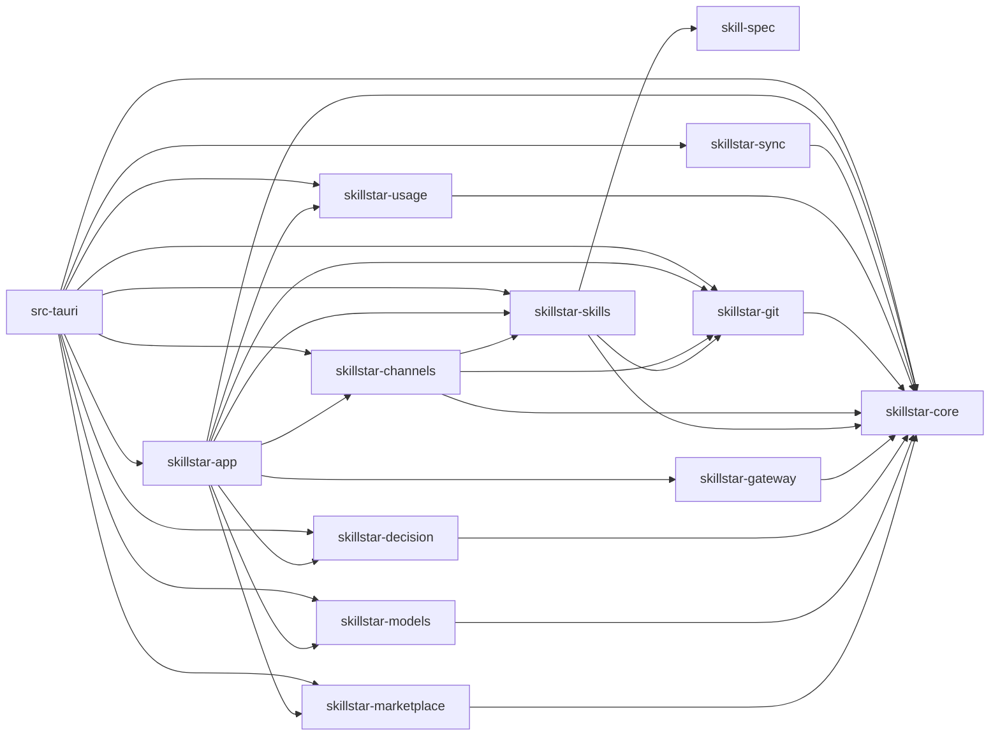

# SkillStar 项目边界

状态：active

本文件是项目树、目录所有权、依赖方向与跨层接缝的单一事实来源。运行时数据流和技术选择见 [architecture.md](./architecture.md)。

## 项目树

```text
SkillStar/
├── .claude/                     # 项目级 Claude 配置与本地 skill 入口
├── .github/workflows/           # 跨平台 CI 与发布
├── src/                         # React SPA
│   ├── pages/                   # 路由级薄壳
│   ├── features/                # 产品域切片；内部实现默认私有
│   ├── components/              # ui/、layout/、跨域 shared/
│   ├── hooks/                   # 真正全局的生命周期与事件 hooks
│   ├── lib/                     # 无 UI 的共享工具、页面生命周期上下文、IPC 契约和 adapters
│   ├── i18n/                    # en / zh-CN 同步维护
│   └── types/                   # 共享类型与 Rust 生成类型
├── src-tauri/
│   ├── src/cli/                 # GUI 同二进制的 CLI 入口与展示适配
│   ├── src/commands/            # 薄 Tauri 命令层
│   ├── src/core/                # Tauri State、Emitter、窗口、ACP 子进程等框架胶水
│   ├── src/lib.rs               # Tauri composition root
│   └── src/main.rs              # 可执行入口
├── crates/
│   ├── skill-spec/              # 产品无关的 Agent Skills SKILL.md 规范叶子
│   ├── skillstar-core/          # 共享契约、配置、基础设施、Provider 元数据
│   ├── skillstar-git/           # Git transport/ops/tree/history 叶子
│   ├── skillstar-skills/        # 技能、项目、部署、Agent profile、GitHub App 身份
│   ├── skillstar-channels/      # 共享频道与 patrol
│   ├── skillstar-marketplace/   # 本地技能市场快照与 FTS
│   ├── skillstar-models/        # Provider store、AI、tool sync
│   ├── skillstar-decision/      # 本地 AgentJev-0.6B 决策模型：权重、tokenizer、candle 前向
│   ├── skillstar-gateway/       # 本机模型网关：协议翻译、环回监听、Claude 进程桥、注入快照签名，以及 Agent 配置写入
│   ├── skillstar-usage/         # 订阅、OAuth、配额、CLI/IDE 账号切换与桌面应用多开
│   ├── skillstar-sync/          # SSH 远端技能传输
│   └── skillstar-app/           # 跨域 use case 与共享 CLI 解析
├── docs/                        # 宪章、功能活文档和冻结历史
├── specs/                       # 多切片实施计划（write-spec 产物）；不承载运行时契约，落地后以 docs/ 为准
├── scripts/internal/            # CI 棘轮和一致性检查
├── scripts/release/             # 发布辅助脚本
├── public/                      # 静态资源与架构图（Agent 图标来自 @lobehub/icons）
└── Cargo.toml / Cargo.lock / package.json
                                  # Rust workspace（唯一 lockfile）与前端脚本/依赖事实源
```

## Workspace crate 所有权

| Crate | 拥有 | 不拥有 |
| --- | --- | --- |
| `skill-spec` | 公开 Agent Skills `SKILL.md` 的 frontmatter 解析与诊断（issue code、阻塞/咨询分级、manifest 大小上限） | SkillStar 安装编排、Hub/lockfile、discovery、bundle，或任何 `skillstar-*` 产品依赖 |
| `skillstar-core` | 路径、文件操作、DB pool/migration、共享错误和配置、HTTP client、共享 `Skill` 契约、Provider identity/鉴权/余额端点元数据（`providers`） | 任一产品域的业务流程 |
| `skillstar-git` | Git 子进程 transport（认证材料、代理、取消、进度、脱敏）、tree-hash、repo history、dismissed skills、操作级 Git 辅助 | 依赖 content/lockfile/channels 的 GitHub 仓库管理（`gh_manager` 留在 `skillstar-skills::git`） |
| `skillstar-channels` | 组织共享频道（GitHub REST 编排、权限投影、descriptor、registry、成员/邀请、registration、release manifest/publish、subscription store、精确发布安装、逐 Skill 升级事务、自动升级策略）与 patrol；`policy::ChannelAwarePolicy` 实现 skills 的 mutation gate | 技能安装/更新核心实现、Marketplace、Usage、Models |
| `skillstar-skills` | 安装、更新、bundle、本地创作、repo scan、lockfile、repo-link 判定、update 状态、统一 `GitSkillFacade`、GitHub 仓库管理（`git::gh_manager` 编排 + `git::gh_rest` 发布 REST）、项目 manifest、deployment；SKILL.md 安装门禁适配（`validation::ensure_installable`，解析委托 `skill-spec`）、`.claude-plugin` 清单发现（`plugin_manifest`）、GitHub API 更新检测快速路径（`update_api`）；`skill_mutation` 定义注入式 mutation-gate 策略接缝；Agent spec/registry/custom profile 与 profile storage（`agents`）；GitHub App 设备授权、token 生命周期、凭据存储与网关（`github_auth`）；本机团队智能（`team`：installed-skill BM25 recall、friction notes、skill health、digest） | Marketplace 搜索、Usage、Models，或拆出叶子的业务编排；不再拥有 SKILL.md frontmatter 解析实现；不拥有已删除的 Learn/教程域 |
| `skillstar-marketplace` | SQLite 快照、FTS、技能市场 | 技能安装实现 |
| `skillstar-models` | Provider store/preset、tool sync、AI 推理 | Usage 订阅、Marketplace 快照 |
| `skillstar-decision` | 本地 AgentJev-0.6B 决策模型：checkpoint 的文件规格/下载/校验、`agentjev.decision.v1` 请求校验与答案整形、Qwen3-0.6B 主干与候选集合头的前向（共享前缀 KV 复用）；workspace 内唯一允许引入 ML 运行时（candle / tokenizers）的 crate | Provider store、tool sync、App AI 的 chat/summarize 路径、任何 Tauri 类型；不拥有业务闸门/路由的判定策略（由调用方决定阈值与后果） |
| `skillstar-gateway` | 本机模型网关：协议翻译、环回监听、Claude 进程桥、用注入的账户快照签上游，以及 Agent 配置写入 | 密钥表、Usage 订阅、决策模型。不读取 `model_providers.json`，不打开 Usage 存储，不发起配额请求 |
| `skillstar-usage` | catalog、OAuth/API-key/Cookie/TokenImport fetcher、加密 token、`tool_paths` / `tool_store` 本地存储基元、请求构建器；Agent 会话文件只读解析（`sessions`：增量 checkpoint 落 `data_root()/sessions/`，claude-code/claude-desktop projects JSONL 家族）；CLI 凭证切换引擎（`usage_switch`：软链快照 custody、逐 CLI target、IDE 凭据写回注册表，D-077）；桌面应用多开（`instances`，按 D-054 不绑定 Usage catalog 数据） | Models provider store；`sessions` 只读 Agent 自己的会话文件，不写 Agent 目录 |
| `skillstar-sync` | SSH/SFTP、远端 hub、传输凭证引用（S3 云同步已移除，见 decisions.md） | 本地技能域规则 |
| `skillstar-app` | 需要多个域协作的 use case、CLI 解析和模式识别；Usage 前端 facade 与 DTO 投影（`usage/dto`，D-034）；启动本机模型网关 | Tauri command 宏或窗口对象。网关协议不放在这里；不再承载单域 Usage 切换/多开实现（D-077） |

## 允许的依赖方向

当前 Cargo 依赖形成以下单向图：


```mermaid
flowchart LR
  spec["skill-spec"]
  core["skillstar-core"]
  git["skillstar-git"]
  skills["skillstar-skills"]
  channels["skillstar-channels"]
  market["skillstar-marketplace"]
  models["skillstar-models"]
  decision["skillstar-decision"]
  gateway["skillstar-gateway"]
  usage["skillstar-usage"]
  sync["skillstar-sync"]
  app["skillstar-app"]
  tauri["src-tauri"]

  market --> core
  models --> core
  decision --> core
  gateway --> core
  skills --> spec
  skills --> core
  skills --> git
  channels --> core
  channels --> git
  channels --> skills
  git --> core
  usage --> core
  sync --> core
  app --> core
  app --> skills
  app --> git
  app --> channels
  app --> market
  app --> models
  app --> decision
  app --> usage
  app --> gateway
  tauri --> app
  tauri --> core
  tauri --> skills
  tauri --> git
  tauri --> channels
  tauri --> market
  tauri --> models
  tauri --> decision
  tauri --> usage
  tauri --> sync
```

- `skillstar-models::providers` 的模块归属：`provider.rs` / `credential.rs` / `binding.rs` / `catalog.rs` / `roles.rs` 是 v4 域类型（`roles.rs` 拥有跨 Agent 的角色词表、`RoleDef` 注册表行类型与写盘跳过原因，因此 `tool_sync` 的 Agent 注册表依赖 `providers`，而不是反过来）；`crud_v4.rs` 拥有 v4 的 provider 行与绑定命令；`migrate/` 拥有 v3→v4 纯函数与迁移报告；`store_v4.rs` 拥有 v4 读写与备份/校验外壳；`catalog_cache.rs` 拥有 provider 自身模型目录的磁盘缓存（`<data_root>/cache/model_catalog/`，一 provider 一文件）；`types.rs` 降级为只供迁移读的 v1/v2/v3 历史形状，新代码不得引用。前端 DTO 投影（剥离明文凭据）在 `skillstar-app/src/models/dto.rs`，Agent 注册表的声明面投影（`AgentDescriptorDto`，剥离函数指针）在 `skillstar-app/src/models/agents.rs`，都不在域 crate。
- `skillstar-models::tool_sync` 只接受 v4 类型：writer 签名是 `(&AgentBinding, &[Provider])`，`view.rs` 是把 v4 可选端点与 `Credential` 投影成 writer 需要的平字符串的**唯一**地方。`migrate_configs.rs` 拥有「迁移那一次运行修复已写坏的 Agent 配置文件」这条接缝——它是 `providers` 与 `tool_sync` 之间唯一一处由 store 侧调用写盘侧的方向。
- `src-tauri/src/commands/models_commands/compat.rs` 是 v4 域类型与仍为 v3 形状的 IPC 之间的唯一翻译层，随前端 IA 重写一并删除。除它以外，命令层不得出现 v3 类型。
- `skillstar-decision` 独立成 crate 的理由是**依赖集合**，不是域边界：`candle-core` / `candle-nn` / `tokenizers` 只被它使用，放进 `skillstar-models` 会让没有任何张量需求的 Provider/CRUD/tool-sync 路径一起编译 ML 运行时（根 `Cargo.toml` 的 workspace 依赖表因此不收这三个版本，由该 crate 自己固定）。它只依赖 `skillstar-core`（HTTP client、路径、错误），不允许依赖任何产品域；Metal 支持按 `target_os = "macos"` 在该 crate 的 manifest 内开启，不通过 feature 向上传染。

禁止：

- `skillstar-core` 依赖任一产品域。
- `skills ↔ marketplace`、`usage → models`、域 crate → `src-tauri`。
- `skillstar-gateway` 的 skillstar 依赖只有 `skillstar-core`。它不依赖 models、usage、decision、app。models、usage、decision、core 不依赖它。`skillstar-app` 依赖它来启动监听；`src-tauri`（包名 `skillstar`）不直接依赖它。从 workspace 拿掉这个 crate 之后，`skillstar-models` 与 `skillstar-usage` 仍必须能单独编译。
- 命令层为绕过边界而直接拼装跨域事务。
- leaf crate 用 default feature 隐式决定最终二进制的重 feature；由 `src-tauri` 显式选择。
- 协议叶子（如 `skill-spec`）依赖任一 `skillstar-*` crate、Tauri、业务 HTTP/DB 运行时或打包库。它们只解析外部技术规范，由产品 crate 做薄 adapter。

依赖方向由 `Cargo.toml` 和 `scripts/internal/check_workspace_deps.sh` 共同看门；本文件不维护依赖版本。
Cargo 只使用仓库根 `Cargo.lock`；workspace member 下出现嵌套 lockfile 由同一 guard 拒绝。

## 前端边界

- `src/pages/*.tsx` 只负责路由、页面级组合和跨区布局，不拥有可复用业务逻辑。
- `src/features/<domain>/` 拥有自己的 `api/`、`hooks/`、`lib/`、`components/`；跨域只消费公开 `index.ts` 或提升后的共享层。
- SSH feature 只公开主机管理、连接进度和远程操作接口；My Skills 的远程卡片、筛选、详情与批量迁移 UI 位于 `src/features/my-skills/remote/`，以单向 `my-skills → ssh` 依赖消费公开入口。
- 无产品语义的 UI primitive 放 `src/components/ui/`；跨域展示组件放 `src/components/shared/`；纯工具放 `src/lib/`。
- Settings 可以组合各域的公开设置入口，但不复制域逻辑。
- Settings 内的 `github/` 子模块拥有 GitHub 登录 hook 与展示；它只消费 typed IPC，设备授权、凭据和网络状态机仍由 `skillstar-skills::github_auth` 拥有。账户入口 `GitHubAccountMenu` 经 `src/features/settings/index.ts` 公开给侧边栏，是该 feature 目前唯一的公开出口。
- `skillstar-skills::git_skill` 是扫描、安装、更新检查和升级的展示无关入口；`skillstar-git::transport` 独占远程 Git 子进程的认证、代理、取消、进度和脱敏策略，私有 `skillstar-git::tree` 对 tracked tree 元数据执行有界读取，私有 `skillstar-git::blobs` 一次批量预取 promisor blob 并在禁用懒取的情况下本地读取。`skillstar-skills::git::gh_manager` 因耦合 content/lockfile/shared_channels 留在 skills，`skills::git` 对 `skillstar-git` 仅 re-export。发布链路的 GitHub REST 独占在 `skills::git::gh_rest`（App 凭据 + `probe_http_client`），`gh_manager` 只做编排；发布的 clone/pull/push 必须经 `skillstar-git::transport` 的 operation session，本地 init/add/commit 才允许裸子进程。`src-tauri::core::github_auth` 只管理 facade/session 生命周期并把结构化进度适配为事件，commands 与 CLI 不得另起带网络的 Git 命令。
- `skillstar-channels::shared_channels` 独占共享频道 GitHub REST 编排、权限投影、版本化 descriptor、本地登记、成员/邀请 facade、已有仓库 registration session、不可变 release manifest/publish session，以及版本化 subscription store、精确发布安装、逐 Skill 频道升级事务和按频道自动升级到期/暂停策略；仓库库存、发布快照和订阅内容扫描只能经注入的操作级 Git scanner/installer/updater 接缝，生产 REST gateway 必须使用 `probe_http_client`。成员与 invitation 不得另建持久 ACL，订阅选择、自动升级偏好和升级结果不得写入 GitHub；Tauri 远程命令只适配当前认证 state，本地只读状态与偏好命令直接访问 subscription registry，不得被登录状态阻断。应用进程内的周期唤醒与事件发送属于 `src-tauri/src/core/` 胶水，不得复制到前端计时器或 command wrapper。`src/features/shared-channels/` 是独立前端 feature，只通过 typed IPC 暴露给 My Skills 组合。
- 通用技能 mutation gate 是依赖倒置接缝：`skillstar-skills::skill_mutation::SkillMutationPolicy` 定义查询接口（默认 allow-all），`skillstar-channels::policy::ChannelAwarePolicy` 查订阅注册表实现它；组合根（Tauri setup、CLI 入口）必须调用 `install_global_policy`，任何新的可执行入口都要注册后才能执行技能写路径。
- `scripts/internal/check_feature_imports.sh` 允许通过目标 feature 根 `index.ts` 的显式依赖，对新跨 feature 深层导入直接失败；既有基线只能缩减。
- `scripts/internal/check_ts_orphan_modules.sh` 是 `check_no_orphan_modules.sh` 的 TypeScript 对偶：`src/features/` 下每个 `.ts`/`.tsx` 必须能从 `src/main.tsx` 或 `src/pages/` 走静态与动态 import 抵达。只被测试或只被另一个孤儿引用都算孤儿——lint/build/test 全绿并不能证明文件在生产路径上。基线 `ts_orphan_modules_baseline.txt` 为空且应保持为空。
- Models 页的生产入口是 `src/features/models/components/hub/ModelsHub.tsx`，三栏为 Agents、Providers、Gateway。页面数据是 `get_models_board`（只有 id 和 name）。`compat.rs` 仍只服务 Settings 的 `get_providers_flat`。旧 `hub/matrix/` 与 `hub/prototype/` 均不作为生产代码落点。

## 关键接缝

| 接缝 | 规则 | 证据入口 |
| --- | --- | --- |
| React → Rust | 只通过集中 IPC wrapper 调用 Tauri command | `src/lib/ipc/`、`src-tauri/src/commands/mod.rs` |
| Tauri → 域 | command 做参数/State/事件适配后调用 facade | `src-tauri/src/commands/` |
| 跨域事务 | 放入 `skillstar-app`，由窄 facade 组合 | `crates/skillstar-app/src/` |
| 项目技能 MCP | 本机 stdio 服务、项目技能推荐与批准编排在 `skillstar_app::project_skills_mcp`。工具参数在 `protocol`，不接收批准字段。`rmcp`、`ort` 和 `tokenizers` 只加入 `skillstar-app` | `crates/skillstar-app/src/project_skills_mcp/` |
| 网络 | 经统一 HTTP client，读取 proxy 配置 | `crates/skillstar-core/src/infra/http_client.rs` |
| 生成类型 | Rust struct → ts-rs → `src/types/generated/` | `package.json` 的 `types:gen` |
| 远端 SSH | `skillstar-sync` 只依赖 `skillstar-core`；SFTP 列出远端 hub，不消费 skills 域契约 | `crates/skillstar-sync/Cargo.toml` |

`scripts/internal/check_command_boundaries.sh` 对 command 层新增的直接文件系统/path ownership 与任何 HTTP 构造（`reqwest`/`probe_http_client`）失败；存量按文件计数棘轮，只能下降。

## 新代码放置决策

1. 只影响一个现有域：先放该 crate/feature 的私有 module。
2. 多域业务事务：放 `skillstar-app`，不要制造反向依赖。
3. 仅 Tauri 生命周期或窗口能力：放 `src-tauri/src/core/`。
4. 仅命令序列化/事件适配：放 `src-tauri/src/commands/`。
5. 真正跨域且无业务语义的基础能力：才考虑 `skillstar-core` 或前端 shared/lib。
6. 只有变更节奏、依赖集合或 deletion test 证明独立编译单元有收益时，才晋升为新 crate。
7. 外部技术规范（如 Agent Skills frontmatter）若满足 D-002，可成为产品无关协议叶子；不得把产品编排塞进该叶子。

## 变化触发器

新增、移动、删除顶层目录、workspace member、前端 feature 或公开接缝时，必须先更新本文件，并同步更新 [architecture.md](./architecture.md) 中受影响的数据流。
