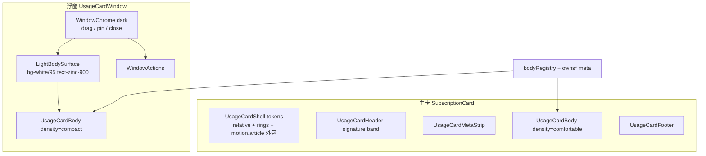
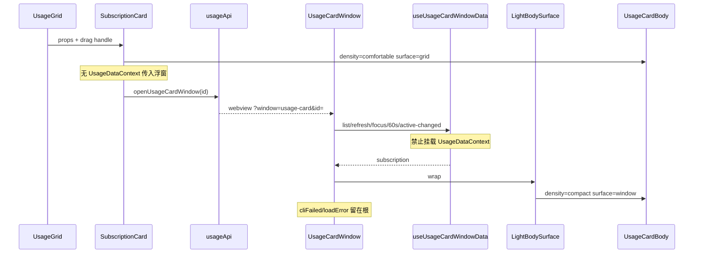
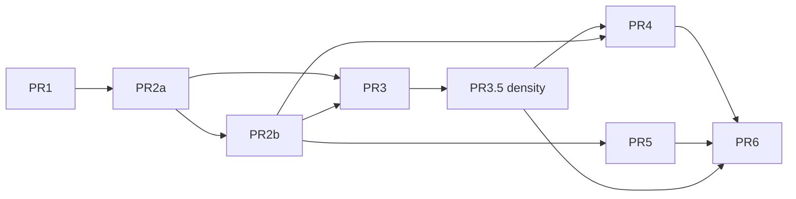

# Usage 卡片解耦 + 风格统一化

状态：historical

| 字段 | 值 |
| --- | --- |
| **作者** | — |
| **日期** | 2026-07-09 |
| **修订** | 2026-07-09（审查修订 v3 · re-review A–G） |
| **状态** | Implemented (PR1–PR6) |
| **范围** | 前端 `src/features/usage/`（卡片骨架 / 风格 primitives / 浮窗 body 共享） |
| **非范围** | 后端 usage API / fetchers、`SubscriptionEditDialog` 大重构 |

> **代码事实核查日期**：2026-07-09（`wc -l` + 源码阅读；见 Background）。

---

## Overview

Usage 模式的主视觉单元是「订阅卡片」：网格中的 `SubscriptionCard`、独立 Tauri 浮窗 `UsageCardWindow`、未绑定占位 `VendorPlaceholderCard`，以及 DeepSeek / GLM / Grok / Cursor 等 vendor body。当前主卡片已膨胀为 ~702 行的上帝组件，内联多 catalog 条件分支，并与浮窗、占位卡片在 header / 进度条 / metric 容器上各自演进，导致**逻辑双路径 + 视觉漂移 + 扩展成本高**。

本设计将卡片拆为**稳定骨架（Shell）+ 注册式 body（含 owns\* 元数据）+ 共享视觉 primitives**，对齐 Models feature 的职责分目录思路。主卡与浮窗共享的是**逻辑 body**（同一 registry + density 适配），**不是**整卡视觉语言：浮窗保持 dark chrome，body 嵌入 **light surface 岛**（K11-A），避免把 zinc 浅色 panel 硬塞进 dark root。

**有意行为变更（非守恒）**：浮窗从「仅通用 compact 条 + 简化 balance」升级为「与主卡同源的 vendor body（compact）」——见 PR4（`feat`/`fix` 语义），需独立产品验收。

---

## Background & Motivation

### 当前结构（代码核实 · 2026-07-09）

| 文件 | 行数 | 角色 |
| --- | --- | --- |
| `components/SubscriptionCard.tsx` | ~702 | 主卡片：品牌 header、meta、vendor 分支 body、balance/credits、footer 操作、删除确认 |
| `components/UsageCardWindow.tsx` | ~419 | 浮窗根：独立数据加载 + 简化 chrome + **仅通用** hourly/weekly/monthly |
| `components/UsageWindowBar.tsx` | ~297 | 配额条（monetary / breakdown / absolute / simple / compact） |
| `components/DeepSeekUsagePanel.tsx` | ~416 | DeepSeek 专用 body |
| `components/UsageGrid.tsx` | ~324 | 网格 + dnd + 占位 |
| `components/GlmUsagePanel.tsx` | ~274 | GLM 专用 body |
| `components/GrokUsagePanel.tsx` / `CursorUsagePanel.tsx` | ~163 / ~174 | 品牌特化 body |
| `components/VendorPlaceholderCard.tsx` | ~87 | 未绑定占位 |
| `lib/brandThemes.ts` | ~85 | `catalog_id → header/bar/fg/glow` |
| `components/SubscriptionEditDialog.tsx` | ~845 | 编辑对话框（**本轮 out of scope**，已有 `subscriptionEdit/` 子目录） |

### 痛点（有代码锚点）

#### 1. `SubscriptionCard` 是上帝组件

同一文件同时承担：

- 品牌 chrome（`--brand-rgb` / signature header band）
- 数据派生（`resetInfo`、`bodyOwnsPrimaryReset`、`hasAutoUsage`…）
- **硬编码 vendor 分支**：

```275:288:src/features/usage/components/SubscriptionCard.tsx
        {sub.catalog_id === "glm" && usage ? (
          <GlmUsagePanel usage={usage} brandColor={brandColorHex} />
        ) : isDeepSeek && usage ? (
          <DeepSeekUsagePanel usage={usage} brandColor={brandColorHex} hasPlatformToken={sub.has_platform_token} />
        ) : isGrok && usage ? (
          <GrokUsagePanel usage={usage} brandColor={brandColorHex} />
        ) : isCursor && usage ? (
          <CursorUsagePanel usage={usage} brandColor={brandColorHex} />
        ) : (
          <>
            {usage?.hourly && <UsageWindowBar window={usage.hourly} />}
            {usage?.weekly && <UsageWindowBar window={usage.weekly} />}
            {usage?.monthly && <UsageWindowBar window={usage.monthly} />}
          </>
        )}
```

- 内联子组件：`BalanceLine` / `CreditsLine` / `CreditProgressItem` / `ManualUsage` / `OpenCodeApiKeyCopyBar`
- 操作栏 + 删除确认 overlay + 直接 `usageApi.openUsageCardWindow`

每加一家 vendor 必须改骨架上的 `if` 链，与 AGENTS「可枚举事实在代码+测试锁定、不在调用点散落」精神冲突。

#### 2. 风格不一致（三套「卡片」）+ 表面主题冲突

| 表面 | Shell | Header | Body 能力 | 表面色 |
| --- | --- | --- | --- | --- |
| 主卡片 | `rounded-3xl bg-white/95`、`sm:w-[280px] min-h-[320px]` | **完整 signature band**（`theme.header` 双色 + 白 chip logo + PlanBadge） | 完整 vendor panels + balance/credits | **浅色** zinc-* 硬编码 panel |
| 浮窗 | `h-screen bg-card` dark glass | glow 轻渐变 + pin/close（border/logo 区亦用 glow），无 signature band | **只用** `UsageWindowBar compact`，**无** vendor panel | **深色** chrome |
| 占位 | 与主卡相近的白卡尺寸 | `ProviderCatalogHero` **inline**（无 gradient band） | 虚线假进度条 | 浅色；`catalogBrandVars` 非 `getBrandTheme` |

`brandThemes.ts` 已是 SSOT，但消费不均。更关键的是：vendor panels 几乎全是浅色 zinc 类名——**若直接嵌入 dark 浮窗 root，对比度与品牌一致性双崩**（见 K11）。

#### 3. 双路径渲染 → 必然漂移

`UsageCardWindow` body（约 318–333 行）只渲染通用条 + 简化余额，与主卡 body 选择逻辑**完全脱节**。用户从主卡「在新窗口打开」后，DeepSeek 分析 / Grok 周配额 / Cursor on-demand 等会丢失或变样。

#### 4. 重复原语散落

- `hexToRgb` 在 `SubscriptionCard` 与 `ProviderCatalogHero` 各写一份
- 进度条容器 class 在 `UsageWindowBar`、`GrokUsagePanel`、`CursorUsagePanel`、`GlmUsagePanel`、`CreditsLine` 多处复制
- `MetricCard` 仅存在于 DeepSeek 内部
- Secondary panel 在 Cursor/Grok/Glm/DeepSeek 各自手写 accent alpha
- 硬编码中文：`SubscriptionCard` 的「当前」badge 与 `title="该 catalog 当前活跃的账号"` 未走 i18n（`scripts/internal/i18n_hardcoded_baseline.txt` 记 `SubscriptionCard.tsx` 存量）

#### 5. Models 已有可参考分层

`src/features/models/components/{hub,agents,provider,diagnostics,shared}/` 证明同 feature 内按职责分子目录可行。Usage 对齐为 `card/` + `panels/` + `window/`，不照搬 hub/provider 命名。

### 为何现在做

- 新 catalog 扩展时分支成本线性上升。
- 浮窗是多账号切换一等入口，body 能力缺口是真实产品缺陷。
- `SubscriptionCard` 接近 700 行，再加逻辑逼近 1000 行硬上限。

---

## Goals & Non-Goals

### Goals

1. **卡片合成模型**：稳定 Shell + 明确 slots；vendor body 静态 registry（含 owns\* 元数据）；骨架零 `catalog_id` 业务分支。
2. **风格统一（可验收）**：见 **§3.5 Style DoD**；header band / ProgressTrack / MetricCard / SecondaryPanel 等 primitives + 禁止列表 + grep/单测闸门。
3. **浮窗 vs 主卡**：共享 **逻辑 body**（registry + density）；不共享 window chrome / 数据源；浮窗 body 落在 **light surface 岛**（K11-A）。
4. **可增量迁移**：PR 可独立 merge；PR2 拆为 2a/2b；PR4 为有意功能变更。
5. **文档同步**：结构约定在 **PR2a 前移更新** `AGENTS-UI.md`（可标 WIP），PR6 收尾删 re-export。

### Non-Goals

- 不改 `crates/skillstar-usage`、DTO、`cursor.rs` 或任何后端 usage 契约。
- 不重构 `SubscriptionEditDialog` / `subscriptionEdit/*`（`hexToRgb` 合并时 Hero **只换 import**，不改视觉）。
- 不重做 `UsageGrid` 分组 / dnd 产品行为（仅改 import 路径）。
- 不引入跨 feature `components/shared/`。
- **不**做 dark/light 双主题全面 token 化 panels（即否决 K11-B 作为本轮主路径）。
- 不做 Chromatic/Percy 级视觉 CI；占位卡 signature band 对齐是**有意视觉升级**（PR5），非零 diff。

---

## Proposed Design

### 1. 目标目录结构

```text
src/features/usage/
├── components/
│   ├── card/                         # 卡片合成层
│   │   ├── SubscriptionCard.tsx      # 编排：Shell tokens + Header/Meta/Body/Footer
│   │   ├── UsageCardShell.tsx        # class + CSS vars + 状态 ring（非过度多态）
│   │   ├── UsageCardHeader.tsx       # signature header band（主卡 / 占位）
│   │   ├── UsageCardMetaStrip.tsx    # auth / active / reset / synced
│   │   ├── UsageCardFooter.tsx       # cost/renew + actions + delete overlay
│   │   ├── UsageCardBody.tsx         # registry + attachments 决策树
│   │   ├── bodyRegistry.ts           # 静态 map + BodyRegistration 元数据
│   │   ├── VendorPlaceholderCard.tsx # 共享 shell tokens + 假 body
│   │   └── primitives/
│   │       ├── brandCssVars.ts
│   │       ├── ProgressTrack.tsx
│   │       ├── MetricCard.tsx
│   │       ├── SecondaryPanel.tsx
│   │       ├── MetaRow.tsx
│   │       ├── BalancePanel.tsx
│   │       ├── CreditsPanel.tsx
│   │       ├── FooterStatCell.tsx
│   │       └── LightBodySurface.tsx  # 浮窗用 light 岛（K11-A）
│   ├── panels/
│   │   ├── DefaultUsageBody.tsx
│   │   ├── DeepSeekUsagePanel.tsx
│   │   ├── GlmUsagePanel.tsx
│   │   ├── GrokUsagePanel.tsx
│   │   ├── CursorUsagePanel.tsx
│   │   └── *.test.tsx
│   ├── window/
│   │   ├── UsageCardWindow.tsx
│   │   ├── UsageCardWindowChrome.tsx
│   │   └── useUsageCardWindowData.ts
│   ├── UsageWindowBar.tsx
│   ├── UsageGrid.tsx
│   ├── UsagePanel.tsx
│   └── …（Sidebar / EditDialog 等不动）
├── lib/
│   ├── brandThemes.ts                # SSOT + 导出 hexToRgbTriplet
│   ├── usageLabels.ts                # + windowRendersOwnReset / reset ownership
│   ├── hasAutoUsage.ts               # computeHasAutoUsage 纯函数
│   └── pricing.ts
└── …
```

**命名约定**：过渡期 `components/SubscriptionCard.tsx` re-export；`main.tsx` 对 `UsageCardWindow` 路径可兼容 re-export。

### 2. 卡片合成模型（Skeleton + Slots）



#### 稳定骨架职责

| 区域 | 稳定性 | 内容 |
| --- | --- | --- |
| **Shell tokens** | 高 | 尺寸、border、active/reauth/`priorityCardClass`、品牌 CSS 变量、**必须** `relative`（delete overlay） |
| **Header** | 中 | 主卡/占位：signature band；浮窗：**不**用此 Header，用 WindowChrome |
| **Meta** | 高 | auth / active / reset（消费 `bodyOwnsPrimaryReset` 布尔）/ synced |
| **Body** | 扩展点 | **唯一** vendor 扩展点 + 附件决策树 |
| **Footer** | 中 | 主卡费用+actions；浮窗独立 WindowActions |

#### Shell API（避免过度多态）— 回应 Issue 11

**不**采用 `as={motion.article | button}` 万能多态。

```tsx
/** 只提供 className + CSS vars + 状态 ring；不接管元素类型 */
export function usageCardShellClassName(state: {
  isActive?: boolean;
  requiresReauth?: boolean;
  priorityClass?: string;
}): string { /* rounded-3xl bg-white/95 … relative overflow-hidden */ }

export function UsageCardShellVars({ catalogId, brandColorHex, children }: …) {
  // 注入 brandThemeToCssVars；children 由调用方决定 article | button
}
```

| 表面 | 外层元素 | 说明 |
| --- | --- | --- |
| 主卡 | `motion.article`（在 `SubscriptionCard` 内）+ shell class/vars | layout 动画、delete overlay `absolute inset-0` |
| 占位 | `<button type="button">` + **同一** shell class/vars | 整卡可点；footer 仅静态 CTA 文案，**不再嵌套**可聚焦按钮 |
| 浮窗 | 不用主卡 Shell；dark root + `LightBodySurface` 包 body | empty/loading/error **early return 在 window 根**，不进 Shell |

**Shell 必须保留的 class/行为契约**：

- `relative` + `overflow-hidden`（delete overlay、光晕）
- active：`border-emerald-400/60 ring-1 ring-emerald-300/40`
- reauth：`border-red-500/40 ring-1 ring-red-500/20`
- `priorityCardClass(reset…)` 在 Shell 层合并（依赖 resetInfo，**非** body）
- `aria-label={display_name}`（主卡）
- 尺寸：`w-full sm:w-[280px] min-h-[320px] shrink-0 rounded-3xl`

#### Slot / Extension 契约（方案 A 唯一；含 owns\*）

```tsx
// features/usage/components/card/bodyRegistry.ts
import type { ComponentType } from "react";
import type { SubscriptionUsage } from "../../types";
import { CursorUsagePanel } from "../panels/CursorUsagePanel";
import { DeepSeekUsagePanel } from "../panels/DeepSeekUsagePanel";
import { GlmUsagePanel } from "../panels/GlmUsagePanel";
import { GrokUsagePanel } from "../panels/GrokUsagePanel";
import { DefaultUsageBody } from "../panels/DefaultUsageBody";

export interface UsageBodyProps {
  usage: SubscriptionUsage; // 仅在 usage != null 时由 Body 编排层传入
  catalogId: string;
  brandColorHex: string;
  density: "comfortable" | "compact"; // 必填，禁止隐式默认导致浮窗漏传
  context?: {
    hasPlatformToken?: boolean;
  };
}

export type UsageBodyComponent = ComponentType<UsageBodyProps>;

export interface BodyRegistration {
  component: UsageBodyComponent;
  /** 该 body 是否自行渲染 credits（抑制通用 CreditsPanel） */
  ownsCredits: boolean;
  /** 该 body 是否自行渲染 balance（抑制通用 BalancePanel） */
  ownsBalance: boolean;
  /**
   * 主/浮窗 Meta 是否抑制 primary ResetCountdown：
   * - true：body 内自带（如 Grok weekly simple bar）
   * - false：Meta 可显示
   * - "infer"：运行时用 windowRendersOwnReset(hourly|weekly|monthly) 推断（Default 路径）
   */
  ownsPrimaryReset: boolean | "infer";
}

/** 仅注册需要特化布局的 catalog；缺省 DefaultUsageBody */
export const USAGE_BODY_REGISTRY: Record<string, BodyRegistration> = {
  deepseek: {
    component: DeepSeekUsagePanel,
    ownsCredits: true,
    ownsBalance: true,
    ownsPrimaryReset: false,
  },
  glm: {
    component: GlmUsagePanel,
    ownsCredits: true,
    ownsBalance: false,
    ownsPrimaryReset: "infer",
  },
  xai: {
    component: GrokUsagePanel,
    ownsCredits: true,
    ownsBalance: false,
    ownsPrimaryReset: "infer", // weekly bar 自带 ResetCountdown 时 infer→true
  },
  cursor: {
    component: CursorUsagePanel,
    ownsCredits: true,
    ownsBalance: false,
    ownsPrimaryReset: "infer",
  },
};

export function resolveUsageBodyRegistration(catalogId: string): BodyRegistration {
  return (
    USAGE_BODY_REGISTRY[catalogId] ?? {
      component: DefaultUsageBody,
      ownsCredits: false,
      ownsBalance: false,
      ownsPrimaryReset: "infer",
    }
  );
}
```

**禁止**用 `catalogId in USAGE_BODY_REGISTRY` 推断 owns\*（Issue 4）。未来 `kimi` 可注册 `ownsCredits: false` 只改布局仍显示通用 Credits。

#### 守卫测试（强锁定 · Issue 10）

```ts
// bodyRegistry.test.ts — 数字只存在于测试（AGENTS：可枚举事实由测试锁定）
const EXPECTED_SPECIALIZED = ["cursor", "deepseek", "glm", "xai"] as const;

it("registry keys match specialized catalog set", () => {
  expect(Object.keys(USAGE_BODY_REGISTRY).sort()).toEqual([...EXPECTED_SPECIALIZED].sort());
});

it("every registration declares owns* booleans / infer", () => {
  for (const [id, reg] of Object.entries(USAGE_BODY_REGISTRY)) {
    expect(typeof reg.ownsCredits).toBe("boolean");
    expect(typeof reg.ownsBalance).toBe("boolean");
    expect(reg.ownsPrimaryReset === true || reg.ownsPrimaryReset === false || reg.ownsPrimaryReset === "infer").toBe(
      true,
    );
    expect(resolveUsageBodyRegistration(id).component).not.toBe(DefaultUsageBody);
  }
});

it("unknown catalog falls back to DefaultUsageBody", () => {
  expect(resolveUsageBodyRegistration("unknown-vendor-xyz").component).toBe(DefaultUsageBody);
});
```

加 panel 却忘注册 → 测试失败（EXPECTED 列表与 registry 不一致）。注册错 id → 与 EXPECTED 不等。

#### Body 附件层决策树（含 null / panel null / hasAutoUsage · Issue 5）

导出纯函数（可单测）：

```ts
// lib/hasAutoUsage.ts
export function computeHasAutoUsage(sub: Subscription): boolean {
  const usage = sub.usage;
  if (!usage) return false;
  const deepseekExtraBalances = (usage.credits ?? []).some((c) =>
    c.credit_type.startsWith("deepseek-balance:"),
  );
  const hasCredits = (usage.credits?.length ?? 0) > 0;
  const hasApiKeys = (usage.api_keys?.length ?? 0) > 0;
  return Boolean(
    usage.hourly ||
      usage.weekly ||
      usage.monthly ||
      usage.balance ||
      (hasCredits && !deepseekExtraBalances) || // 与今日 SubscriptionCard 一致
      hasApiKeys,
  );
}
```

`UsageCardBody` 编排伪代码：

```tsx
function UsageCardBody({ subscription: sub, density, surface }: {
  subscription: Subscription;
  density: "comfortable" | "compact";
  surface: "grid" | "window"; // 仅影响附件矩阵，不改 registry
}) {
  const usage = sub.usage ?? null;
  const brandColorHex = …;
  const reg = resolveUsageBodyRegistration(sub.catalog_id);
  const hasAuto = computeHasAutoUsage(sub);

  // 1) Vendor / default body
  let panelNode: ReactNode = null;
  if (usage) {
    const Panel = reg.component;
    panelNode = (
      <Panel
        usage={usage}
        catalogId={sub.catalog_id}
        brandColorHex={brandColorHex}
        density={density}
        context={{ hasPlatformToken: sub.has_platform_token }}
      />
    );
    // panel 返回 null：不回退 DefaultUsageBody（与今日一致——特化 catalog 无数据时不画通用条，
    // 避免 Grok 空数据却画出空 hourly）。附件层仍可补 Manual / Error。
  }
  // usage == null：不调用 registry component；直接走附件（Manual / 无数据提示）

  // 2) Balance
  const showBalance =
    usage?.balance &&
    !reg.ownsBalance &&
    // 附件矩阵：window 与 grid 均显示通用 balance（见矩阵；DeepSeek ownsBalance=true 仍抑制）
    true;

  // 3) Credits
  const showCredits =
    (usage?.credits?.length ?? 0) > 0 && !reg.ownsCredits && surfaceAllows("credits", surface);

  // 4) Manual
  const showManual = !hasAuto && surfaceAllows("manual", surface);

  // 5) usageError（来自 usage.error）
  // 6) ApiKeys — surface 矩阵

  return (
    <>
      {panelNode}
      {showBalance && <BalancePanel … density={density} />}
      {showCredits && <CreditsPanel … />}
      {showManual && <ManualUsage … />}
      {usageError && surfaceAllows("usageError", surface) && <ErrorStrip … />}
      {hasApiKeys && surfaceAllows("apiKeys", surface) && <OpenCodeApiKeyCopyBar … />}
    </>
  );
}
```

**panel `return null` 时**：不自动回退 `DefaultUsageBody`（避免特化 catalog 误显通用条）。若 `!hasAuto && showManual`，仍可显示手动配额 /「暂无数据」。

#### Body Density 适配表（必做 · Issue 2 · 阻塞 PR4）

所有 registry body **最终**必须接受并实现 `density`（PR3.5）。PR2a 阶段 registry 经 **adapter** 调用 legacy panel（忽略 density）；见 PR2a / K12。PR3.5 完成前 **禁止**合 PR4。

| Body | `comfortable`（主卡，保持今日） | `compact`（浮窗，必做） |
| --- | --- | --- |
| **DefaultUsageBody** | `UsageWindowBar` 默认（monetary/simple 全貌） | **一律** `<UsageWindowBar window={…} compact />`（对齐今日浮窗 `UsageCategoryBar`） |
| **CursorUsagePanel** | monthly/weekly 全貌 bar + secondary SecondaryPanel | monthly/weekly **强制 compact**；secondary 用 `MetaRow` / 紧凑 OnDemand 行（更矮 padding） |
| **GrokUsagePanel** | `GrokWeeklyBar` 全貌 + spend panel | weekly：缩小内边距、`ProgressTrack` compact；spend/on-demand **单行** MetaRow；自带 ResetCountdown 保留 |
| **GlmUsagePanel** | 全 section + activity | 仅主 quota windows（hourly/weekly/monthly）compact track；activity/model breakdown **默认折叠**（一键展开） |
| **DeepSeekUsagePanel** | 全量 status/balance/analytics/图表 | **必显**：account status + total balance；**analytics 默认折叠**（`details`/本地 state，默认 `open=false`）；extra balances 紧凑列表 |

实现约束：

- Panel 内凡调用 `UsageWindowBar`，compact 时必须传 `compact`（今日 Cursor/Grok **未传**，这是炸高度的根因）。
- DeepSeek compact **禁止**默认展开图表（修订 Open Q2：由「完整+滚动」改为「折叠+可展开」）。

#### 主卡 vs 浮窗附件矩阵（Issue 3 + D）

| 附件 / UI | 主卡 grid | 浮窗 window | 说明 |
| --- | --- | --- | --- |
| **ResetCountdown（Meta）** | 有；若 `computeBodyOwnsPrimaryReset` 为 true 则**抑制** | **写死默认**：在 `LightBodySurface` **内部顶部**渲染精简 Meta 一行：`PlanBadge` +（`!computeBodyOwnsPrimaryReset` 时）`ResetCountdown`。**删除**今日 body **下方**无条件 ResetCountdown。**禁止**第三处（旧底部块） | 与主卡同一 ownership 函数；default/codex 等 body 不自带 countdown 时，浮窗 Meta **仍显示** primary reset（信息不少，仅位置从底部挪到岛顶——**有意视觉位置变更**） |
| **ResetCountdown（body 内）** | Grok weekly / 部分 bars | 同 panel 逻辑 | 仅当 ownership 为 true 时存在；不与 Meta 叠 primary |
| **usageError**（`usage.error`） | 有 | 有 | Body 附件；见 `SURFACE_ATTACHMENTS` |
| **loadError / switchError**（window 本地 state） | 无 | **有**，留在 window 根（非 Body） | 与 usage 解耦 |
| **cliFailed banner** | 无独立 banner（footer 图标琥珀色） | **有**，留在 window 根（非 Body） | 不塞进 UsageCardBody |
| **BalancePanel** | `!ownsBalance` | `!ownsBalance`（与主卡一致） | **有意变更**：今日浮窗对 **所有** catalog（含 DeepSeek）画简化 balance；共享后 DeepSeek 走 panel 自绘余额，**不再**双画简化 balance |
| **CreditsPanel** | `!ownsCredits` | `!ownsCredits` | 同主卡 |
| **ManualUsage** | `!hasAuto` | `!hasAuto` | 同主卡 |
| **OpenCodeApiKeyCopyBar** | 有 | **隐藏** | 见 `SURFACE_ATTACHMENTS.apiKeys` |
| **PlanBadge** | Header band 上 | **写死**：LightBodySurface 顶栏 Meta 内（与 Reset 同行） | 不强制 signature band |
| **费用/续费 footer** | 有 | 无 | 不变 |
| **delete overlay** | 有 | 无 | 不变 |

##### `SURFACE_ATTACHMENTS` SSOT（Issue E）

与上表对齐的常量表（实现放 `card/surfaceAttachments.ts` 或 `UsageCardBody` 同文件；单测可锁）：

```ts
export type AttachmentSurface = "grid" | "window";
export type AttachmentKind = "credits" | "manual" | "usageError" | "apiKeys" | "balance";

/** SSOT：附件是否在该 surface 渲染（owns* / hasAuto 等业务门闩另算） */
export const SURFACE_ATTACHMENTS = {
  grid:   { credits: true, manual: true, usageError: true, apiKeys: true,  balance: true },
  window: { credits: true, manual: true, usageError: true, apiKeys: false, balance: true },
} as const satisfies Record<AttachmentSurface, Record<AttachmentKind, boolean>>;

export function surfaceAllows(kind: AttachmentKind, surface: AttachmentSurface): boolean {
  return SURFACE_ATTACHMENTS[surface][kind];
}
```

`showBalance` / `showCredits` 等仍须叠加 `!reg.ownsBalance` / `!reg.ownsCredits` / `computeHasAutoUsage`；`surfaceAllows` **只**编码 surface 维。

#### Reset 所有权（Issue 12 · Key Decision）

将 `windowRendersOwnReset` **迁入** `lib/usageLabels.ts`（或 `lib/resetOwnership.ts`），并单测：

| 用例 | 期望 |
| --- | --- |
| 无 `reset_at` | false |
| label `5h` / `7d`（Codex defer） | false（countdown 留给 header/meta） |
| monetary / breakdown / absolute | false |
| 其余 simple + 有 reset_at | true |

```ts
export function computeBodyOwnsPrimaryReset(
  reg: BodyRegistration,
  usage: SubscriptionUsage | null,
): boolean {
  if (!usage) return false;
  if (reg.ownsPrimaryReset === true) return true;
  if (reg.ownsPrimaryReset === false) return false;
  // "infer"
  const info = getPrimaryResetInfo(usage);
  if (!info) return false;
  const win =
    info.source === "weekly" ? usage.weekly :
    info.source === "hourly" ? usage.hourly :
    usage.monthly;
  return windowRendersOwnReset(win);
}
```

MetaStrip **只消费布尔**，禁止复制 window 判定逻辑。

### 3. 风格统一：Tokens + Primitives

#### 3.1 品牌 CSS 变量（分阶段 · Issue 14）

**Phase 1（与今日对齐，PR1）** — 最小 vars 集：

```ts
// lib/brandThemes.ts
export function hexToRgbTriplet(hex: string): string { /* 合并两处 hexToRgb */ }

// card/primitives/brandCssVars.ts
export function brandThemeToCssVars(theme: BrandTheme): CSSProperties {
  return {
    "--brand-rgb": hexToRgbTriplet(theme.glow),
    "--brand-color": theme.bar[0],
    "--brand-color-2": theme.bar[1],
  } as CSSProperties;
}
```

- Header **继续** inline `linear-gradient(135deg, theme.header[0], theme.header[1])` + `color: theme.fg`（不必强行 CSS 变量化）。
- `ProviderCatalogHero` / EditDialog：仅改为 `import { hexToRgbTriplet } from "../lib/brandThemes"`，**保持** `catalogBrandVars(brand_color)` 视觉（out of scope 不改 Hero 主题语义）。

**Phase 2（可选，不阻塞）**：增加 `--brand-header-from/to`、`--brand-fg`、`--brand-glow`；Header 改读变量。

#### 3.2 视觉原语清单

| Primitive | 来源 | 统一规范 |
| --- | --- | --- |
| `ProgressTrack` | WindowBar / Cursor / Grok / Credits / Glm | 见 Style DoD **multi-tone** API |
| `MetricCard` | DeepSeek | label `text-[9px] uppercase` + mono value |
| `SecondaryPanel` | **次级信息容器** only | accent alpha **固定** `06` / `14`；见 Issue F 边界 |
| `MetaRow` | Cursor | label/value |
| `BalancePanel` / `BalanceHero` | BalanceLine / DeepSeek 主余额 | density 支持；**非** SecondaryPanel |
| `CreditsPanel` | CreditsLine | 内部 `ProgressTrack tone="accent-static"` |
| `FooterStatCell` | footer 格 | 占位空态 `—` |
| `LightBodySurface` | 新 | light 岛 + **必须**注入 `brandThemeToCssVars`（见 §3.4 / §7） |

`UsageWindowBar` 保留为领域组件，内部按路径选择 ProgressTrack `tone`（见 §3.5）。

**SecondaryPanel 适用范围（Issue F）**：

| 应用 SecondaryPanel（06/14） | **不**用 SecondaryPanel |
| --- | --- |
| Cursor secondary spend 外壳 | DeepSeek **主余额卡**（今日 `08`/`1A` 强调视觉 → 保留为 `BalanceHero` 或专用结构） |
| Grok month-spend / on-demand 外壳 | DeepSeek **account status**（emerald/amber 语义色，非 brand accent alpha） |
| Glm activity section 外壳 | DeepSeek analytics MetricCard 网格（走 `MetricCard` primitive） |
| 通用 CreditsPanel 外框 | 任何「主 KPI / 状态条」 |

PR3 禁止列表只针对「本应走 SecondaryPanel 却手写 `` `${accent}06` ``」；**禁止**机械把 DeepSeek 主余额改成 06/14。

#### 3.3 与 `brandThemes` 协作

不变：`getBrandTheme(catalog_id, brand_color)` → shell vars + header inline；Logo 仍收 raw hex。

#### 3.4 三表面视觉对齐 + 表面策略（K11 · Issue 1）

| Token / 区域 | 主卡 | 浮窗 | 占位 |
| --- | --- | --- | --- |
| Chrome | 浅色整卡 | **Dark** drag/pin/close | 浅色整卡 |
| Body 表面 | 浅色（卡体本身） | **LightBodySurface 岛** 嵌入 dark chrome | 浅色 |
| Body 逻辑 | UsageCardBody comfortable | **同一** UsageCardBody compact | skeleton |
| Header identity | signature band | WindowChrome（glow）；**不**共享整卡视觉语言 | signature band（PR5 **有意**升级，见下） |
| 主题色来源 | `getBrandTheme` | glow 用于 chrome；body 内 panel 仍用 brandColorHex | PR5 起 `getBrandTheme` |

**K11 选定方案 A（推荐，本设计写死）**：

- 共享的是**逻辑 body**，不是浮窗整卡视觉语言。
- 浮窗结构：`dark root` → `WindowChrome` → **`LightBodySurface`（注入 brand CSS vars）** → 顶栏 Meta → `UsageCardBody density=compact`。
- **否决本轮 B**（全 panel 语义 token dark 适配）——工作量单列 epic，不进本 PR 序列。

**Brand CSS 变量注入（Issue B · 写死）**：

主卡今日在 `motion.article` 上设 `--brand-rgb` / `--brand-color` / `--brand-color-2`，供 `from-[var(--brand-color)]` 使用。浮窗 dark chrome **不**自动提供这组变量。因此：

```tsx
// LightBodySurface 必须接收 theme（或 catalogId+brandColorHex）并注入 vars
export function LightBodySurface({
  theme,
  children,
  className,
}: {
  theme: BrandTheme;
  children: React.ReactNode;
  className?: string;
}) {
  return (
    <div
      className={cn("rounded-2xl bg-white/95 text-zinc-900 p-3", className)}
      style={brandThemeToCssVars(theme)} // Phase1：--brand-rgb / --brand-color / --brand-color-2
    >
      {children}
    </div>
  );
}
```

- **禁止**无 `style={brandThemeToCssVars(...)}` 的裸 light 岛包 body。
- PR4 验收：Grok weekly / Default simple 在浮窗 light 岛内 brand fill **可见**且与主卡 bar 同源（同 catalog 的 `theme.bar`）。

PR5 占位：改为 signature band + shell tokens 是**有意视觉变更**；footer 硬编码 `/月` **一并**改为 `t("usage.perMonth")`（与主卡一致），并视情况更新 i18n baseline。

#### 3.5 Style Definition of Done（Issue 7 + A multi-tone）

**最终（PR6 前）必须满足：**

1. **配额 track 唯一入口**：所有 remaining-oriented 配额条经 `ProgressTrack`（含）：
   - `UsageWindowBar` 五条路径（QuotaPanel / Breakdown / Category / Stats / Simple）
   - `GrokWeeklyBar`
   - `CursorUsagePanel` OnDemand 条
   - `GlmUsagePanel` token/mcp 条
   - `CreditsPanel` / 原 `CreditProgressItem`
   - 非配额份额条（DeepSeek model mix）**除外**，保持比例宽
2. **ProgressTrack 几何契约**（单测可锁 class 片段）：

| prop | 值 | track 高度 / 容器 |
| --- | --- | --- |
| `size="comfortable"` | 主卡 simple/stats | 外 `h-2`，`rounded-full bg-zinc-100 ring-1 ring-zinc-200/20`（或 `/30` 统一为 `/20`） |
| `size="compact"` | 浮窗 / 次级 | 外 `h-1.5`，同上 ring |
| `size="category"` | breakdown 子类 | 外 `h-1`，`bg-zinc-200/60` 可无 ring |

3. **Fill 几何**：一律 `width: remainingBarWidth(usedPercent)`（`usageLabels.ts`）。**色阶不由此条统一。**

4. **Fill tone：多 mode 契约（主卡视觉守恒 · Issue A）**

DoD 要求的是 **唯一实现文件**（`ProgressTrack` / 可选 `lib/progressTrackTone.ts`）+ **下表 mode 语义不可丢**，**不是**「全世界只剩 90/75/brand 一种公式」。

```tsx
type ProgressTrackTone =
  | "brand-urgency"   // Simple / Stats / Grok weekly / Breakdown 外条
  | "billing-used"    // Monetary UsageQuotaPanel
  | "consumed"        // compact UsageCategoryBar
  | "accent-static";  // Credits / Cursor OnDemand（及同类 accent 实心条）

interface ProgressTrackProps {
  usedPercent: number;
  size: "comfortable" | "compact" | "category";
  tone: ProgressTrackTone;
  /** billing-used 必填；其余忽略 */
  resetAt?: number | null;
  /** accent-static 使用；缺省读 CSS var --brand-color */
  accent?: string;
}
```

| `tone` | 现网来源 | fill 语义（必须保持等价） | 委托 / 实现 |
| --- | --- | --- | --- |
| **`brand-urgency`** | `UsageSimpleWindow` / `UsageStatsWindow` / `UsageBreakdownQuotaPanel` 外条 / `GrokWeeklyBar` 的 `barBgClass` | `>=90` rose 渐变 + pulse；`>=75` amber 渐变；else `from-[var(--brand-color)] to-[var(--brand-color-2)]` + brand glow | 内联于 ProgressTrack（可抽 `brandUrgencyFillClass`） |
| **`billing-used`** | `UsageQuotaPanel` 的 `pickUsedBarTone(used, resetAt)` | **实心** class；掺入 **billing reset urgency**（critical/urgent→red、soon→orange、normal→amber）与健康 emerald / muted；**不是** 90/75/brand 渐变 | **委托**现有 `pickUsedBarTone`（`usageLabels.ts`），禁止重写公式 |
| **`consumed`** | `UsageCategoryBar` 的 `pickConsumedTone` → `pickUsageTone(remaining)` | emerald/amber/orange/red **实心**；无 brand 渐变、无 pulse | **委托** `pickConsumedTone(...).bar` |
| **`accent-static`** | `CreditProgressItem` / Cursor `OnDemandRow` | 固定 accent 线性/实心（如 `linear-gradient(90deg, accent, accentcc)`）；**不做** 75/90 urgency | `accent` prop 或 brand CSS var；无 reset 分支 |

**Call site → tone 映射（PR3 完成时）**：

| 路径 | tone |
| --- | --- |
| `UsageSimpleWindow` / `UsageStatsWindow` / Breakdown 外条 / Grok weekly bar | `brand-urgency` |
| `UsageQuotaPanel`（monetary） | `billing-used` + `resetAt` |
| `UsageCategoryBar`（compact） | `consumed` |
| Credits / Cursor OnDemand | `accent-static` |
| Glm token 条外框若现用 brand 渐变 90/75 | `brand-urgency`；若仅 accent 实心则 `accent-static`（以现网为准，迁移时对照截图） |

**文本 tone**（label 颜色，非 track fill）：`pickRemainingTone` / `pickRateLimitUsageTone` 等仍可在各 panel 使用；**不**强行并入 ProgressTrack，但禁止为 fill 再抄一套 90/75 三元。

- **禁止** panels/`UsageWindowBar` 再维护**散落**的 `barBgClass` 三元（应改为 `<ProgressTrack tone="…" />`）。
- **允许** ProgressTrack 文件内按 `tone` 分支；grep 闸门只禁散落复制，不禁 mode 分支。
- **禁止**把 monetary / category / credits 压成单一 `brand-urgency`（违反 K8 主卡守恒）。

5. **SecondaryPanel**：仅次级容器；`bg` alpha `06`、`border` alpha `14`；**禁止** panels 对手写 Secondary 等价物 `` `${accent}06` ``。DeepSeek 主余额 / status **除外**（Issue F）。
6. **禁止列表**（PR6 前于 panels + `UsageWindowBar`）：
   - 手写配额 track 容器 class（应走 ProgressTrack）
   - 手写散落 `barBgClass` 90/75/`brand` 三元（应走 `tone="brand-urgency"`）
7. **手工验收 checklist（风格）**：
   - [ ] track 高度符合 size 表
   - [ ] **brand-urgency**：75/90 与品牌渐变（simple/stats/Grok）
   - [ ] **billing-used**：货币条临近 reset 时仍为 reset-aware 实心色（**非**强制 rose 渐变）
   - [ ] **consumed**：category compact 为 emerald→red 实心阶梯
   - [ ] **accent-static**：credits / on-demand 无 75/90 跳变
   - [ ] fill 随用量**减少**（remaining-oriented width）
   - [ ] 浮窗 light 岛：panel 浅色字 + **brand fill 可见**（vars 已注入）
   - [ ] SecondaryPanel 仅次级容器；DeepSeek 主余额未误改为 06/14

**分阶段**：PR1 至少切换 **2** 个真实 call site——推荐 `UsageSimpleWindow`（`tone="brand-urgency"`）+ DeepSeek `MetricCard`；可选第三条 `UsageQuotaPanel` 用 `billing-used` 锁定 multi-tone API。其余 call site 列 TODO→PR3；PR6 前 100% 配额 track。

### 4. 浮窗 vs 主卡：共享逻辑 body、分离 chrome



| 层 | 共享？ | 说明 |
| --- | --- | --- |
| `UsageCardBody` + registry + panels | **是**（逻辑） | density + surface 附件矩阵 |
| Light 浅色 panel 视觉 | 主卡天然；浮窗经 **LightBodySurface** | K11-A |
| WindowChrome / 数据 hook | **否** | |
| Signature header | **否**（主卡/占位） | 浮窗不强制 |
| `main.tsx` 入口 | 不变 | |

**行为守恒（主卡）** vs **有意变更（浮窗 body）**：

- 守恒：主卡 dnd、delete、reauth、CLI resync 色、Grok 双 reset 抑制、60s/focus/`usage://active-changed`（均在 window hook）
- **有意变更（PR4）**：浮窗展示 vendor panels；DeepSeek 不再双画简化 balance；浮窗去掉重复 primary ResetCountdown；ApiKeys 不在浮窗显示

### 5. 解耦边界

| 区域 | 本轮 | 说明 |
| --- | --- | --- |
| `card/**` / `panels/**` / `window/**` | **In** | |
| `UsageWindowBar` | **In** | ProgressTrack 分阶段 |
| `VendorPlaceholderCard` | **In** | 有意视觉升级 |
| `lib/brandThemes` + `hasAutoUsage` + reset ownership | **In** | |
| `SubscriptionEditDialog` | **Out** | Hero 仅 hex import |
| 后端 | **Out** | |
| i18n「当前」+ title + 占位 `/月` | **In** | 见 §i18n |

### 6. 与 Models hub 模式对齐

同前：对齐分目录思想，不照搬 hub/provider 命名。Shell props 在 **PR2b 冻结**，PR4/PR5 只消费（Issue 21）。

### 7. 关键接口示意（重构后）

```tsx
// SubscriptionCard.tsx — 编排目标 <300 行；单文件硬上限 <1000
export function SubscriptionCard(props: SubscriptionCardProps) {
  const theme = getBrandTheme(…);
  const ownsReset = computeBodyOwnsPrimaryReset(reg, usage);
  return (
    <motion.article
      layout
      style={brandThemeToCssVars(theme)}
      className={usageCardShellClassName({ isActive, requiresReauth, priorityClass })}
      aria-label={sub.display_name}
    >
      <UsageCardHeader … onDragHandlePointerDown={…} />
      <UsageCardMetaStrip … hidePrimaryReset={ownsReset} />
      <UsageCardBody subscription={sub} density="comfortable" surface="grid" />
      <UsageCardFooter … />
    </motion.article>
  );
}
```

```tsx
// UsageCardWindow — brand vars + Meta reset 默认策略写死
const theme = getBrandTheme(subscription.catalog_id, brandColorHex);
const reg = resolveUsageBodyRegistration(subscription.catalog_id);
const hidePrimaryReset = computeBodyOwnsPrimaryReset(reg, subscription.usage);

<div className="usage-card-root … bg-card …"> {/* dark chrome；可不设 --brand-* */}
  <UsageCardWindowChrome … />
  <div className="flex-1 overflow-y-auto p-3">
    <LightBodySurface theme={theme}>
      {/* 浮窗 Meta：岛顶一行；禁止再在 body 下方第三处画 primary Reset */}
      <div className="mb-2 flex items-center justify-between gap-2" data-window-meta>
        <PlanBadge plan={planName} />
        {!hidePrimaryReset && resetInfo && (
          <ResetCountdown
            resetAt={resetInfo.resetAt}
            usedPercent={resetInfo.usedPercent}
            mode={resetInfo.mode}
            className="text-[10px]"
          />
        )}
      </div>
      <UsageCardBody subscription={subscription} density="compact" surface="window" />
    </LightBodySurface>
    {cliFailed && <CliFailedBanner … />}
    {loadError && <div>…</div>}
  </div>
  <UsageCardWindowActions … />
</div>
```

### 8. 风险与缓解

| 风险 | 严重度 | 缓解 |
| --- | --- | --- |
| 浅色 panel 嵌入 dark 浮窗对比度崩 | **高** | K11-A LightBodySurface；PR4 四 vendor 截图验收 |
| 浮窗 brand fill 无色 / 透明 | **高** | LightBodySurface **强制** `brandThemeToCssVars`；PR4 测 brand 可见 |
| 单 tone 收敛导致主卡色阶回归 | **高** | ProgressTrack multi-tone 表；billing/consumed/accent 不得压成 brand-urgency |
| compact 未实现导致浮窗过高 | **高** | Density 表 + PR3.5 阻塞 PR4 |
| 双 ResetCountdown | 中 | 岛顶 Meta + ownership；禁旧底部块 |
| owns\* 误配吞附件 | 中 | 显式元数据 + 强测试 |
| 丢 deepseek-balance hasAuto 特例 | 中 | `computeHasAutoUsage` 单测 |
| PR2 大爆炸 | 中 | 拆 2a/2b |
| primitives 无消费方空转 | 低 | PR1 DoD ≥2 call site |
| i18n baseline 未更新 | 低 | PR 描述列字符串 + 改 baseline |
| PR4/PR5 并行冲突 | 低 | Shell props PR2b 冻结 |

---

## API / Interface Changes

### 前端公共 API

- **无**新 Tauri command。
- 过渡 re-export 保持 `SubscriptionCard` / `UsageCardWindow` 可达。

### Props

- `UsageBodyProps.density` **必填**。
- `SubscriptionCardProps` 对外不变。
- 临时回滚：`enableVendorBodyInWindow`（默认 `true`）仅 PR4 热修用，不长期存在。

---

## Data Model Changes

**无**持久化 / DTO 变更。

---

## Alternatives Considered

### 替代 A：继续 if/else，只抽样式

否决：扩展仍改骨架；浮窗双路径不消。

### 替代 B：单一巨型 variant 卡片

否决：变体爆炸，再成上帝组件。

### 替代 C：提升 `components/shared/`

否决：域内语义 + 跨 feature 闸门。

### 替代 D：后端 body schema

否决：过度设计；不改后端。

### 替代 E：最小修复——只抽 `renderUsageBody(sub)` 供浮窗调用（Issue 16）

- **做法**：把主卡 vendor 分支提成共享函数/小组件，浮窗调用；**不上** Shell/目录大迁/全 primitives。
- **优点**：最快修能力缺口（可能 1 PR）。
- **缺点**：主卡仍 600+ 行；风格不统一；density/surface 问题仍在；扩展仍改共享函数内分支。
- **本设计立场**：**作为 PR2a 的实际形态采纳其精神**（先抽 Body+registry，不移目录），但**不**止步于 E——后续 2b/3/3.5/4 完成解耦与 surface。若只做 E 而不做 K11-A + density，浮窗仍会视觉/高度回归。

### 替代 F：浮窗嵌入只读缩小版整卡 `SubscriptionCard`

- **优点**：UI 完全一致。
- **缺点**：dnd handle、delete、edit、费用 footer、宽 280/min-h 320 与浮窗 viewport 冲突；需大量 `mode="window"` 又回到巨型 variant（B）。
- **否决**：与分离 chrome 目标相反。

**选定**：Shell tokens + 静态 registry（owns\*）+ feature primitives + K11-A；以 E 为 PR2a 增量第一步。

---

## Security & Privacy Considerations

| 主题 | 评估 |
| --- | --- |
| API Key | 仍 `getSubscriptionApiKey` → clipboard；DOM 仅 `display` |
| 浮窗 | 不新增权限 |
| 迁移测试义务（Issue 19） | PR2a：`OpenCodeApiKeyCopyBar` 单测 — mock API 返回完整 key 时，**render 树不出现**该完整字符串；仅 display 字段可见 |

---

## Observability

同前：toast/error；registry miss → Default；无强制 dev warn。

---

## Rollout Plan

1. **无长期 feature flag**；PR4 可短时 `enableVendorBodyInWindow`。
2. **顺序**：PR1 → PR2a（含 AGENTS-UI 骨架）→ PR2b → PR3 → **PR3.5 density** → PR4（feat）→ PR5 ∥ 可在 2b 后并行但 props 冻结 → PR6。
3. **回滚**：每 PR 独立 revert。
4. **文档**：PR2a 前移更新 AGENTS-UI；PR6 收尾。

---

## Testing Strategy

### 现有测试迁移

| 测试 | 策略 |
| --- | --- |
| `UsageGrid.test.tsx` | mock 路径 / re-export |
| `*UsagePanel.test.tsx` | 随 panels 移动；**增补 density=compact 用例**（PR3.5） |
| `usageLabels.test.ts` | 扩展 `windowRendersOwnReset` / `computeBodyOwnsPrimaryReset` |

### 新增测试

| 测试 | 内容 |
| --- | --- |
| `bodyRegistry.test.ts` | **强锁定** EXPECTED keys + owns\* + fallback |
| `hasAutoUsage.test.ts` | deepseek-balance 过滤、null usage、api_keys |
| `UsageCardBody.test.tsx` | null usage；xai 特征；unknown → default；ownsCredits 抑制 |
| `ProgressTrack` / tone | **按 mode** 单测：brand-urgency / billing-used / consumed / accent-static |
| `surfaceAttachments` | 与矩阵一致的 true/false 表 |
| `OpenCodeApiKeyCopyBar` | 完整 key 不进 DOM |
| `UsageCardWindow` | mock api：vendor body 在 light surface 内；无双重 Reset；DeepSeek 无简化 balance 双画 |

### 视觉 / 手工验收

**主卡守恒**

- [ ] dnd、分组折叠
- [ ] 刷新 / reauth / 编辑 / 删除 overlay（`relative`）
- [ ] setActive + CLI resync 琥珀色
- [ ] Grok **单** reset countdown
- [ ] Style DoD track 高度与 urgency

**浮窗（PR4 产品验收 · 有意变更）**

- [ ] 四 vendor + 一默认 catalog 在 **dark chrome + light 岛** 下对比度可接受
- [ ] compact 下无需过度滚动即可用（DeepSeek analytics 默认折叠）
- [ ] 无双重 primary ResetCountdown
- [ ] cliFailed / loadError 仍在根显示
- [ ] 60s / focus / active-changed 仍工作
- [ ] ApiKeys 不出现在浮窗

**占位（PR5 有意视觉变更）**

- [ ] 尺寸与主卡对齐；signature band 使用 `getBrandTheme`
- [ ] `/月` 已 i18n

---

## i18n 与棘轮（Issue 13）

| 字符串 | 处理 |
| --- | --- |
| Badge「当前」 | → `t("usage.cardActive")`（与浮窗 en/zh 对齐） |
| `title="该 catalog 当前活跃的账号"` | → 新 key `usage.cardActiveTitle`（en/zh 同步） |
| 占位 footer `/月` | → `t("usage.perMonth")`（PR5） |
| baseline | 修改硬编码后更新 `scripts/internal/i18n_hardcoded_baseline.txt` 对应行/计数（按仓库棘轮脚本约定：存量告警、新增 fail——减少命中应同步 baseline 以免噪音） |

挂在 **PR2a**（当前+title）与 **PR5**（/月）。

---

## Open Questions

| # | 问题 | 决议（本修订） |
| --- | --- | --- |
| Q1 | 浮窗 mini signature band？ | **不阻塞**；默认不做，仅 WindowChrome |
| Q2 | DeepSeek 浮窗 analytics？ | **compact 默认折叠**，可展开（否决「默认完整」） |
| Q3 | ownsCredits 推断？ | **否决 in REGISTRY**；显式 owns\* |
| Q4 | UsageWindowBar 迁 primitives？ | **否**；保留路径，内部用 ProgressTrack |
| Q5 | K11-A vs B？ | **写死 A** |

无阻塞性 open product 问题；若产品坚持浮窗整卡 dark token 化，需另开 epic（B）。

---

## Key Decisions

| # | 决策 | 理由 |
| --- | --- | --- |
| K1 | Shell tokens + Body Registry；骨架禁 vendor 业务分支 | 扩展点单一 |
| K2 | **静态** registry map（非自注册） | 可 grep / 可测 |
| K3 | primitives 留在 feature 内 | 避免跨 feature 闸门 |
| K4 | 共享**逻辑** body；不共享 chrome / 数据源 / Context | 修双路径；保留 window 生命周期 |
| K5 | `brandThemes` SSOT；Phase1 仅三 CSS 变量；Header 可 inline | 与今日对齐，降低范围 |
| K6 | EditDialog out of scope | 正交 |
| K7 | 增量 PR；PR2→2a/2b；无长期 flag | 抗大爆炸 |
| K8 | 主卡行为守恒；浮窗 body **有意变更**；i18n 对齐 cardActive + title | 诚实语义 |
| K9 | Models 分目录思想，不照搬命名 | Usage 一等公民是订阅卡 |
| K10 | attachments 在 Body；**owns\* 显式元数据**（非 in REGISTRY） | 防未来 kimi 误吞 credits |
| **K11** | **Body 表面契约 = 方案 A**：浮窗 dark chrome + **LightBodySurface** 浅色岛；不共享整卡视觉语言 | 避免 zinc panel 在 dark root 崩盘；改动小于全 token dark |
| **K11b** | **LightBodySurface 必须** `style={brandThemeToCssVars(theme)}`（Phase1 三变量） | 闭合 brand fill 继承链；防浮窗「有条无色」 |
| **K12** | **density 在 UsageBodyProps 必填**；PR2a 用 **adapter** 包 legacy panel（忽略 density 直至 PR3.5）；PR3.5 实现 Density 表并删 adapter | 类型与实现时序一致，避免 `as any` |
| **K13** | `windowRendersOwnReset` / ownership → `lib/` + 单测；Meta 只消费布尔 | 防双 countdown 与逻辑分叉 |
| **K13b** | 浮窗 primary Reset：**仅** LightBodySurface 岛顶 Meta（`!owns` 时显示）；删底部块；body 内 countdown 另算 | 消除矩阵「或」歧义；default catalog 信息不丢 |
| **K14** | Shell **非** polymorphic `as`；主卡 motion.article / 占位 button 共享 class token | a11y + dnd 边界清晰 |
| **K15** | AGENTS-UI 骨架更新前移 PR2a | 遵守「结构变更先文档」 |
| **K16** | 替代 E 精神 = PR2a；完整架构不在 E 止步 | ROI 与终态平衡 |
| **K17** | ProgressTrack **multi-tone**（brand-urgency / billing-used / consumed / accent-static）；唯一实现文件 ≠ 唯一色阶公式 | 主卡视觉守恒；对齐现网四套 fill 语义 |
| **K18** | SecondaryPanel 仅次级容器；DeepSeek 主余额/status 不强制 06/14 | 防 PR3 误伤主 KPI 视觉 |

---

## References

- 代码：`SubscriptionCard.tsx`、`UsageCardWindow.tsx`、`UsageGrid.tsx`、`UsageWindowBar.tsx`、`*UsagePanel.tsx`、`VendorPlaceholderCard.tsx`、`lib/brandThemes.ts`、`lib/usageLabels.ts`、`types.ts`
- 约定：`AGENTS-UI.md`、`AGENTS.md`
- 棘轮：`scripts/internal/check_i18n_hardcoded.sh`、`i18n_hardcoded_baseline.txt`
- 参考：`src/features/models/components/{hub,agents,provider,diagnostics,shared}/`
- 入口：`src/main.tsx`
- 审查：`/tmp/grok-design-review-64509b11.md`（v2 修订响应）

---

## PR Plan

> 原则：每 PR 可独立 review / merge / revert。Shell props 在 PR2b **冻结**。PR4 为用户可感知功能变更。

### PR1 — `refactor(usage): extract card visual primitives`

| 项 | 内容 |
| --- | --- |
| **标题** | `refactor(usage): extract card visual primitives` |
| **依赖** | 无 |
| **影响** | 新增 `ProgressTrack`（**multi-tone API** 骨架：至少实现 `brand-urgency`；类型预留 `billing-used` / `consumed` / `accent-static`）、`MetricCard`、`SecondaryPanel`、`MetaRow`、`brandCssVars`（Phase1 三变量）、`lib/brandThemes.hexToRgbTriplet`；**至少 2 个 call site**：`UsageSimpleWindow`（`brand-urgency`）+ DeepSeek `MetricCard`；Hero 改 import hex |
| **DoD** | 截图；ProgressTrack 单测 **按 tone**（至少 brand-urgency 90/75/else）；TODO 列表指向 PR3 补全其余 tone call site |
| **回滚** | 删 primitives，恢复内联 |

### PR2a — `refactor(usage): extract UsageCardBody and body registry`

| 项 | 内容 |
| --- | --- |
| **标题** | `refactor(usage): extract UsageCardBody and body registry`（可含 `docs`） |
| **依赖** | PR1 建议 |
| **影响** | **同目录/不强制 git mv**：抽出 `UsageCardBody`、`bodyRegistry`（owns\*）、`SURFACE_ATTACHMENTS` / `surfaceAllows`、`computeHasAutoUsage`、`windowRendersOwnReset`→lib；消灭 SubscriptionCard 内 is\* 分支；attachments 决策树；i18n + baseline；OpenCode 安全单测；AGENTS-UI WIP；强测试 |
| **Panel 适配（Issue C · 写死）** | Registry **不**直接把 legacy panel 标成 `UsageBodyComponent`。PR2a 使用**薄 adapter**：`const adapt = (P) => (props: UsageBodyProps) => <P usage={props.usage} brandColor={props.brandColorHex} hasPlatformToken={props.context?.hasPlatformToken} />`（忽略 `density` / `catalogId`）。主卡只传 `density="comfortable"`。**PR3.5** 将 panel 签名改为 `UsageBodyProps` 并实现 Density 表后**删除 adapter**。禁止 `as any`。 |
| **描述** | 等价替代 E 的安全增强版；SubscriptionCard 可仍 400–500 行但零 vendor if |
| **回滚** | revert；保留 PR1 |

### PR2b — `refactor(usage): split card shell files and freeze shell API`

| 项 | 内容 |
| --- | --- |
| **标题** | `refactor(usage): split card shell files and freeze shell API` |
| **依赖** | PR2a |
| **影响** | `git mv` / 拆 `UsageCardHeader|MetaStrip|Footer`、shell class helper、re-export；**冻结** shell className / Body props 供 PR4/PR5 |
| **描述** | 纯结构；行为不变 |
| **回滚** | 移回 |

### PR3 — `refactor(usage): move vendor panels and finish ProgressTrack migration`

| 项 | 内容 |
| --- | --- |
| **标题** | `refactor(usage): move vendor panels and finish ProgressTrack migration` |
| **依赖** | **要求 PR2a**；**推荐 PR2b 合并后再做**，以便 registry import **一次到位**到 `components/panels/`（避免 2b 前迁路径、2b 后再改路径的抖动 · Issue G）。若必须并行：PR3 可先在现路径完成 ProgressTrack multi-tone 迁移，路径搬迁留给紧随的 2b 或 3 尾部单独 commit。 |
| **影响** | panels → `components/panels/`（在 2b 后一次到位）；全部配额 track → ProgressTrack（**补全** `billing-used` / `consumed` / `accent-static` call site）；SecondaryPanel 仅次级容器；grep 自检散落 barBgClass |
| **回滚** | 移回 |

### PR3.5 — `refactor(usage): add density compact support to usage bodies`

| 项 | 内容 |
| --- | --- |
| **标题** | `refactor(usage): add density compact support to usage bodies` |
| **依赖** | PR3 |
| **影响** | Density 适配表落地；panel 签名改为 `UsageBodyProps`；**删除 PR2a adapter**；Default/Cursor/Grok/Glm/DeepSeek compact；panel 测 compact；**阻塞 PR4** |
| **回滚** | revert density 分支；可临时恢复 adapter |

### PR4 — `feat(usage): show vendor panels in floating card window`

| 项 | 内容 |
| --- | --- |
| **标题** | `feat(usage): show vendor panels in floating card window`（或 `fix(usage): …`） |
| **依赖** | **PR3.5 必需**；PR2b |
| **影响** | `window/*`；`LightBodySurface theme={…}`（**强制 brand vars**）；岛顶 Meta（PlanBadge + conditional Reset）；删底部重复 ResetCountdown；附件矩阵 / `SURFACE_ATTACHMENTS`；可选 `enableVendorBodyInWindow`；window 测；**changelog：有意打破旧浮窗 body** |
| **验收** | 四 vendor dark+light 岛截图；**brand fill 可见**；无双 primary reset；default catalog Meta 仍有 reset（当 `!owns`）；DeepSeek 折叠 analytics |
| **回滚** | flag false 或恢复旧 body |

### PR5 — `refactor(usage): align VendorPlaceholderCard shell (intentional visual change)`

| 项 | 内容 |
| --- | --- |
| **标题** | `refactor(usage): align VendorPlaceholderCard shell` |
| **依赖** | PR2b（冻结 shell） |
| **影响** | 占位 signature band + `getBrandTheme`；`/月` i18n；**PR 描述声明有意视觉 diff** |
| **回滚** | 恢复旧 placeholder |

### PR6 — `docs(usage): finalize card architecture and drop re-exports`

| 项 | 内容 |
| --- | --- |
| **标题** | `docs(usage): finalize card architecture and drop re-exports` |
| **依赖** | PR2–PR5、PR3.5、PR4 |
| **影响** | AGENTS-UI 去 WIP；删 re-export；Style DoD grep 清零；全量 test/lint |
| **回滚** | 文档/re-export 恢复 |

### PR 依赖关系



- PR5 ∥ PR3.5/PR4（均依赖 PR2b 冻结 API）。
- **禁止** PR4 先于 PR3.5。

### 工作量粗估（含 surface/density）

| PR | 粗估 |
| --- | --- |
| PR1 | 0.5–1 d |
| PR2a | 1–1.5 d |
| PR2b | 0.5–1 d |
| PR3 | 0.5–1 d |
| PR3.5 | 0.5–1 d |
| PR4 | 1–1.5 d |
| PR5 | 0.5 d |
| PR6 | 0.25–0.5 d |
| **合计** | **约 5–8 d** |

---

## Implementation Status

| PR | 状态 | 说明 |
| --- | --- | --- |
| PR1 primitives | ✅ | `card/primitives/*` + first call sites |
| PR2a body registry | ✅ | `UsageCardBody` + owns* + adapters removed in 3.5 |
| PR2b shell split | ✅ | Header / Meta / Footer / shell class frozen |
| PR3 ProgressTrack + panels/ | ✅ | quota tracks unified; vendor panels moved |
| PR3.5 density | ✅ | compact paths for float window |
| PR4 float body | ✅ | `LightBodySurface` + shared body |
| PR5 placeholder | ✅ | signature band + shell tokens + `perMonth` i18n |
| PR6 docs | ✅ | AGENTS-UI + this status table |

## Revision History

| 版本 | 日期 | 说明 |
| --- | --- | --- |
| v1 | 2026-07-09 | 初稿 |
| v3 | 2026-07-09 | 对抗审查收敛 |
| impl | 2026-07-09 | 代码落地 PR1–PR6 |
| v2 | 2026-07-09 | 响应 design review：K11-A 表面、density 表、附件矩阵、owns\*、null/hasAutoUsage、PR2 拆分、Style DoD、PR4 feat 语义、强 registry 测试、替代 E/F、文档前移等 |
| v3 | 2026-07-09 | Re-review：ProgressTrack multi-tone（K17）；LightBodySurface brand vars（K11b）；PR2a adapter（K12）；浮窗 Meta reset 默认（K13b）；SURFACE_ATTACHMENTS；SecondaryPanel 边界（K18）；PR3 依赖措辞 |

---

*End of design document.*
